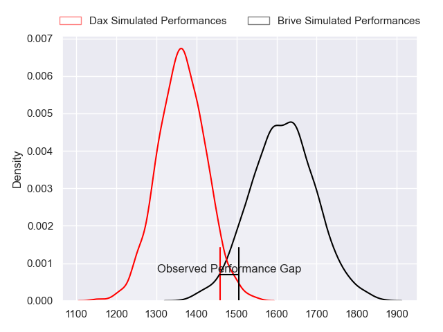
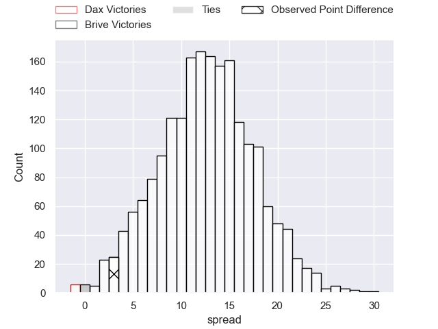
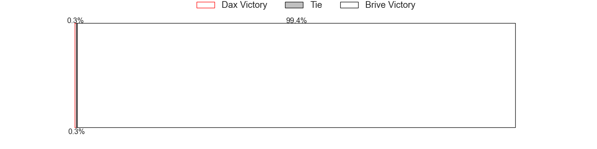
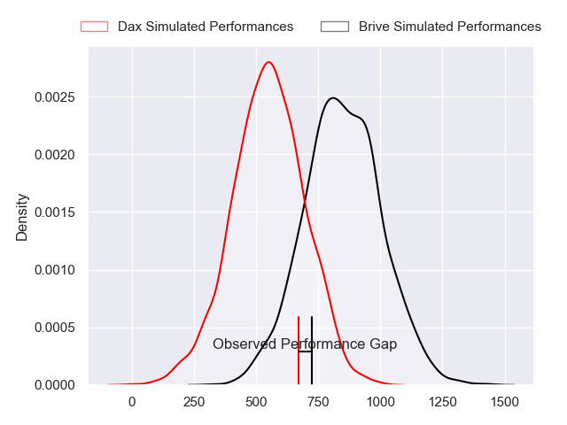
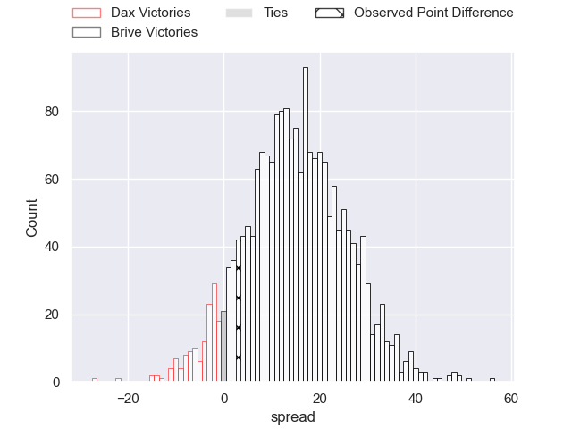
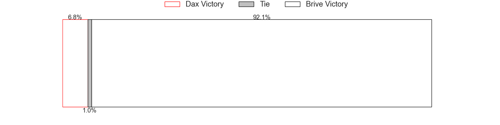
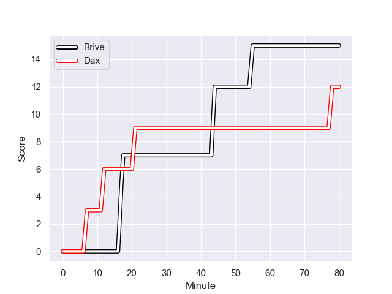
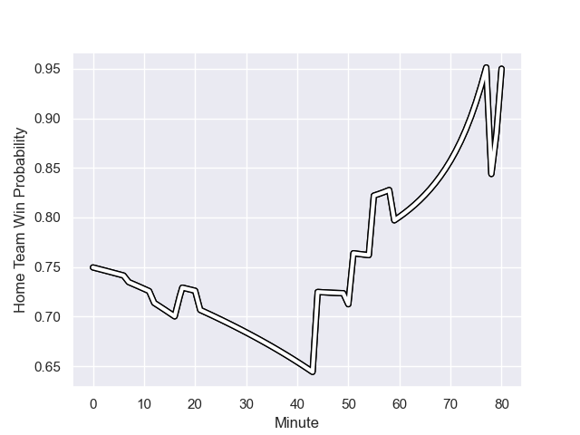

---  
layout: page  
title: Dax at Brive; 12.0-15.0  
date: 2023-09-27 18:00:00 -0500  
categories: match review  
---
# Dax at Brive; 12.0-15.0

# Club Level Predictions

The first set of predictions treats a club as the smallest object, as the club develops its members, organizes a gameplan, and deploys its players as needed for each match. This club model has a prediction of 0.807, which translates to predicting Brive to win by 12.6.

Each club has a rating and a rating deviation (simiar to a Glicko system), and expected performances can be generated. This allows for simulated matches and spreads like the ones below.
## Projected Performances - Club Model

## Projected Spreads - Club Model

## Projected Results - Club Model

# Player Level Predictions - Version 2

Treating teams instead as an entity made up of the currently active players, I have ratings for each player in an altogether different system. These can be combined to form team ratings once teamsheets are announced, weighting starters a bit higher than the reserves. After the match is played, players can be weighted by their minutes on the field, allowing for an accurate measure of the team's composition. With these compiled team ratings, we can make predictions, measure inaccuracy, and update the individual player ratings.
## Prediction with Player Minutes: Brive by 12.0

Brive by 7.2 on a neutral field
## Prediction without Player Minutes: Brive by 11.1

Brive by 6.3 on a neutral pitch

## Projected Performances - Player Model

## Projected Spreads - Player Model

## Projected Results - Player Model

## Scores over Time

## Win Probability over Time

There were 7 large changes in win probability in this match

|   Away Minutes | Away Player           |   Away elo |   Number |   Home elo | Home Player               |   Home Minutes |
|---------------:|:----------------------|-----------:|---------:|-----------:|:--------------------------|---------------:|
|             50 | Louis Mary            |      49.74 |        1 |      48.89 | Wesley Tapueluelu         |             59 |
|             50 | Maxime Delonca        |      41.5  |        2 |      54.94 | Issam Hamel               |             59 |
|             50 | David Lolohea         |      21.69 |        3 |      31.91 | Marcel van der Merwe      |             59 |
|             80 | Brice Ferrer          |      38.62 |        4 |      51.62 | Retief Marais             |             80 |
|             80 | Josh Furno            |       9.34 |        5 |      52.77 | Tevita Ratuva             |             50 |
|             50 | Jean-Baptiste Barrère |      26.95 |        6 |      38.18 | Sasha Gue                 |             59 |
|             50 | Ratu Nacika           |      38.46 |        7 |      88.29 | Ross Moriarty             |             80 |
|             50 | Paul Arnaud Ausset    |      63.51 |        8 |      54.08 | Rahboni Warren-Vosayaco   |             80 |
|             59 | Paul Ravier           |      49.63 |        9 |      50.6  | Julien Blanc              |             59 |
|             80 | Romuald Séguy         |      29.52 |       10 |      10.71 | Jackson Garden-Bachop     |             63 |
|             80 | Jope Naceava          |      39.08 |       11 |      42.35 | Asaeli Tuivuaka           |             80 |
|             80 | Ilikena Bolakoro      |      40.78 |       12 |      69.46 | Stuart Olding             |             80 |
|             80 | Bastien Daguerre      |      44.74 |       13 |      49.19 | Paula Walisolio           |             80 |
|             59 | Maxime Oltmann        |       8.61 |       14 |      19.26 | Mathieu Brignonen         |             51 |
|             80 | Théo Gatelier         |      43.96 |       15 |      43.35 | Mathis Ferté              |             80 |
|             30 | Thibaud Dréan         |      48.96 |       16 |      41.08 | Oskar Rixen               |             30 |
|             30 | Louis Barrere         |      34.71 |       17 |      46.65 | Georges Shvelidze         |             29 |
|             30 | Arnaud Aletti         |      44.85 |       18 |      34.58 | Lucas da Silva            |             21 |
|             30 | Mat Luamanu           |      40.87 |       19 |      46.52 | Nathan Fraissenon         |             21 |
|             30 | Nephi Leatigaga       |      25.26 |       20 |      87.31 | Said Hireche              |             21 |
|             30 | Théo Tremeau          |      38.14 |       21 |      36.41 | Francisco Coria Marchetti |             21 |
|             21 | Hugo Cerisier         |      50.72 |       22 |      73.43 | Thomas Laranjeira         |             21 |
|             21 | Sylvère Reteau        |      45.38 |       23 |      18.29 | Wesley Douglas            |             17 |

