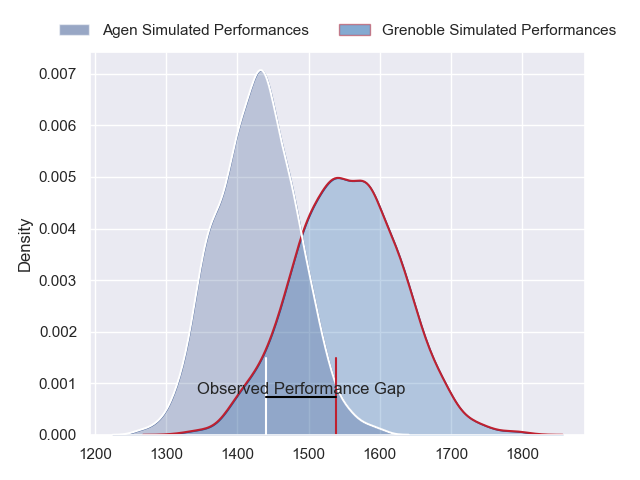
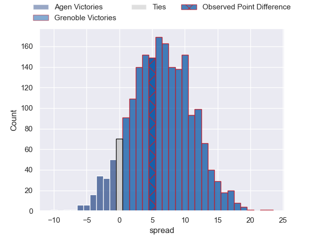
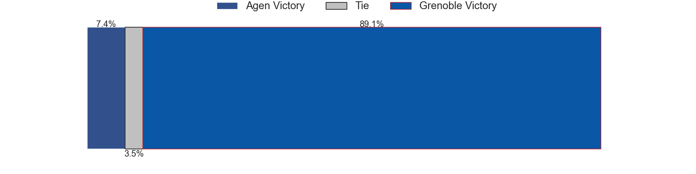
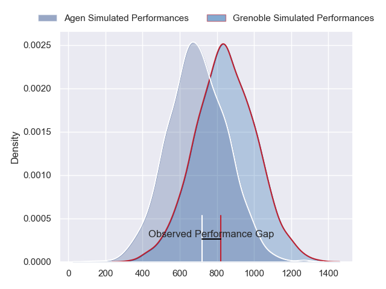
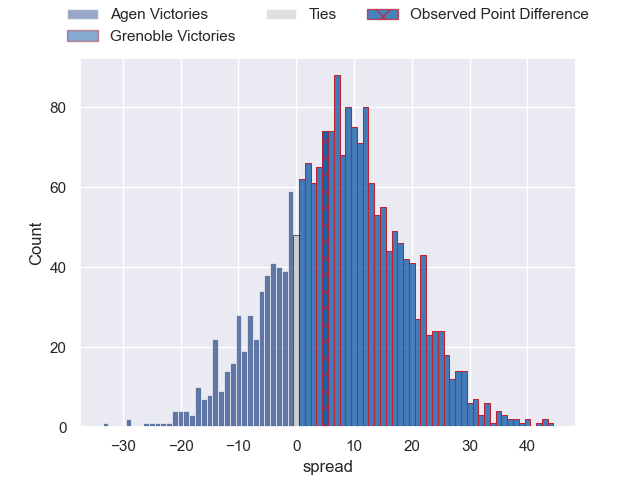
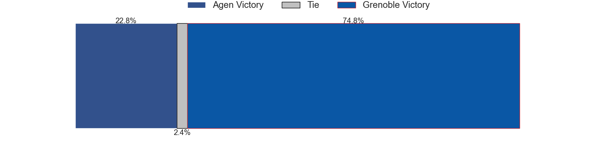
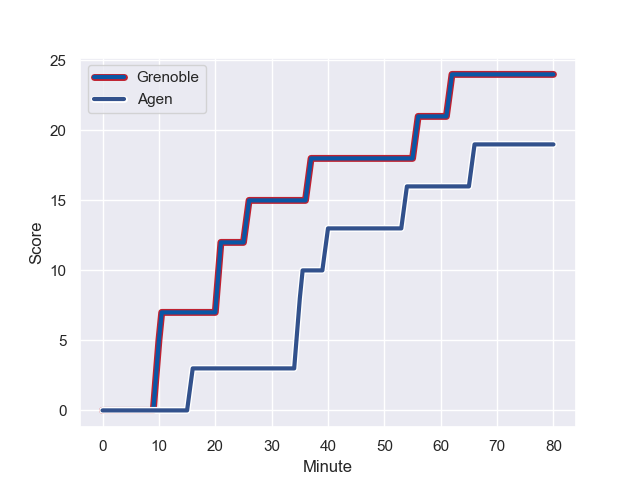
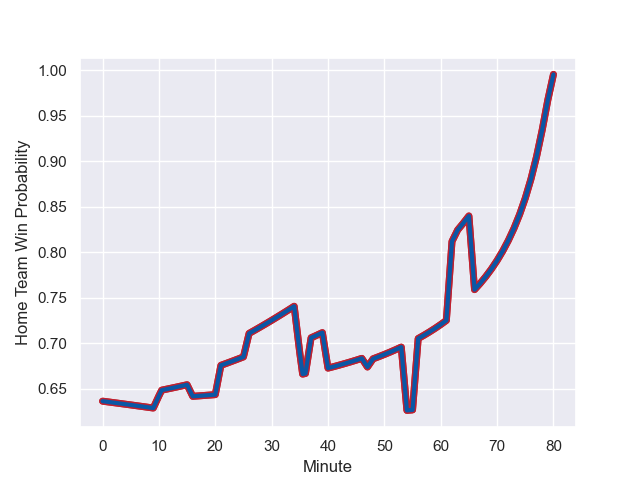

---  
layout: page  
title: Agen at Grenoble; 19.0-24.0  
date: 2023-09-27 18:00:00 -0500  
categories: match review  
---
# Agen at Grenoble; 19.0-24.0

# Club Level Predictions

The first set of predictions treats a club as the smallest object, as the club develops its members, organizes a gameplan, and deploys its players as needed for each match. This club model has a prediction of 0.671, which translates to predicting Grenoble to win by 6.3.

Each club has a rating and a rating deviation (simiar to a Glicko system), and expected performances can be generated. This allows for simulated matches and spreads like the ones below.
## Projected Performances - Club Model

## Projected Spreads - Club Model

## Projected Results - Club Model

# Player Level Predictions - Version 2

Treating teams instead as an entity made up of the currently active players, I have ratings for each player in an altogether different system. These can be combined to form team ratings once teamsheets are announced, weighting starters a bit higher than the reserves. After the match is played, players can be weighted by their minutes on the field, allowing for an accurate measure of the team's composition. With these compiled team ratings, we can make predictions, measure inaccuracy, and update the individual player ratings.
## Prediction with Player Minutes: Grenoble by 6.2

Grenoble by 1.4 on a neutral field
## Prediction without Player Minutes: Grenoble by 6.0

Grenoble by 1.2 on a neutral pitch

## Projected Performances - Player Model

## Projected Spreads - Player Model

## Projected Results - Player Model

## Scores over Time

## Win Probability over Time

There were 12 large changes in win probability in this match

|   Away Minutes | Away Player        |   Away elo |   Number |   Home elo | Home Player         |   Home Minutes |
|---------------:|:-------------------|-----------:|---------:|-----------:|:--------------------|---------------:|
|             57 | Hans Lombard-Buret |      50.88 |        1 |      33.21 | Eli Eglaine         |             48 |
|             63 | Clement Martinez   |      41.96 |        2 |      52.11 | Bernabe Massa       |             57 |
|             67 | Alex Burin         |      48.94 |        3 |      48.36 | Regis Montagne      |             70 |
|             47 | Joe Maksymiw       |      24.92 |        4 |      46.2  | Pierce Phillips     |             80 |
|             80 | William Demotte    |      72.78 |        5 |      47.48 | Brandon Nansen      |             51 |
|             57 | Antoine Erbani     |      90.51 |        6 |      50.79 | Thibaut Martel      |             80 |
|             80 | Valentin Gayraud   |      47.01 |        7 |      36.28 | Steeve Blanc-Mappaz |             80 |
|             80 | Martin Devergie    |      39.28 |        8 |      30.43 | Antonin Berruyer    |             80 |
|             57 | Theo Idjellidaine  |      37.76 |        9 |      23.42 | Barnabe Couilloud   |             53 |
|             80 | Thomas Vincent     |      53.47 |       10 |      58.55 | Sam Davies          |             80 |
|             80 | Iban Etcheverry    |      34.8  |       11 |      45.37 | Karim Qadiri        |             80 |
|             67 | Kolinio Ramoka     |      29.92 |       12 |      80.2  | Bautista Ezcurra    |             80 |
|             80 | Clement Garrigues  |      53.21 |       13 |      31.34 | Romain Fusier       |             63 |
|             80 | Henry Purdy        |      74.45 |       14 |      50.17 | Erwan Dridi         |             66 |
|             57 | Loris Tolot        |     -12.21 |       15 |      84.58 | Julien Farnoux      |             80 |
|             33 | Zak Farrance       |      45.92 |       16 |      45.46 | Luka Goginava       |             32 |
|             23 | Andre Warner       |      28.34 |       17 |      42.66 | Pio Muarua          |             29 |
|             23 | Ben Volavola       |      41.68 |       18 |      53.48 | Eric Escande        |             27 |
|             23 | Florent Guion      |      24.8  |       19 |      38.23 | Mathis Sarragallet  |             23 |
|             23 | Matthieu Bonnet    |      51.77 |       20 |      46.95 | Romain Trouilloud   |             17 |
|             13 | Théo Sauzaret      |      47.24 |       21 |      39.13 | Geoffrey Cros       |             14 |
|             17 | Pierre Jouvin      |      42.81 |       22 |      45.37 | Vincent Vial        |             10 |
|             13 | Harry Sloan        |      63.91 |       23 |     nan    | nan                 |            nan |

