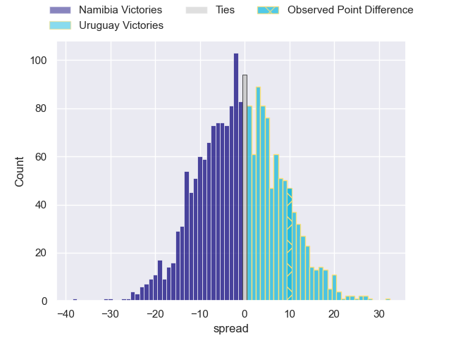
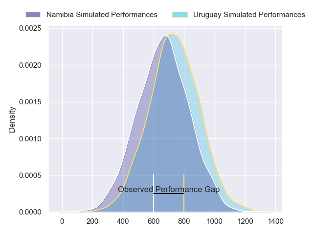
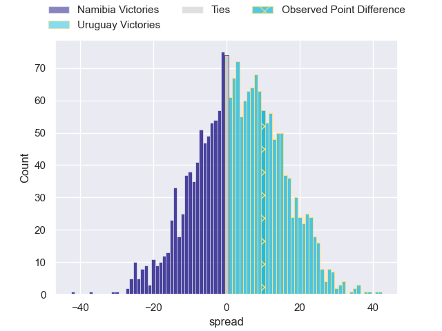
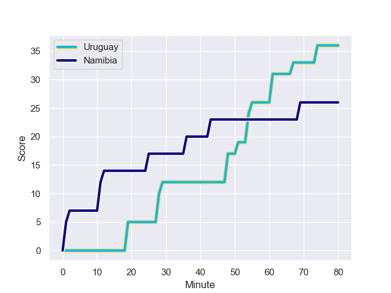
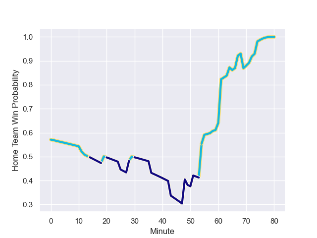

---  
layout: page  
title: Namibia at Uruguay; 26.0-36.0  
date: 2023-09-27 18:00:00 -0500  
categories: match review  
---
# Namibia at Uruguay; 26.0-36.0

# Club Level Predictions

The first set of predictions treats a club as the smallest object, as the club develops its members, organizes a gameplan, and deploys its players as needed for each match. This club model has a prediction of 0.486, which translates to predicting Namibia to win by 0.5.

Each club has a rating and a rating deviation (simiar to a Glicko system), and expected performances can be generated. This allows for simulated matches and spreads like the ones below.
## Projected Performances - Club Model

## Projected Spreads - Club Model

## Projected Results - Club Model

# Player Level Predictions - Version 2

Treating teams instead as an entity made up of the currently active players, I have ratings for each player in an altogether different system. These can be combined to form team ratings once teamsheets are announced, weighting starters a bit higher than the reserves. After the match is played, players can be weighted by their minutes on the field, allowing for an accurate measure of the team's composition. With these compiled team ratings, we can make predictions, measure inaccuracy, and update the individual player ratings.
## Prediction with Player Minutes: Uruguay by 3.2

Uruguay by 3.2 on a neutral field
## Prediction without Player Minutes: Uruguay by 3.1

Uruguay by 3.1 on a neutral pitch

## Projected Performances - Player Model

## Projected Spreads - Player Model

## Projected Results - Player Model

## Scores over Time

## Win Probability over Time

There were 16 large changes in win probability in this match

|   Away Minutes | Away Player              |   Away elo |   Number |   Home elo | Home Player                |   Home Minutes |
|---------------:|:-------------------------|-----------:|---------:|-----------:|:---------------------------|---------------:|
|             74 | Jason Benade             |      24.82 |        1 |      42.48 | Mateo Sanguinetti          |             70 |
|             61 | Torsten van Jaarsveld    |     108.22 |        2 |      47.62 | German Kessler             |             61 |
|             80 | Aranos Coetzee           |      47.79 |        3 |      53.65 | Diego Arbelo               |             61 |
|             55 | Adriaan Ludick           |      45.63 |        4 |      44.38 | Felipe Aliaga              |             69 |
|             72 | Tiaan de Klerk           |      46.65 |        5 |      14.9  | Manuel Leindekar           |             80 |
|             71 | Prince Gaoseb            |      19.41 |        6 |      64.26 | Manuel Ardao               |             80 |
|             80 | Tjuee Uanivi             |      31.4  |        7 |      70.48 | Santiago Civetta           |             61 |
|             60 | Richard Hardwick         |      52.2  |        8 |      68.81 | Carlos Deus                |             80 |
|             74 | Damian Stevens           |      14.6  |        9 |      51.44 | Santiago Arata             |             67 |
|             80 | Tiaan Swanepoel          |      56.57 |       10 |      63.89 | Felipe Etcheverry          |             60 |
|             64 | JC Greyling              |      17.36 |       11 |      17.11 | Nicolas Freitas            |             60 |
|             80 | Danco Burger             |      46.65 |       12 |      16.16 | Andres Vilaseca            |             80 |
|             80 | Alcino Izaacs            |      46.65 |       13 |      68.6  | Felipe Arcos Perez         |             80 |
|             72 | Gerswin Mouton           |      46.65 |       14 |      54.7  | Bautista Basso             |             80 |
|             80 | Cliven Loubser           |      61.35 |       15 |      55.34 | Baltazar Amaya Saavedra    |             80 |
|             19 | Louis van der Westhuizen |      67.24 |       16 |      87.64 | Guillermo Pujadas          |             19 |
|             22 | Des Sethie               |      41.94 |       17 |      46.68 | Facundo Gattas             |             10 |
|              9 | Haitembu Shifuka         |      46.65 |       18 |      46.65 | Reinaldo Piussi            |             19 |
|             25 | PJ van Lill              |      85.45 |       19 |      46.65 | Juan Manuel Rodriguez      |             11 |
|             20 | Adriaan Booysen          |     -11.19 |       20 |      79.14 | Eric Dosantos              |             19 |
|              8 | Max Katjijeko            |      39.63 |       21 |      33.63 | Agustin Ormaechea          |             13 |
|              6 | Jacques Theron           |      46.65 |       22 |      22.81 | Felipe Berchesi Pisano     |             20 |
|              8 | Andre van der Berg       |      30.95 |       23 |      46.65 | Juan Manuel Alonso Dieguez |             20 |

