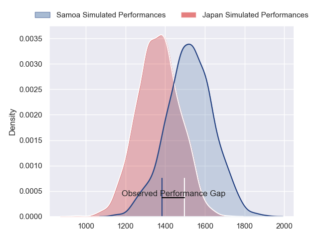
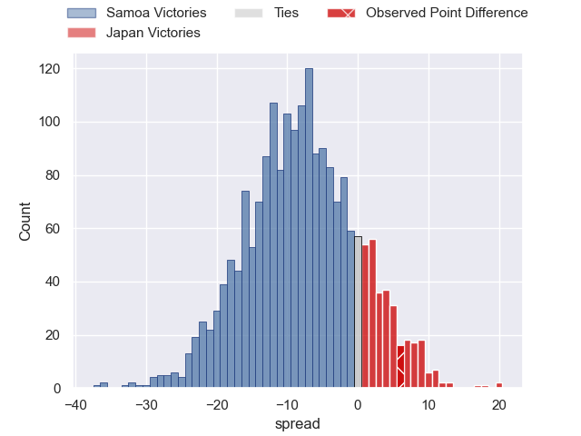
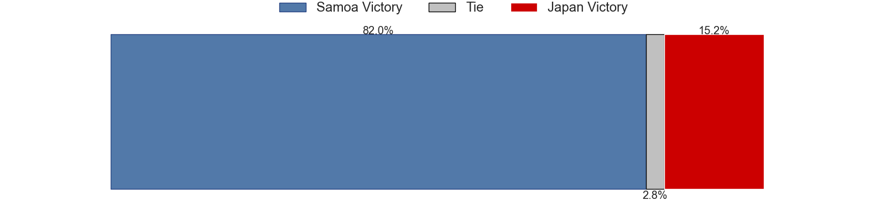
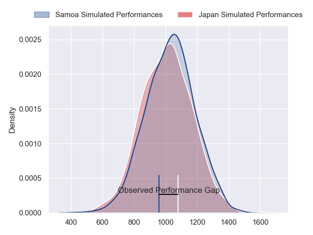
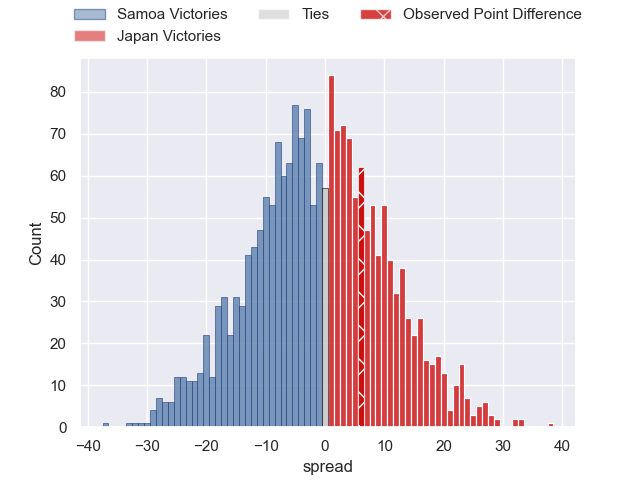
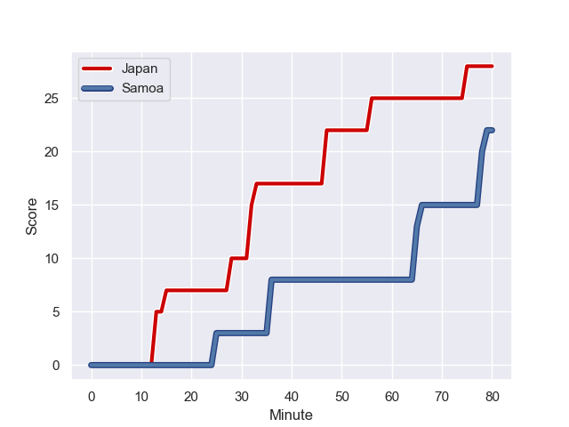
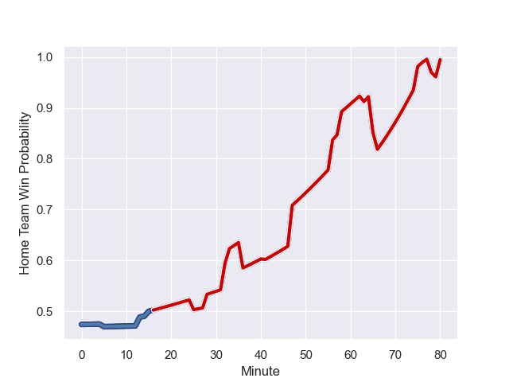

---  
layout: page  
title: Samoa at Japan; 22.0-28.0  
date: 2023-09-28 18:00:00 -0500  
categories: match review  
---
# Samoa at Japan; 22.0-28.0

# Club Level Predictions

The first set of predictions treats a club as the smallest object, as the club develops its members, organizes a gameplan, and deploys its players as needed for each match. This club model has a prediction of 0.296, which translates to predicting Samoa to win by 8.1.

Each club has a rating and a rating deviation (simiar to a Glicko system), and expected performances can be generated. This allows for simulated matches and spreads like the ones below.
## Projected Performances - Club Model

## Projected Spreads - Club Model

## Projected Results - Club Model

# Player Level Predictions - Version 2

Treating teams instead as an entity made up of the currently active players, I have ratings for each player in an altogether different system. These can be combined to form team ratings once teamsheets are announced, weighting starters a bit higher than the reserves. After the match is played, players can be weighted by their minutes on the field, allowing for an accurate measure of the team's composition. With these compiled team ratings, we can make predictions, measure inaccuracy, and update the individual player ratings.
## Prediction with Player Minutes: Samoa by 1.1

Samoa by 1.1 on a neutral field
## Prediction without Player Minutes: Samoa by 1.9

Samoa by 1.9 on a neutral pitch

## Projected Performances - Player Model

## Projected Spreads - Player Model

## Projected Results - Player Model

## Scores over Time

## Win Probability over Time

There were 12 large changes in win probability in this match

|   Away Minutes | Away Player          |   Away elo |   Number |   Home elo | Home Player         |   Home Minutes |
|---------------:|:---------------------|-----------:|---------:|-----------:|:--------------------|---------------:|
|             51 | James Lay            |      51.88 |        1 |      85.69 | Keita Inagaki       |             47 |
|             51 | Seilala Lam          |      63.85 |        2 |      86.98 | Shota Horie         |             58 |
|             51 | Paul Alo-Emile       |      77.48 |        3 |      10.19 | Koo Ji-won          |             47 |
|             80 | Steven Luatua        |     101.74 |        4 |      78.71 | Jack Cornelsen      |             63 |
|             80 | Theo McFarland       |      68    |        5 |      41.16 | Amato Fakatava      |             80 |
|              5 | Taleni Seu           |      65.59 |        6 |      75.52 | Michael Leitch      |             75 |
|             80 | Fritz Lee            |      89.22 |        7 |      76.36 | Lappies Labuschagne |             69 |
|             58 | Jordan Taufua        |     102.66 |        8 |      53.66 | Kazuki Himeno       |             80 |
|             58 | Jonathan Taumateine  |      48.35 |        9 |      29.71 | Naoto Saito         |             75 |
|             80 | Christian Lealiifano |      46.65 |       10 |     104.56 | Rikiya Matsuda      |             76 |
|             80 | Ben Lam              |     116.04 |       11 |      60.94 | Jone Naikabula      |             74 |
|             33 | D'Angelo Leuila      |      47.23 |       12 |     100.13 | Ryoto Nakamura      |             75 |
|             80 | Tumua Manu           |      92.53 |       13 |      92.1  | Dylan Riley         |             80 |
|             73 | Ed Fidow             |      14.38 |       14 |      93.09 | Kotaro Matsushima   |             80 |
|             80 | Duncan Paia'aua      |      72.31 |       15 |      36.91 | Lomano Lemeki       |             80 |
|             29 | Sama Malolo          |      46.3  |       16 |      50.69 | Atsushi Sakate      |             28 |
|             29 | Jordan Lay           |      32.99 |       17 |      39.3  | Craig Millar        |             33 |
|             29 | Michael Ala'alatoa   |      70.14 |       18 |      79.17 | Asaeli Ai Valu      |             33 |
|             75 | Brian Alainu'uese    |      72.06 |       19 |      63.12 | Warner Dearns       |             28 |
|             22 | Alamanda Motuga      |      53.61 |       20 |      38.65 | Kanji Shimokawa     |              5 |
|             22 | Melani Matavao       |      51.35 |       21 |      46.65 | Kenta Fukuda        |              5 |
|              7 | Neria Fomai          |      75.27 |       22 |      12.38 | Seungsin Lee        |              4 |
|             47 | Danny Toala          |      40.94 |       23 |      35.2  | Tomoki Osada        |              5 |

