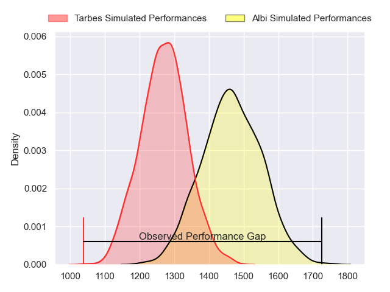
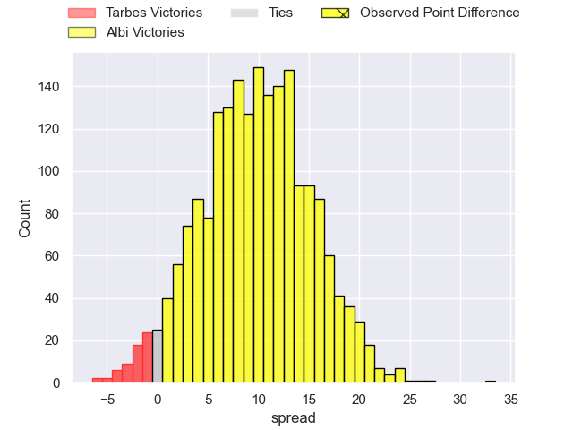
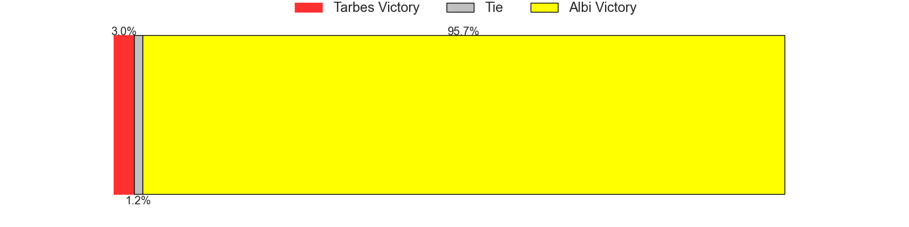
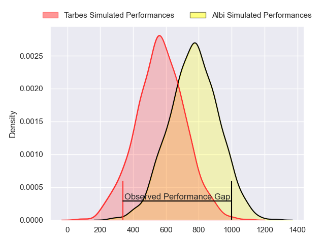
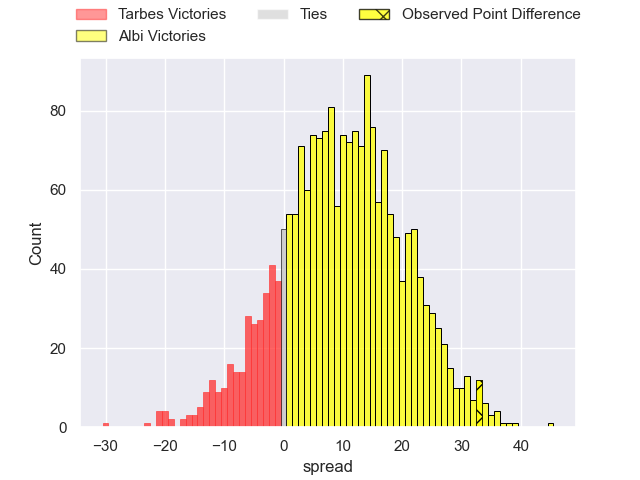
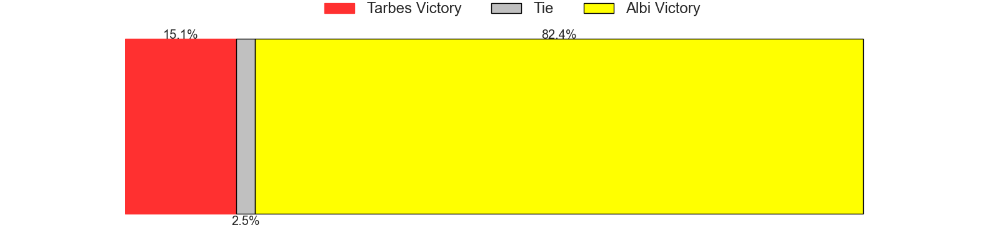
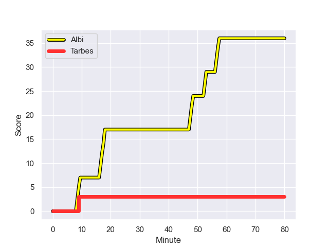
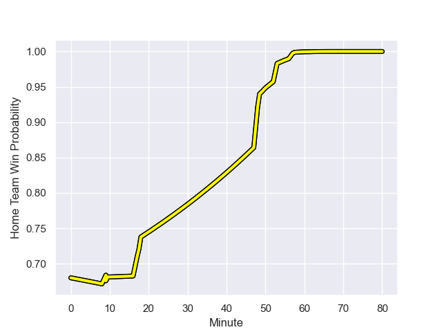

---  
layout: page  
title: Tarbes at Albi; 3.0-36.0  
date: 2023-09-29 18:00:00 -0500  
categories: match review  
---
# Tarbes at Albi; 3.0-36.0

# Club Level Predictions

The first set of predictions treats a club as the smallest object, as the club develops its members, organizes a gameplan, and deploys its players as needed for each match. This club model has a prediction of 0.749, which translates to predicting Albi to win by 9.7.

Each club has a rating and a rating deviation (simiar to a Glicko system), and expected performances can be generated. This allows for simulated matches and spreads like the ones below.
## Projected Performances - Club Model

## Projected Spreads - Club Model

## Projected Results - Club Model

# Player Level Predictions - Version 2

Treating teams instead as an entity made up of the currently active players, I have ratings for each player in an altogether different system. These can be combined to form team ratings once teamsheets are announced, weighting starters a bit higher than the reserves. After the match is played, players can be weighted by their minutes on the field, allowing for an accurate measure of the team's composition. With these compiled team ratings, we can make predictions, measure inaccuracy, and update the individual player ratings.
## Prediction with Player Minutes: Albi by 8.3

Albi by 3.9 on a neutral field
## Prediction without Player Minutes: Albi by 7.1

Albi by 2.7 on a neutral pitch

## Projected Performances - Player Model

## Projected Spreads - Player Model

## Projected Results - Player Model

## Scores over Time

## Win Probability over Time

There were 3 large changes in win probability in this match

|   Away Minutes | Away Player            |   Away elo |   Number |   Home elo | Home Player             |   Home Minutes |
|---------------:|:-----------------------|-----------:|---------:|-----------:|:------------------------|---------------:|
|             50 | Alexandre Combier      |      39.06 |        1 |      43.29 | Thibaud Sebire          |             50 |
|             50 | Vincent Dolier         |      49.86 |        2 |      50.11 | Romain Maurice          |             50 |
|             50 | Alexandre Duny         |      33.34 |        3 |      57.68 | Dimitri Tchapnga        |             50 |
|             54 | Baptiste Peytavi       |      45.23 |        4 |      11.23 | Pierre Roussel          |             50 |
|             80 | Jone Trevor Seuvou     |      34.2  |        5 |       6.64 | Dion Evrard Oulai       |             50 |
|             54 | Alexis Armary          |      55.55 |        6 |      30.7  | Luke Stringer           |             80 |
|             80 | Léo Saint-Guilhem      |      41.22 |        7 |      43.88 | Vincent Calas           |             80 |
|             54 | Len Massyn             |      33.29 |        8 |      71.71 | Sandrick Maciotta       |             80 |
|             54 | Thibaut Dulucq         |      32.21 |        9 |      47.68 | Titouan Pouzoullic      |             58 |
|             80 | Anthony Fuertes        |      19.75 |       10 |      27.4  | James Haydn Tedder      |             80 |
|             80 | Clement Latorre        |      40.95 |       11 |      55.16 | Tim Giresse             |             80 |
|             80 | Kalione Nasoko         |      46.65 |       12 |      18.04 | Jarrod Poi              |             54 |
|             73 | Johan Paulet           |      24.72 |       13 |      65.28 | Baptiste Couchinave     |             80 |
|             80 | Thibaut Trotta         |      36.23 |       14 |      49.11 | Simon Hartmann          |             80 |
|             80 | William Pees           |      33    |       15 |      59.79 | Paul Clergue            |             61 |
|             30 | Johan Mees Erasmus     |      36.69 |       16 |      52.48 | Antoine Soave           |             30 |
|             30 | Aleksi Tchitchiashvili |      39.7  |       17 |      55.47 | Arthur Castant          |             30 |
|             30 | Arnaud Puyo            |      46.65 |       18 |      49.43 | Jean Baptiste De Clercq |             30 |
|             26 | Léo Estaque            |      43.88 |       19 |      50    | Simon Meka              |             30 |
|             26 | Dorian Bonnin          |      28.55 |       20 |      12.62 | Jacques Engelbrecht     |             30 |
|             26 | Julien Cantan          |      35.01 |       21 |      70.11 | Théo Vidal              |             22 |
|              7 | Yon Camou              |      46.38 |       22 |      54.24 | Benjamin Pehau          |             26 |
|             26 | Mickael Thébault       |      51.78 |       23 |      -3.97 | Téo Dospital            |             19 |

