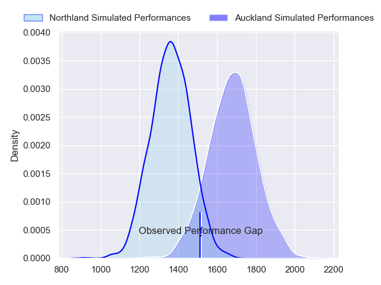
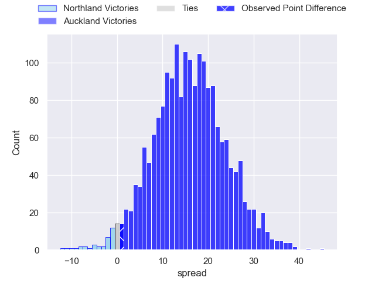
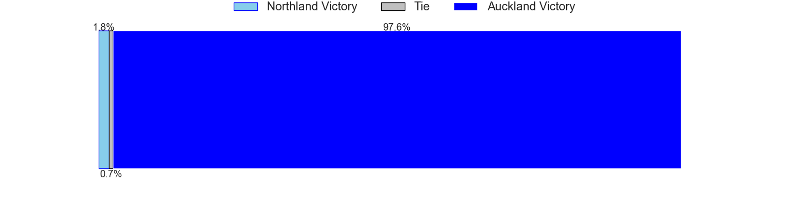
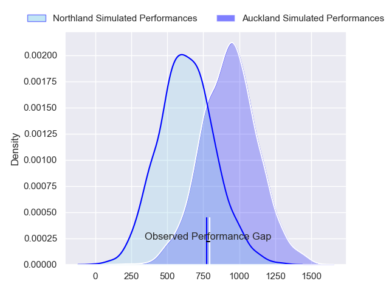
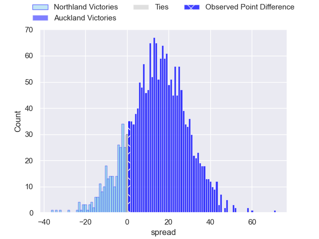
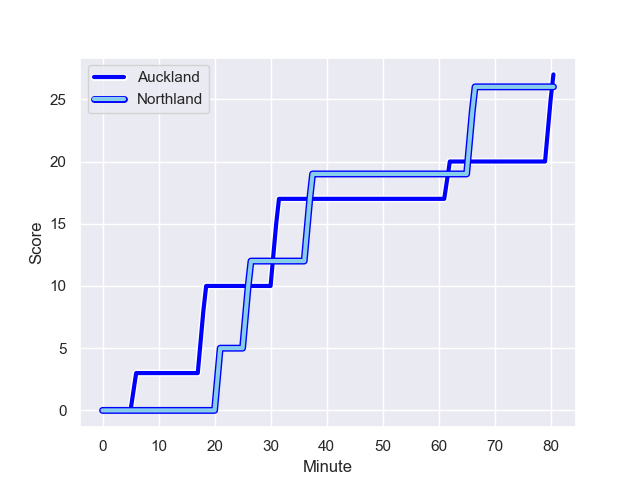
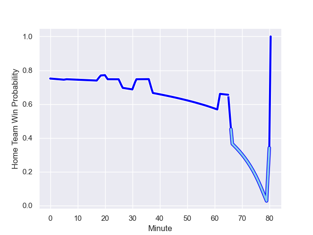

---  
layout: page  
title: Northland at Auckland; 26.0-27.0  
date: 2023-09-29 18:00:00 -0500  
categories: match review  
---
# Northland at Auckland; 26.0-27.0

# Club Level Predictions

The first set of predictions treats a club as the smallest object, as the club develops its members, organizes a gameplan, and deploys its players as needed for each match. This club model has a prediction of 0.854, which translates to predicting Auckland to win by 16.1.

Each club has a rating and a rating deviation (simiar to a Glicko system), and expected performances can be generated. This allows for simulated matches and spreads like the ones below.
## Projected Performances - Club Model

## Projected Spreads - Club Model

## Projected Results - Club Model

# Player Level Predictions - Version 2

Treating teams instead as an entity made up of the currently active players, I have ratings for each player in an altogether different system. These can be combined to form team ratings once teamsheets are announced, weighting starters a bit higher than the reserves. After the match is played, players can be weighted by their minutes on the field, allowing for an accurate measure of the team's composition. With these compiled team ratings, we can make predictions, measure inaccuracy, and update the individual player ratings.
## Prediction with Player Minutes: Auckland by 12.5

Auckland by 9.1 on a neutral field
## Prediction without Player Minutes: Auckland by 12.5

Auckland by 9.1 on a neutral pitch

## Projected Performances - Player Model

## Projected Spreads - Player Model

## Projected Results - Player Model

## Scores over Time

## Win Probability over Time

There were 15 large changes in win probability in this match

|   Away Minutes | Away Player                   |   Away elo |   Number |   Home elo | Home Player         |   Home Minutes |
|---------------:|:------------------------------|-----------:|---------:|-----------:|:--------------------|---------------:|
|             80 | Jarred Adams                  |      51.41 |        1 |      50.98 | Josh Fusitua        |             80 |
|             80 | Matt Moulds                   |      41.6  |        2 |      48.47 | Soane Vikena        |             80 |
|             80 | Remsy Lemisio                 |      48.86 |        3 |      46.62 | Sione Ahio          |             80 |
|             80 | Sam Caird                     |      -5.08 |        4 |      37.33 | Edward Annandale    |             80 |
|             80 | Liam Hallam-Eames             |       5.26 |        5 |      51.23 | Josh Beehre         |             80 |
|             80 | Rob Rush                      |      34.2  |        6 |      44.87 | Che Clark           |             80 |
|             80 | Saimoni Banuve Uluinakauvadra |      45.33 |        7 |      71.66 | Blake Gibson        |             80 |
|             80 | Matt Polwart-Matich           |      54.99 |        8 |      37.54 | Vaiolini Ekuasi     |             80 |
|             80 | Sam Nock                      |      56.47 |        9 |      49.53 | Kalani Thomas       |             80 |
|             80 | Rivez Reihana                 |      44.68 |       10 |      64.47 | Zarn Sullivan       |             80 |
|             80 | Heremaia Murray               |      43.37 |       11 |      78.86 | Salesi Rayasi       |             80 |
|             80 | Rene Ranger                   |      37.74 |       12 |      81.21 | Harry Plummer       |             80 |
|             80 | Tamati Tua                    |      46.17 |       13 |     113.59 | Bryce Heem          |             80 |
|             80 | Jordan Trainor                |      74.26 |       14 |      49.22 | AJ Lam              |             80 |
|             80 | Joshua Moorby                 |      59.57 |       15 |      33.68 | Roger Tuivasa-Sheck |             80 |

