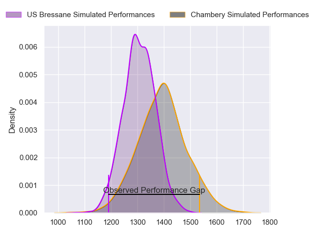
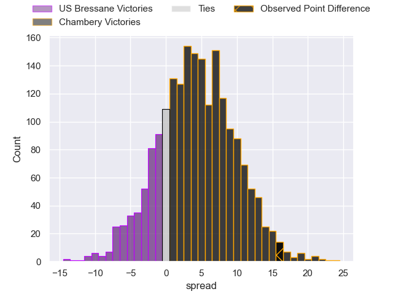
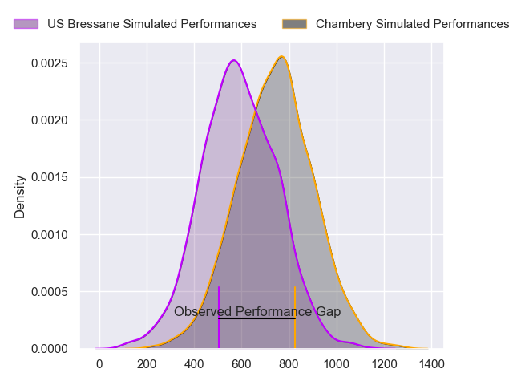
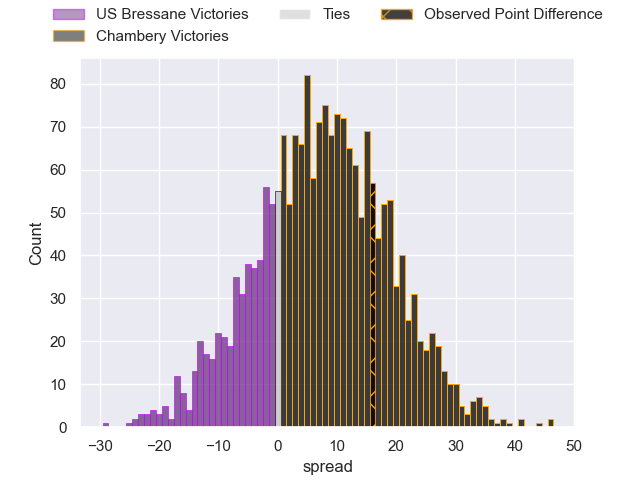
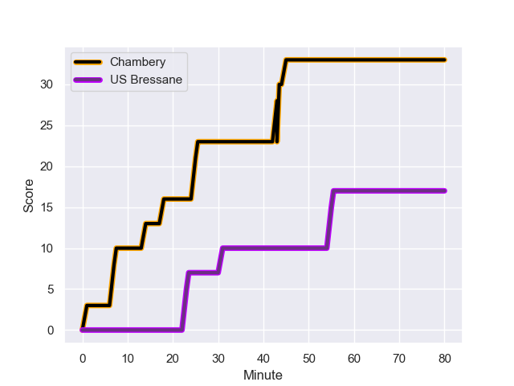
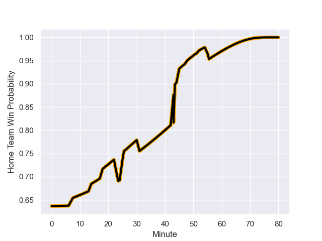

---  
layout: page  
title: US Bressane at Chambery; 17.0-33.0  
date: 2023-09-29 18:00:00 -0500  
categories: match review  
---
# US Bressane at Chambery; 17.0-33.0

# Club Level Predictions

The first set of predictions treats a club as the smallest object, as the club develops its members, organizes a gameplan, and deploys its players as needed for each match. This club model has a prediction of 0.616, which translates to predicting Chambery to win by 4.2.

Each club has a rating and a rating deviation (simiar to a Glicko system), and expected performances can be generated. This allows for simulated matches and spreads like the ones below.
## Projected Performances - Club Model

## Projected Spreads - Club Model

## Projected Results - Club Model

# Player Level Predictions - Version 2

Treating teams instead as an entity made up of the currently active players, I have ratings for each player in an altogether different system. These can be combined to form team ratings once teamsheets are announced, weighting starters a bit higher than the reserves. After the match is played, players can be weighted by their minutes on the field, allowing for an accurate measure of the team's composition. With these compiled team ratings, we can make predictions, measure inaccuracy, and update the individual player ratings.
## Prediction with Player Minutes: Chambery by 6.2

Chambery by 3.0 on a neutral field
## Prediction without Player Minutes: Chambery by 5.6

Chambery by 2.3 on a neutral pitch

## Projected Performances - Player Model

## Projected Spreads - Player Model

## Projected Results - Player Model

## Scores over Time

## Win Probability over Time

There were 6 large changes in win probability in this match

|   Away Minutes | Away Player               |   Away elo |   Number |   Home elo | Home Player              |   Home Minutes |
|---------------:|:--------------------------|-----------:|---------:|-----------:|:-------------------------|---------------:|
|             52 | Vazha Kapanadze           |      48.12 |        1 |      45.22 | Enzo Segui               |             50 |
|             52 | Louis Dasalmartini        |      37.42 |        2 |      46.82 | Gauthier Brute de Remur  |             50 |
|             52 | Ma'afu Fia                |      55.53 |        3 |      50.75 | Giorgi Pertaia           |             50 |
|             80 | Louis Bruinsma            |      28.24 |        4 |      42.18 | Fabien Witz              |             59 |
|             80 | Josh Peters               |      36.58 |        5 |      48.48 | Corentin Astier          |             80 |
|             59 | Loic Baradel              |      35.45 |        6 |      45.39 | Ahmed Tidiane Kane       |             80 |
|             80 | Pierre Reynaud            |      44.42 |        7 |      35.88 | Colin Lebian             |             80 |
|             48 | Joseph Penitito           |      60.38 |        8 |      56.81 | Tui Uru                  |             78 |
|             55 | Robin Graulle             |      34.39 |        9 |      31.88 | Thibault Dufau           |             65 |
|             78 | Fred Zeilinga             |      60.61 |       10 |      34.18 | Jean-Luc Alewyn Cilliers |             55 |
|             80 | Kavekini Tabu             |      47.1  |       11 |      52.35 | Arthur Nennig            |             80 |
|             80 | Parataiso Silafai-Lea'ana |       4.84 |       12 |      28.44 | Mickael Blanc            |             80 |
|             65 | Alexandre Badet           |      28.9  |       13 |      46.06 | Emmanuel Vaitulukina     |             80 |
|             80 | Thibaut Perrette          |      33.8  |       14 |      43.51 | Va'aufauese Apelu Maliko |             80 |
|             80 | François Grange           |      46.65 |       15 |      45.35 | Thomas Hecquet           |             61 |
|             32 | Nicolas Tachat            |      42.46 |       16 |      53.64 | Géraud Clermont          |             30 |
|             28 | Nicolas Lemaire           |      46.4  |       17 |      45.34 | Julien Primault          |             30 |
|             28 | Arnaud Feltrin            |      43.14 |       18 |      49.34 | Enzo Bailly              |             30 |
|             28 | Atonio Ulutuipalelei      |      27.28 |       19 |      47.69 | Thibault Moreno          |             25 |
|             25 | Jeremy Valencot           |      43.42 |       20 |      66.21 | Matheo Triki             |             21 |
|             21 | Thomas Déliance           |      50.7  |       21 |      34.87 | Victor Pisano            |             19 |
|             15 | Christian Lacombe         |      20.02 |       22 |      33.29 | Hugo Deschaux            |             15 |
|              2 | Benjamin Doy              |      46.3  |       23 |      41.08 | Luka Begic               |              2 |

