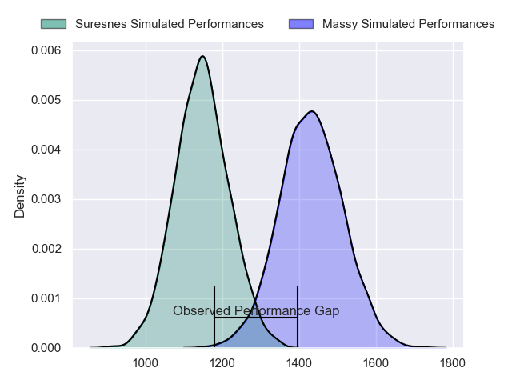
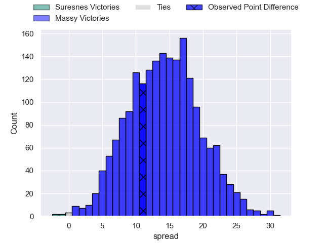
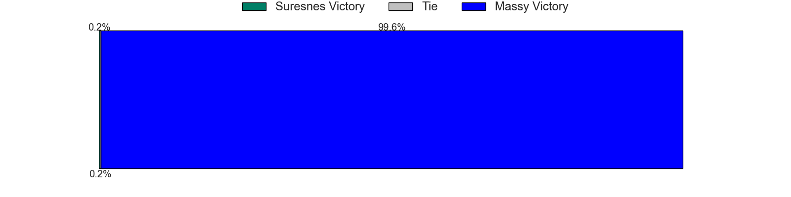
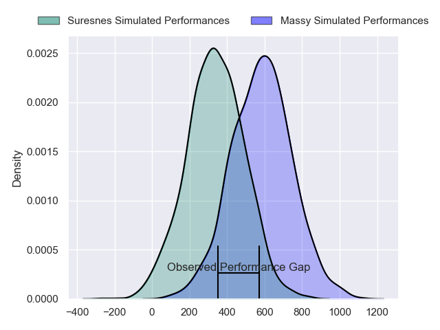
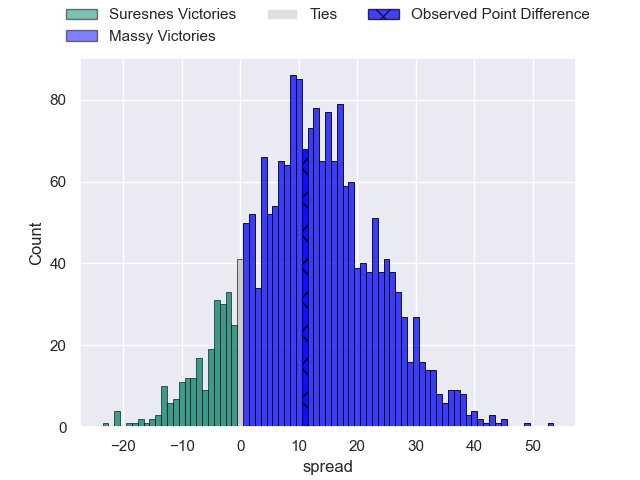
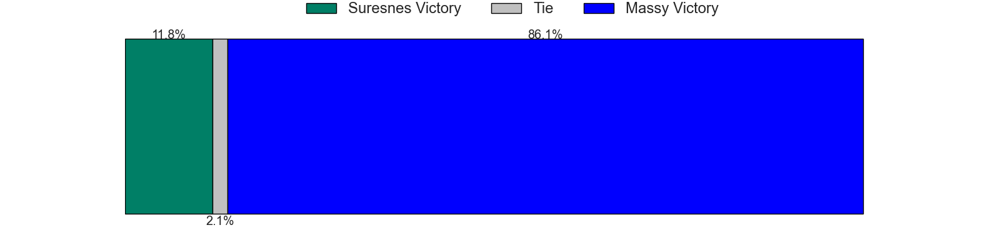
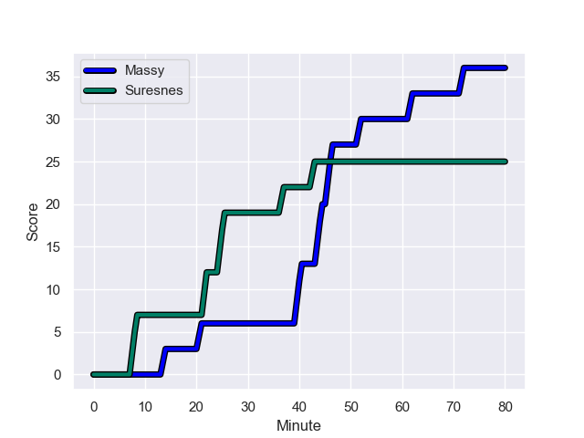
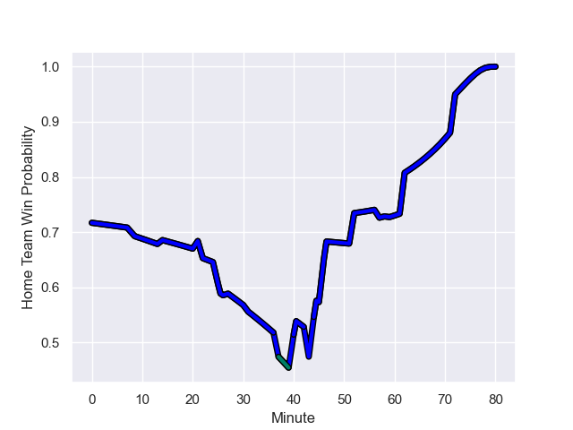

---  
layout: page  
title: Suresnes at Massy; 25.0-36.0  
date: 2023-09-29 18:00:00 -0500  
categories: match review  
---
# Suresnes at Massy; 25.0-36.0

# Club Level Predictions

The first set of predictions treats a club as the smallest object, as the club develops its members, organizes a gameplan, and deploys its players as needed for each match. This club model has a prediction of 0.83, which translates to predicting Massy to win by 14.1.

Each club has a rating and a rating deviation (simiar to a Glicko system), and expected performances can be generated. This allows for simulated matches and spreads like the ones below.
## Projected Performances - Club Model

## Projected Spreads - Club Model

## Projected Results - Club Model

# Player Level Predictions - Version 2

Treating teams instead as an entity made up of the currently active players, I have ratings for each player in an altogether different system. These can be combined to form team ratings once teamsheets are announced, weighting starters a bit higher than the reserves. After the match is played, players can be weighted by their minutes on the field, allowing for an accurate measure of the team's composition. With these compiled team ratings, we can make predictions, measure inaccuracy, and update the individual player ratings.
## Prediction with Player Minutes: Massy by 10.2

Massy by 6.6 on a neutral field
## Prediction without Player Minutes: Massy by 9.8

Massy by 6.2 on a neutral pitch

## Projected Performances - Player Model

## Projected Spreads - Player Model

## Projected Results - Player Model

## Scores over Time

## Win Probability over Time

There were 12 large changes in win probability in this match

|   Away Minutes | Away Player            |   Away elo |   Number |   Home elo | Home Player              |   Home Minutes |
|---------------:|:-----------------------|-----------:|---------:|-----------:|:-------------------------|---------------:|
|             54 | Sébastien Lafrancesca  |      46.48 |        1 |      44.26 | Robin Poipy              |             70 |
|             59 | Hayam El Bibouji       |      22.74 |        2 |      44.16 | Pierre-Alexandre Duclieu |             73 |
|             54 | Victor Damian Arias    |      24.05 |        3 |      40.59 | Tijde Visser             |             54 |
|             80 | Florian Desbordes      |      12.8  |        4 |      60.25 | Saba Pesvianidze         |             54 |
|             80 | Marvin Woki            |      46.98 |        5 |       0.94 | Andrei Mahu              |             70 |
|             37 | Jean-Baptiste Lachaise |      45.44 |        6 |       1.25 | Abongile Nonkontwana     |             80 |
|             80 | Wian Vosloo            |       9.19 |        7 |      46.43 | Clément Vidoni           |             31 |
|             27 | Lakisipone Lee         |      36.58 |        8 |      18.36 | Samuel Nollet            |             80 |
|             73 | Thomas Lacroix         |      20.22 |        9 |      27.85 | Benjamin Prier           |             62 |
|             57 | Jean Chezeau           |      50.75 |       10 |       8.53 | Hugo Verdu               |             80 |
|             80 | Alexis Clement         |      -0.06 |       11 |      48.72 | Martin Carre             |             80 |
|             80 | Victor Barnier         |      42.96 |       12 |      37.94 | Tom Cusson               |             80 |
|             57 | JJ Taulagi             |     -16.62 |       13 |      47.46 | Arthur Seigneuret        |             80 |
|             80 | Ervin Muric            |      -3.75 |       14 |      65.11 | Alex Preira              |             65 |
|             80 | Thomas Baudy           |       7.88 |       15 |      40.54 | Giorgi Gogoladze         |             80 |
|             53 | Louis-Mathieu Jazeix   |      22.51 |       16 |      38.65 | Tony Tissot              |             49 |
|             43 | Damien Bozic           |      42.39 |       17 |      14.25 | Koen Bloemen             |             26 |
|             26 | Leandro Mario Assi     |      29.63 |       18 |      46.08 | Nicolas Ferrer           |             26 |
|             26 | Lucas Dycke            |      12.97 |       19 |      23.55 | Lucas Rubio              |             18 |
|             23 | Petero Tuwai           |      30.25 |       20 |     -14.37 | Kimami Sitauti           |             15 |
|             23 | Ignacio Mieres         |      36.57 |       21 |      46.6  | Lilian Rousset           |             10 |
|             21 | Jean-Étienne Lesueur   |      33.32 |       22 |      37.46 | Alexandre Candel         |             10 |
|              7 | Peïo Etchebest         |      46.65 |       23 |       4.3  | Fernandez Correa         |              7 |

