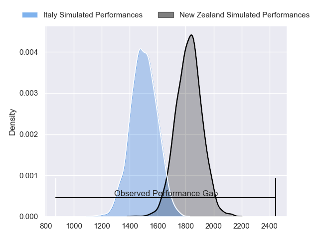
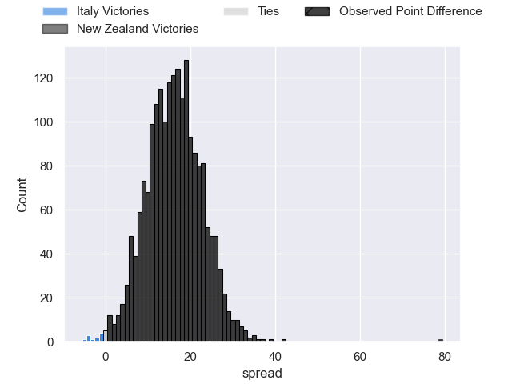
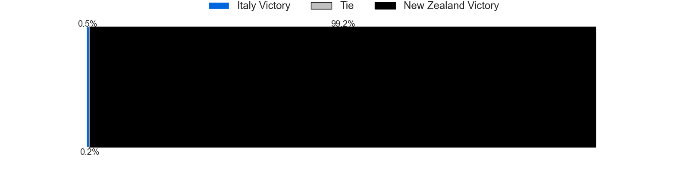
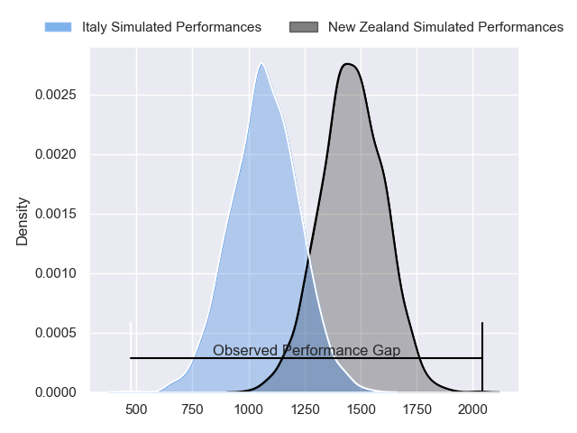
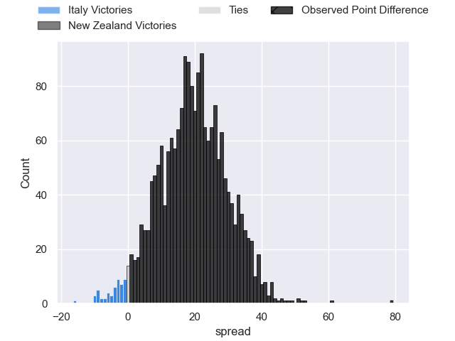
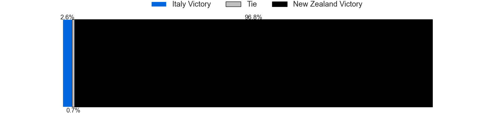
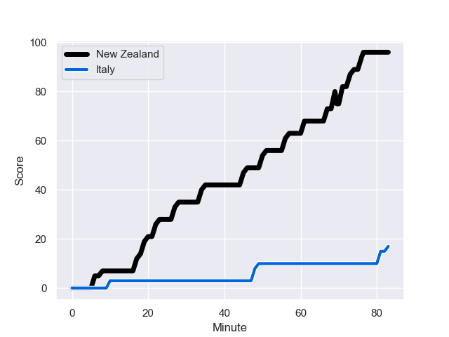
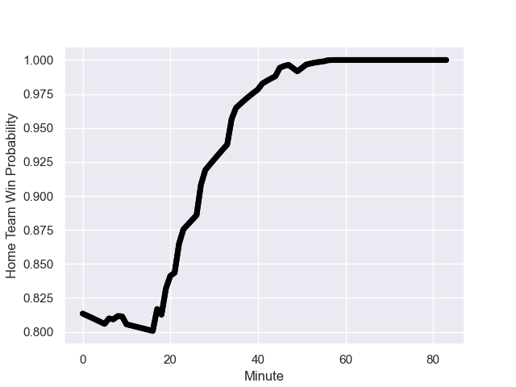

---  
layout: page  
title: Italy at New Zealand; 17.0-96.0  
date: 2023-09-29 18:00:00 -0500  
categories: match review  
---
# Italy at New Zealand; 17.0-96.0

# Club Level Predictions

The first set of predictions treats a club as the smallest object, as the club develops its members, organizes a gameplan, and deploys its players as needed for each match. This club model has a prediction of 0.855, which translates to predicting New Zealand to win by 16.1.

Each club has a rating and a rating deviation (simiar to a Glicko system), and expected performances can be generated. This allows for simulated matches and spreads like the ones below.
## Projected Performances - Club Model

## Projected Spreads - Club Model

## Projected Results - Club Model

# Player Level Predictions - Version 2

Treating teams instead as an entity made up of the currently active players, I have ratings for each player in an altogether different system. These can be combined to form team ratings once teamsheets are announced, weighting starters a bit higher than the reserves. After the match is played, players can be weighted by their minutes on the field, allowing for an accurate measure of the team's composition. With these compiled team ratings, we can make predictions, measure inaccuracy, and update the individual player ratings.
## Prediction with Player Minutes: New Zealand by 16.1

New Zealand by 16.1 on a neutral field
## Prediction without Player Minutes: New Zealand by 17.3

New Zealand by 17.3 on a neutral pitch

## Projected Performances - Player Model

## Projected Spreads - Player Model

## Projected Results - Player Model

## Scores over Time

## Win Probability over Time

|   Away Minutes | Away Player       |   Away elo |   Number |   Home elo | Home Player         |   Home Minutes |
|---------------:|:------------------|-----------:|---------:|-----------:|:--------------------|---------------:|
|             18 | Danilo Fischetti  |      40.38 |        1 |      98.09 | Ofa Tu'ungafasi     |             49 |
|             50 | Giacomo Nicotera  |      92.3  |        2 |     103.43 | Codie Taylor        |             57 |
|             54 | Marco Riccioni    |      43.58 |        3 |      84.7  | Nepo Laulala        |             49 |
|             41 | Dino Lamb         |      70.38 |        4 |     135.1  | Brodie Retallick    |             77 |
|             83 | Federico Ruzza    |      98.25 |        5 |      97.95 | Scott Barrett       |             83 |
|             50 | Sebastian Negri   |      60.14 |        6 |      56.05 | Shannon Frizell     |             49 |
|             65 | Michele Lamaro    |      90.68 |        7 |     109.7  | Dalton Papalii      |             57 |
|             83 | Lorenzo Cannone   |      79.32 |        8 |     102.29 | Ardie Savea         |             83 |
|             49 | Stephen Varney    |      33.09 |        9 |     103.41 | Aaron Smith         |             49 |
|             83 | Paolo Garbisi     |      58.77 |       10 |     118.97 | Richie Mo'unga      |             64 |
|             83 | Monty Ioane       |      98.34 |       11 |      95.49 | Mark Telea          |             83 |
|             83 | Luca Morisi       |      86.13 |       12 |      79.09 | Jordie Barrett      |             64 |
|             83 | Juan Ignacio Brex |      88.89 |       13 |      56.43 | Rieko Ioane         |             83 |
|             83 | Ange Capuozzo     |      85.12 |       14 |     101.26 | Will Jordan         |             83 |
|             61 | Tommaso Allan     |      49.34 |       15 |     143.28 | Beauden Barrett     |             83 |
|             33 | Hame Faiva        |      17.59 |       16 |     121.14 | Dane Coles          |             26 |
|             65 | Ivan Nemer        |      63.01 |       17 |      60.88 | Tamaiti Williams    |             34 |
|             29 | Simone Ferrari    |      87.69 |       18 |      67.11 | Tyrel Lomax         |             34 |
|             42 | Niccolo Cannone   |      40.83 |       19 |     141.69 | Samuel Whitelock    |             34 |
|             33 | Manuel Zuliani    |      50.85 |       20 |     105.52 | Sam Cane            |             26 |
|             18 | Toa Halafihi      |      74.27 |       21 |      40.28 | Cam Roigard         |             34 |
|             34 | Martin Page-Relo  |      59.17 |       22 |     102.52 | Damian McKenzie     |             19 |
|             22 | Paolo Odogwu      |      67.11 |       23 |      75.52 | Anton Lienert-Brown |             19 |

