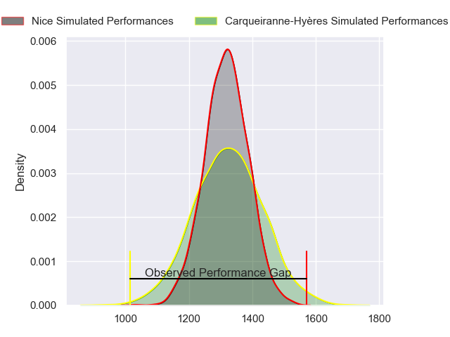
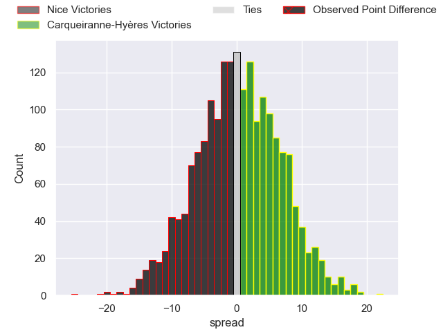
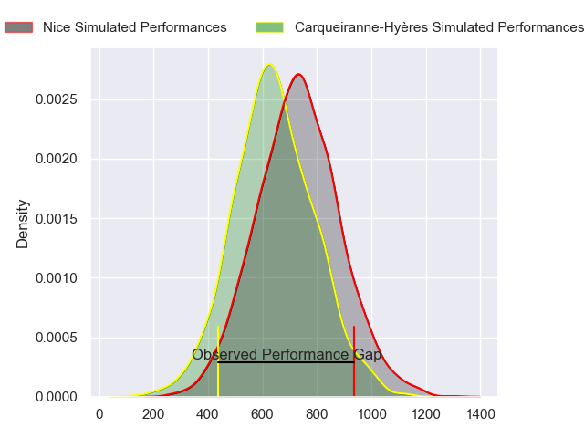
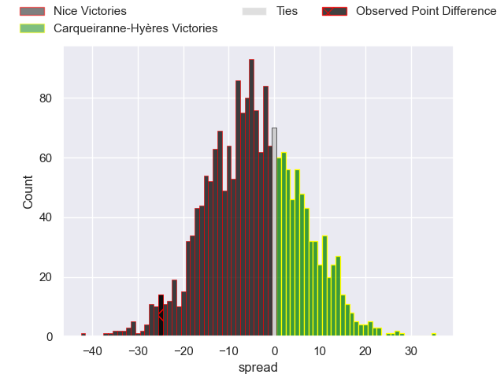
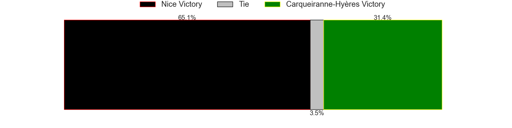
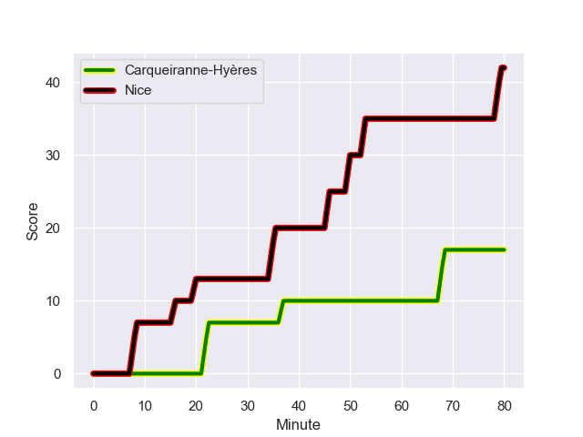
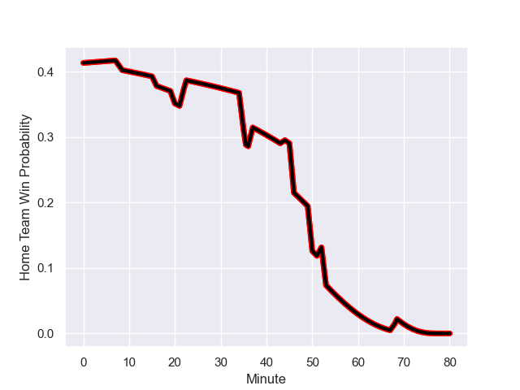

---  
layout: page  
title: Nice at Carqueiranne-Hyères; 42.0-17.0  
date: 2023-09-30 18:00:00 -0500  
categories: match review  
---
# Nice at Carqueiranne-Hyères; 42.0-17.0

# Club Level Predictions

The first set of predictions treats a club as the smallest object, as the club develops its members, organizes a gameplan, and deploys its players as needed for each match. This club model has a prediction of 0.517, which translates to predicting Carqueiranne-Hyères to win by 0.6.

Each club has a rating and a rating deviation (simiar to a Glicko system), and expected performances can be generated. This allows for simulated matches and spreads like the ones below.
## Projected Performances - Club Model

## Projected Spreads - Club Model

## Projected Results - Club Model

# Player Level Predictions - Version 2

Treating teams instead as an entity made up of the currently active players, I have ratings for each player in an altogether different system. These can be combined to form team ratings once teamsheets are announced, weighting starters a bit higher than the reserves. After the match is played, players can be weighted by their minutes on the field, allowing for an accurate measure of the team's composition. With these compiled team ratings, we can make predictions, measure inaccuracy, and update the individual player ratings.
## Prediction with Player Minutes: Nice by 3.8

Nice by 6.9 on a neutral field
## Prediction without Player Minutes: Nice by 4.1

Nice by 7.2 on a neutral pitch

## Projected Performances - Player Model

## Projected Spreads - Player Model

## Projected Results - Player Model

## Scores over Time

## Win Probability over Time

There were 6 large changes in win probability in this match

|   Away Minutes | Away Player               |   Away elo |   Number |   Home elo | Home Player          |   Home Minutes |
|---------------:|:--------------------------|-----------:|---------:|-----------:|:---------------------|---------------:|
|             52 | Jules Martinez            |      30.01 |        1 |      46.26 | Sti Sithole          |             44 |
|             58 | Pierre Strippoli          |      38.8  |        2 |      27.01 | Michael Tyumenev     |             44 |
|             52 | Luvuyo Pupuma             |      22.01 |        3 |      39.39 | Miguel Mathieu       |             44 |
|             58 | Tom Murday                |     105.11 |        4 |      25.25 | Adam Peters          |             63 |
|             60 | Adrien Vigne              |      53.61 |        5 |      26.2  | Nathan Gendre        |             80 |
|             80 | Arthur Vignolles          |      46.45 |        6 |      48.74 | Florian Munoz Rivero |             80 |
|             80 | Louis Suaud               |      59.43 |        7 |      51.63 | Joachim Beaumont     |             63 |
|             80 | Ramiha Tarrel Tia Smiler  |      46.65 |        8 |      33.27 | Nicolas Baquer       |             80 |
|             65 | Corentin Penc'hoat        |      46.54 |        9 |      32.04 | Rémi Dubié           |             58 |
|             60 | Mathis Viard              |      56.62 |       10 |      36.32 | Juan Kotze           |             80 |
|             80 | Andrzej Charlat           |      55.29 |       11 |      46.06 | Paul Gadea           |             80 |
|             80 | Romain Riguet             |      39.74 |       12 |      49.44 | Romain Leveque       |             58 |
|             80 | Nathan Courtade           |      40.37 |       13 |      33.59 | Dylan Sage           |             52 |
|             80 | Simon Delas               |      37.75 |       14 |      25.35 | Vincent Alessi       |             80 |
|             60 | David Odiete              |      56.68 |       15 |      37.66 | Théo Defrance        |             80 |
|             28 | Nicolas Ciancio           |      45.16 |       16 |      44.31 | Ferdinand Changel    |             36 |
|             22 | Santiago Benjamin Ovejero |      41.69 |       17 |      40.57 | Yan Tabarot          |             36 |
|             28 | Julien Beaufils           |      43.81 |       18 |      48.31 | Lasha Mchelidze      |             36 |
|             22 | Yann Tivoli               |      58.64 |       19 |      13.74 | Lucas Cazac          |             17 |
|             20 | Martin Freytes            |      58.02 |       20 |      31.97 | Spike Salman         |             17 |
|             15 | Jules Solinas             |      39.05 |       21 |      56.24 | Thomas Sonetti       |             22 |
|             20 | Laijiasa Bolenaivalu      |      70.88 |       22 |      44.04 | Enzo Miot            |             22 |
|             20 | Pierre Le Huby            |      33.88 |       23 |      32.71 | Charles Brousse      |             28 |

