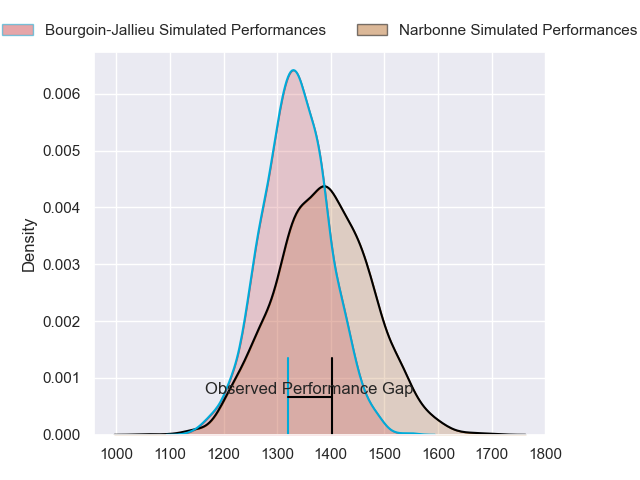
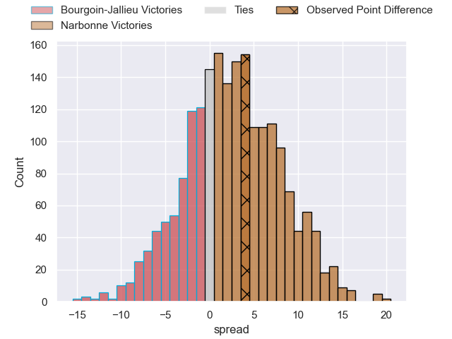
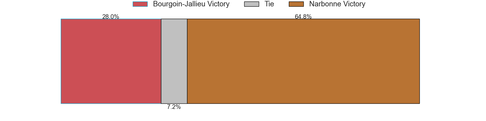
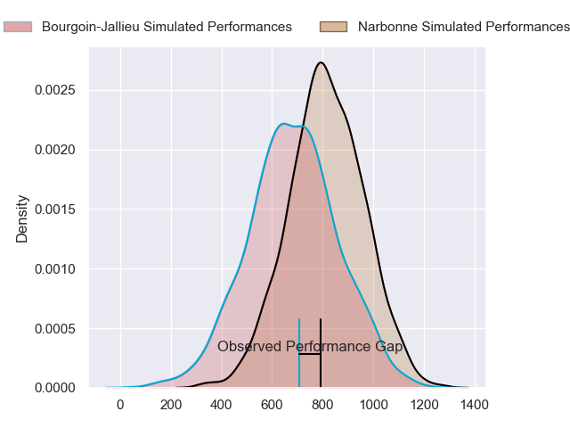
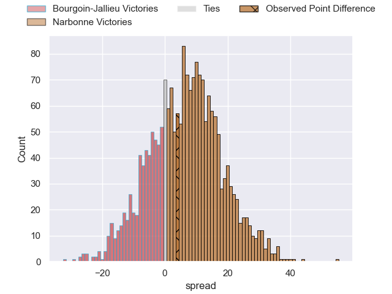
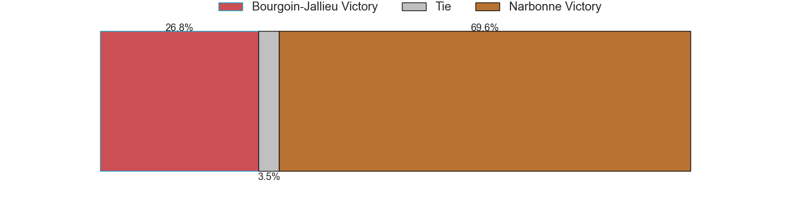
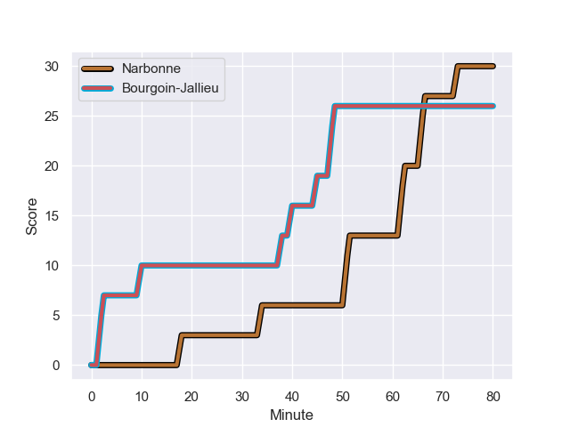
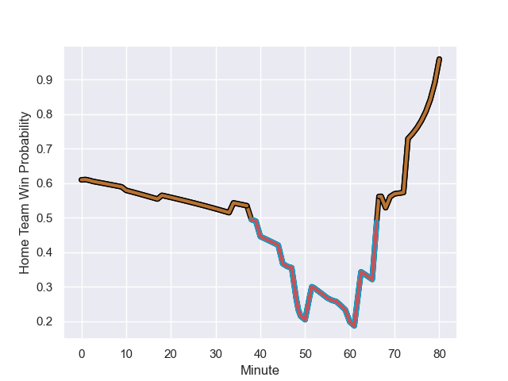

---  
layout: page  
title: Bourgoin-Jallieu at Narbonne; 26.0-30.0  
date: 2023-09-30 18:00:00 -0500  
categories: match review  
---
# Bourgoin-Jallieu at Narbonne; 26.0-30.0

# Club Level Predictions

The first set of predictions treats a club as the smallest object, as the club develops its members, organizes a gameplan, and deploys its players as needed for each match. This club model has a prediction of 0.578, which translates to predicting Narbonne to win by 2.8.

Each club has a rating and a rating deviation (simiar to a Glicko system), and expected performances can be generated. This allows for simulated matches and spreads like the ones below.
## Projected Performances - Club Model

## Projected Spreads - Club Model

## Projected Results - Club Model

# Player Level Predictions - Version 2

Treating teams instead as an entity made up of the currently active players, I have ratings for each player in an altogether different system. These can be combined to form team ratings once teamsheets are announced, weighting starters a bit higher than the reserves. After the match is played, players can be weighted by their minutes on the field, allowing for an accurate measure of the team's composition. With these compiled team ratings, we can make predictions, measure inaccuracy, and update the individual player ratings.
## Prediction with Player Minutes: Narbonne by 5.0

Narbonne by 0.4 on a neutral field
## Prediction without Player Minutes: Narbonne by 6.2

Narbonne by 1.7 on a neutral pitch

## Projected Performances - Player Model

## Projected Spreads - Player Model

## Projected Results - Player Model

## Scores over Time

## Win Probability over Time

There were 20 large changes in win probability in this match

|   Away Minutes | Away Player              |   Away elo |   Number |   Home elo | Home Player            |   Home Minutes |
|---------------:|:-------------------------|-----------:|---------:|-----------:|:-----------------------|---------------:|
|              1 | Rémy Gaborit             |      48.09 |        1 |      52.06 | Théo Castinel          |             52 |
|             80 | Mohamed Khribache        |      31.57 |        2 |      46.26 | Gabriel Atlan          |             47 |
|             79 | Osman Dimen              |      49.13 |        3 |      47.13 | Levi Tikoipau          |             59 |
|             80 | Robin Gascou             |      44.19 |        4 |      53.44 | Marius Antonescu       |             80 |
|             56 | Léandre Cotte            |       5.53 |        5 |      30.97 | Dennis Visser          |             57 |
|             61 | Theophile Cotte          |      41.53 |        6 |      49.68 | Thibault Clauzade      |             80 |
|             80 | Bynjamin Rabatel         |      63.37 |        7 |      41.04 | Baptiste Abescat-Leroy |             68 |
|             80 | Poutasi Luafutu          |      47.03 |        8 |      18.78 | Charles Malet          |             80 |
|             80 | Tomas Munilla lo Duca    |      61.58 |        9 |      78.52 | Josh Valentine         |             49 |
|             80 | Nicolas Vuillemin        |      60.33 |       10 |      46.27 | Tom Chauvet            |             80 |
|             70 | Hugo Desgrange           |      46.65 |       11 |      26.68 | Sébastien Giorgis      |             80 |
|             69 | Isaiah Leota             |      56.06 |       12 |     112.61 | Peter Betham           |             60 |
|             80 | Gaby Lovobalavu          |      49.85 |       13 |      30.31 | Ambrose Curtis         |             52 |
|             80 | Paul-Hugo Champ          |      46.15 |       14 |      39.64 | Pierre-Hugo Ducom      |             80 |
|             80 | Nicolas Cachet           |      44.47 |       15 |      50.03 | Paul Auradou           |             80 |
|             79 | Romain Favaretto         |      46.33 |       16 |      33.96 | Sylvain Abadie         |             28 |
|              1 | Oktay Yilmaz             |      49.25 |       17 |      44.67 | Avto Gogiashvili       |             21 |
|             24 | Morgan Eames             |      -5.54 |       18 |      56.15 | Mehdi Boundjema        |             33 |
|             19 | Kevin Rivoire            |      66.12 |       19 |      50.54 | Mauro Rebussone        |             23 |
|             10 | Quentin Lefort           |      23.27 |       20 |      38.57 | Bill Caffo             |             12 |
|             11 | Brieuc Plessis-Couillaud |      37.3  |       21 |      34.53 | Étienne Ducom          |             20 |
|            nan | nan                      |     nan    |       22 |      51.52 | Pierre Nueno           |             28 |
|            nan | nan                      |     nan    |       23 |      46.05 | Pablo Barbaste         |             31 |

