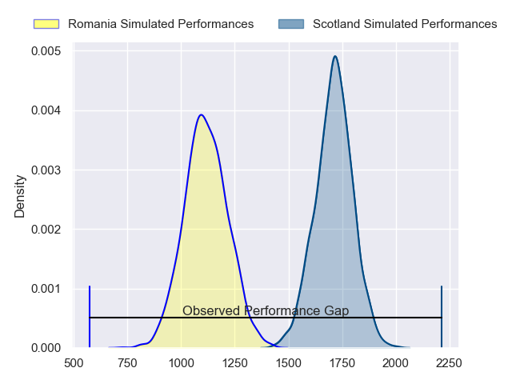
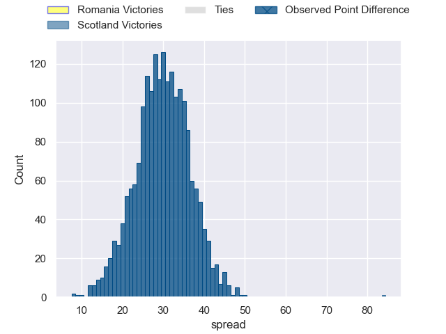
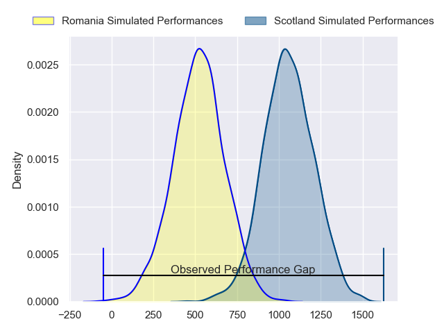
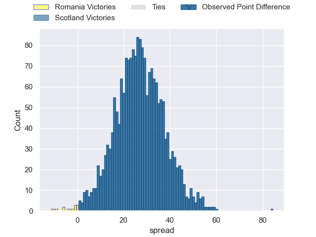
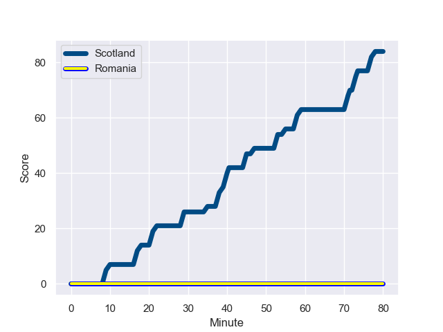
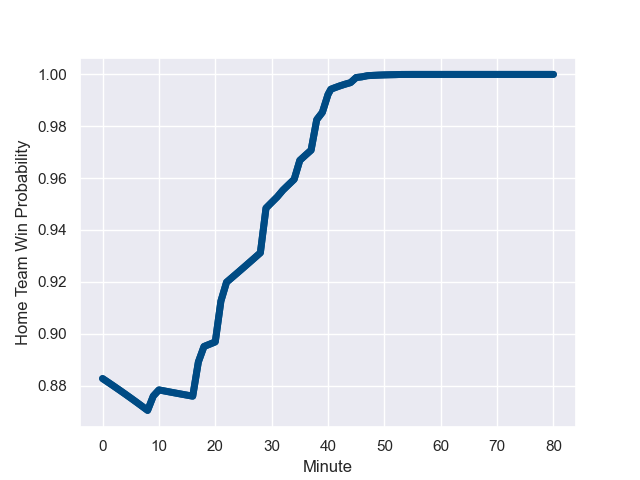

---  
layout: page  
title: Romania at Scotland; 0.0-84.0  
date: 2023-09-30 18:00:00 -0500  
categories: match review  
---
# Romania at Scotland; 0.0-84.0

# Club Level Predictions

The first set of predictions treats a club as the smallest object, as the club develops its members, organizes a gameplan, and deploys its players as needed for each match. This club model has a prediction of 0.963, which translates to predicting Scotland to win by 29.7.

Each club has a rating and a rating deviation (simiar to a Glicko system), and expected performances can be generated. This allows for simulated matches and spreads like the ones below.
## Projected Performances - Club Model

## Projected Spreads - Club Model

## Projected Results - Club Model

# Player Level Predictions - Version 2

Treating teams instead as an entity made up of the currently active players, I have ratings for each player in an altogether different system. These can be combined to form team ratings once teamsheets are announced, weighting starters a bit higher than the reserves. After the match is played, players can be weighted by their minutes on the field, allowing for an accurate measure of the team's composition. With these compiled team ratings, we can make predictions, measure inaccuracy, and update the individual player ratings.
## Prediction with Player Minutes: Scotland by 22.1

Scotland by 22.1 on a neutral field
## Prediction without Player Minutes: Scotland by 21.3

Scotland by 21.3 on a neutral pitch

## Projected Performances - Player Model

## Projected Spreads - Player Model

## Projected Results - Player Model

## Scores over Time

## Win Probability over Time

|   Away Minutes | Away Player       |   Away elo |   Number |   Home elo | Home Player     |   Home Minutes |
|---------------:|:------------------|-----------:|---------:|-----------:|:----------------|---------------:|
|             51 | Alexandru Savin   |      36.09 |        1 |      82.77 | Jamie Bhatti    |             59 |
|             59 | Rob Irimescu      |      46.65 |        2 |      39.08 | Ewan Ashman     |             59 |
|             57 | Gheorghe Gajion   |      70.12 |        3 |      40.77 | Javan Sebastian |             59 |
|             80 | Adrian Motoc      |       7.09 |        4 |      74.55 | Sam Skinner     |             80 |
|             61 | Stefan Iancu      |      26.71 |        5 |      97.76 | Grant Gilchrist |             59 |
|             80 | Florian Rosu      |      43.91 |        6 |      71.09 | Luke Crosbie    |             80 |
|             80 | Dragos Ser        |      20.26 |        7 |      49.02 | Hamish Watson   |             65 |
|             39 | Cristian Chirica  |      26.74 |        8 |      99.93 | Matt Fagerson   |             80 |
|             53 | Gabriel Rupanu    |      45.41 |        9 |      70.49 | Ali Price       |             55 |
|             53 | Alin Conache      |      39.62 |       10 |      48.34 | Ben Healy       |             80 |
|             80 | Taliauli Sikuea   |      46.65 |       11 |     100.17 | Kyle Steyn      |             80 |
|             57 | Fonovai Tangimana |      46.65 |       12 |      52.14 | Cameron Redpath |             80 |
|             80 | Jason Tomane      |      32.13 |       13 |      69.14 | Chris Harris    |             65 |
|             80 | Sioeli Lama       |      31.86 |       14 |      49.95 | Darcy Graham    |             80 |
|             80 | Marius Simionescu |       8.12 |       15 |      76.11 | Ollie Smith     |             59 |
|             29 | Florin Bardasu    |      42.98 |       16 |      46.65 | Johnny Matthews |             21 |
|             29 | Iulian Hartig     |      37.74 |       17 |      48.61 | Rory Sutherland |             21 |
|             23 | Costel Burtila    |      48.39 |       18 |      93.97 | WP Nel          |             21 |
|             19 | Marius Iftimiciuc |      25.84 |       19 |     104.55 | Scott Cummings  |             21 |
|             41 | Damian Stratila   |      52.84 |       20 |      59.98 | Rory Darge      |             15 |
|             19 | Florin Surugiu    |      -1.5  |       21 |     126.32 | George Horne    |             25 |
|             27 | Tudor Boldor      |      39.28 |       22 |     129.34 | Blair Kinghorn  |             21 |
|             23 | Nicolas Onutu     |      45.33 |       23 |      41.22 | Huw Jones       |             15 |

