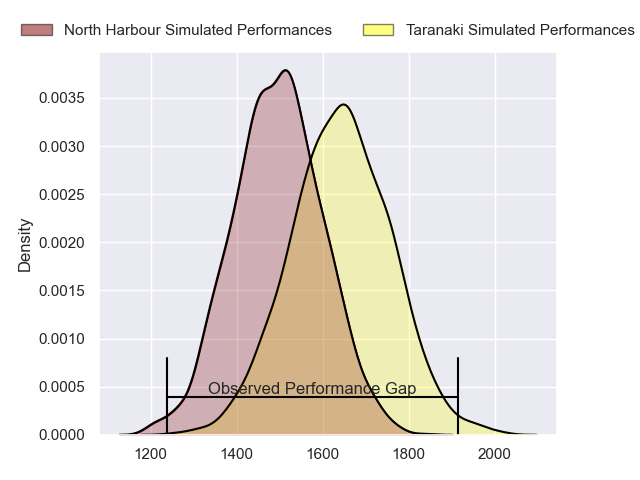
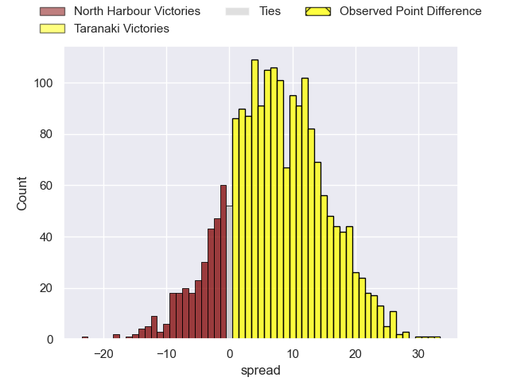
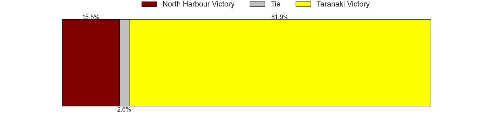
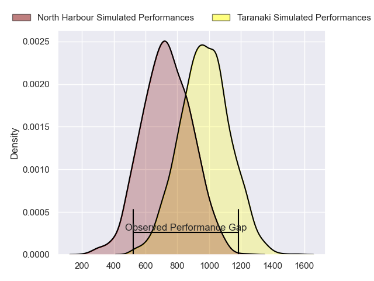
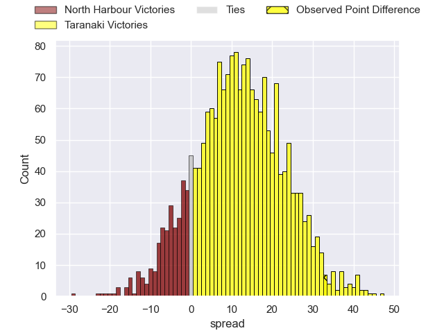
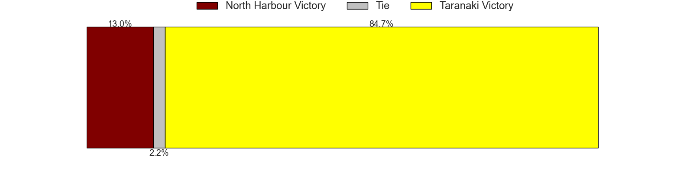
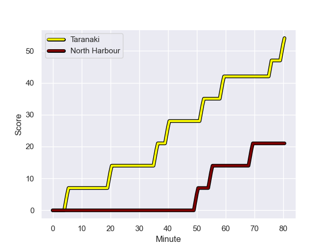
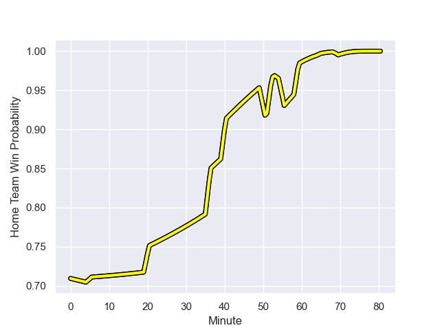

---  
layout: page  
title: North Harbour at Taranaki; 21.0-54.0  
date: 2023-09-30 18:00:00 -0500  
categories: match review  
---
# North Harbour at Taranaki; 21.0-54.0

# Club Level Predictions

The first set of predictions treats a club as the smallest object, as the club develops its members, organizes a gameplan, and deploys its players as needed for each match. This club model has a prediction of 0.686, which translates to predicting Taranaki to win by 7.1.

Each club has a rating and a rating deviation (simiar to a Glicko system), and expected performances can be generated. This allows for simulated matches and spreads like the ones below.
## Projected Performances - Club Model

## Projected Spreads - Club Model

## Projected Results - Club Model

# Player Level Predictions - Version 2

Treating teams instead as an entity made up of the currently active players, I have ratings for each player in an altogether different system. These can be combined to form team ratings once teamsheets are announced, weighting starters a bit higher than the reserves. After the match is played, players can be weighted by their minutes on the field, allowing for an accurate measure of the team's composition. With these compiled team ratings, we can make predictions, measure inaccuracy, and update the individual player ratings.
## Prediction with Player Minutes: Taranaki by 9.8

Taranaki by 6.4 on a neutral field
## Prediction without Player Minutes: Taranaki by 10.6

Taranaki by 7.2 on a neutral pitch

## Projected Performances - Player Model

## Projected Spreads - Player Model

## Projected Results - Player Model

## Scores over Time

## Win Probability over Time

There were 4 large changes in win probability in this match

|   Away Minutes | Away Player       |   Away elo |   Number |   Home elo | Home Player                   |   Home Minutes |
|---------------:|:------------------|-----------:|---------:|-----------:|:------------------------------|---------------:|
|             65 | Tevita Mafileo    |      60.03 |        1 |      38.58 | Jared Proffit                 |             54 |
|             65 | Shilo Klein       |      45.65 |        2 |      56.83 | Bradley Slater                |             54 |
|             60 | Sione Mafileo     |      72.95 |        3 |     102.95 | Michael Bent                  |             54 |
|             54 | James Fiebig      |      46.56 |        4 |      89.21 | Tom Franklin                  |             56 |
|             80 | Mahroni Ngakuru   |      12.69 |        5 |      30.04 | Heiden Bedwell-Curtis         |             80 |
|             60 | Tamarau McGahan   |      52.05 |        6 |      83.96 | Pita Gus Sowakula             |             80 |
|             80 | Jed Melvin        |      55.08 |        7 |      38.58 | Michael Loft                  |             80 |
|             65 | Cameron Suafoa    |      46.73 |        8 |      43.95 | Kaylum Boshier                |             61 |
|             61 | Jamie Booth       |      12.54 |        9 |      40.23 | Adam Lennox                   |             61 |
|             80 | Bryn Gatland      |      77.73 |       10 |      53.36 | Josh Jacomb                   |             80 |
|             80 | Moses Leo         |      50.06 |       11 |      85.44 | Kini Naholo                   |             61 |
|             57 | Henry Taefu       |      25.81 |       12 |      44.63 | Matt McKenzie                 |             56 |
|             80 | Tom Barham        |      41.11 |       13 |      57.87 | Meihana Grindlay              |             80 |
|             80 | Kade Banks        |      45.13 |       14 |      48.1  | Willem Ratu                   |             80 |
|             80 | Shaun Stevenson   |      82.97 |       15 |     101.25 | Jacob Ratumaitavuki-Kneepkens |             80 |
|             15 | Tevita Langi      |      41.5  |       16 |       6.72 | Donald Brighouse              |             26 |
|             15 | Bryn Gordon       |      46.56 |       17 |      50.12 | Ricky Riccitelli              |             26 |
|             20 | Sam Davies        |      36.02 |       18 |      49.15 | Mitch O'Neill                 |             26 |
|             26 | Wallace Sititi    |      38.84 |       19 |      47.58 | Fiti Sa                       |             24 |
|             20 | Ben Grant         |      82.58 |       20 |      54.97 | Millennium Sanerivi           |             19 |
|             15 | Karl Ruzich       |      43.03 |       21 |      66.19 | Liam Blyde                    |             19 |
|             19 | Siaosi Nginingini |      48.03 |       22 |     100.67 | Jayson Potroz                 |             24 |
|             23 | Sofai Maka        |      46.65 |       23 |      46.65 | Brad Kooman                   |             19 |

