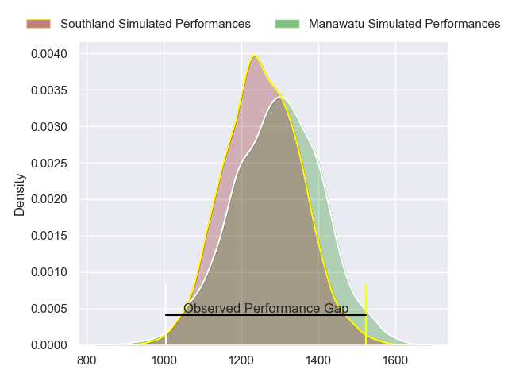
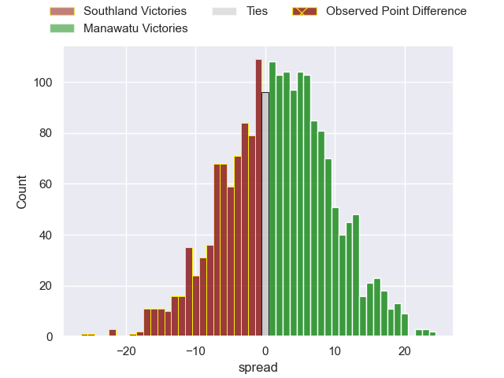
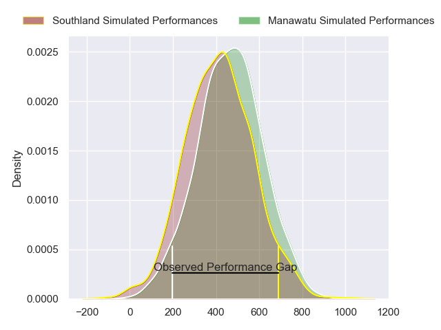
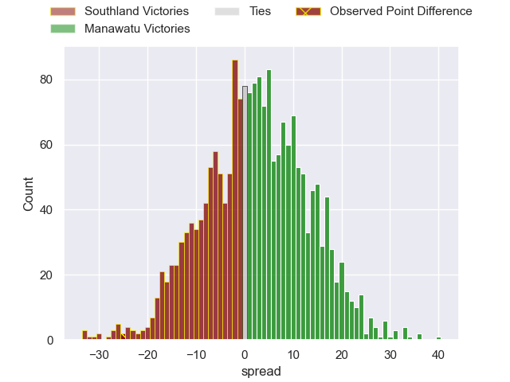
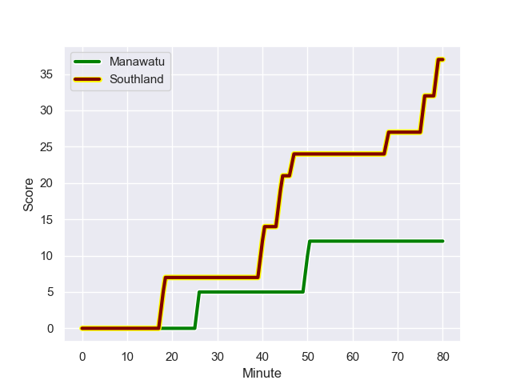
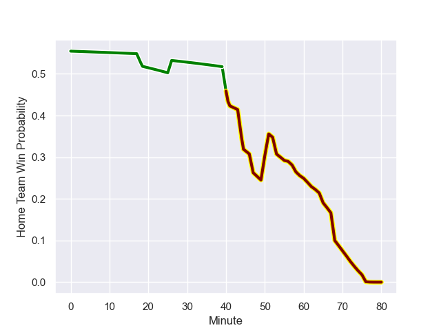

---  
layout: page  
title: Southland at Manawatu; 37.0-12.0  
date: 2023-10-01 18:00:00 -0500  
categories: match review  
---
# Southland at Manawatu; 37.0-12.0

# Club Level Predictions

The first set of predictions treats a club as the smallest object, as the club develops its members, organizes a gameplan, and deploys its players as needed for each match. This club model has a prediction of 0.551, which translates to predicting Manawatu to win by 1.9.

Each club has a rating and a rating deviation (simiar to a Glicko system), and expected performances can be generated. This allows for simulated matches and spreads like the ones below.
## Projected Performances - Club Model

## Projected Spreads - Club Model

## Projected Results - Club Model

# Player Level Predictions - Version 2

Treating teams instead as an entity made up of the currently active players, I have ratings for each player in an altogether different system. These can be combined to form team ratings once teamsheets are announced, weighting starters a bit higher than the reserves. After the match is played, players can be weighted by their minutes on the field, allowing for an accurate measure of the team's composition. With these compiled team ratings, we can make predictions, measure inaccuracy, and update the individual player ratings.
## Prediction with Player Minutes: Manawatu by 2.4

Southland by 0.9 on a neutral field
## Prediction without Player Minutes: Manawatu by 2.6

Southland by 0.8 on a neutral pitch

## Projected Performances - Player Model

## Projected Spreads - Player Model

## Projected Results - Player Model

## Scores over Time

## Win Probability over Time

There were 10 large changes in win probability in this match

|   Away Minutes | Away Player           |   Away elo |   Number |   Home elo | Home Player         |   Home Minutes |
|---------------:|:----------------------|-----------:|---------:|-----------:|:--------------------|---------------:|
|             65 | Jack Sexton           |      45.75 |        1 |      40.99 | Malakai Hala-Ngatai |             58 |
|             56 | Jack Taylor           |      43.26 |        2 |      35.59 | AJ Quattrin         |             25 |
|             65 | Morgan Mitchell       |     -10    |        3 |      17.81 | Flyn Yates          |             58 |
|             80 | Mike McKee            |     -13.25 |        4 |      17.2  | Stan van den Hoven  |             60 |
|             56 | Josh Bekhuis          |       0.71 |        5 |      10.64 | Johannes Momsen     |             63 |
|             80 | Blair Ryall           |      32.65 |        6 |       1.54 | TK Howden           |             80 |
|             80 | Leroy Ferguson        |      43.36 |        7 |      63.33 | Slade McDowall      |             80 |
|             51 | Jacob Henry Coghlan   |      46.19 |        8 |      -6.27 | Brayden Iose        |             80 |
|             78 | Jay Renton            |       4.71 |        9 |      60.47 | John Poland         |             41 |
|             58 | Marty Banks           |      54.62 |       10 |      28    | Brett Cameron       |             80 |
|             80 | Gabriel Hamer-Webb    |      64.74 |       11 |      45.1  | Pena Va'a           |             53 |
|             80 | Matt Whaanga          |      30.73 |       12 |      13.04 | James Tofa          |             80 |
|             72 | Tevita Latu           |      36.91 |       13 |      59.07 | Taniela Filimone    |             80 |
|             80 | Viliami Fine          |      14.26 |       14 |      23.84 | Drew Wild           |             64 |
|             80 | Rory van Vugt         |      -2.5  |       15 |     -19.08 | Beaudein Waaka      |             80 |
|             15 | Hunter Fahey          |      43.01 |       16 |      34.06 | Sean Paranihi       |             22 |
|             15 | Hamdahn Tuipulotu     |      47.56 |       17 |      55.89 | Cole Keith          |             22 |
|             24 | Nic Souchon           |      49.18 |       18 |      41.62 | Vernon Bason        |             55 |
|             24 | Danny Drake           |      57.54 |       19 |      26.85 | Johnny Galloway     |             17 |
|             29 | Semisi Tupou Ta’eiloa |      43.74 |       20 |      27.48 | Ofa Tauatevalu      |             20 |
|              2 | Jahvis Wallace        |      43.59 |       21 |      30.22 | Luke Campbell       |             39 |
|             22 | Dan Hollinshead       |      20.25 |       22 |      36.69 | Isaiah Ravula       |             16 |
|              8 | Scott Gregory         |      48.4  |       23 |      23.03 | Jason Emery         |             27 |

