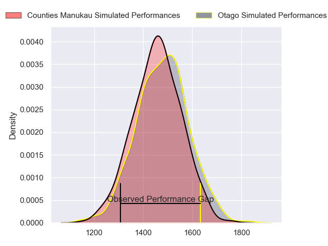
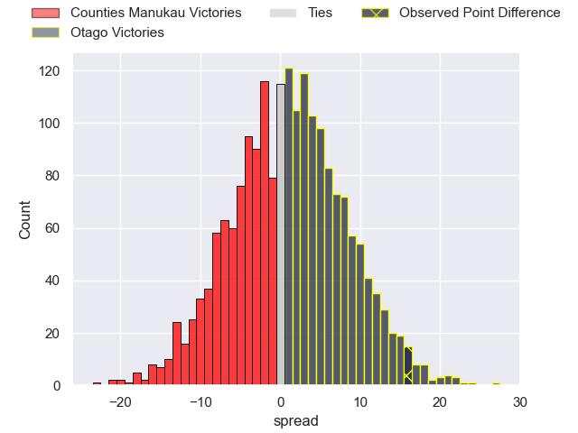
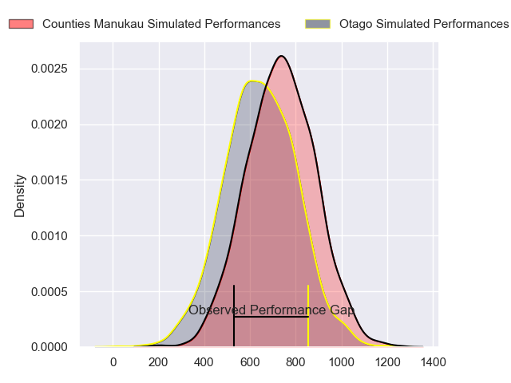
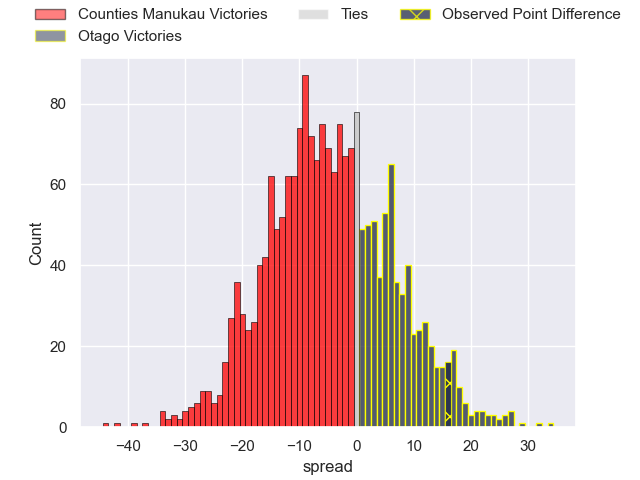
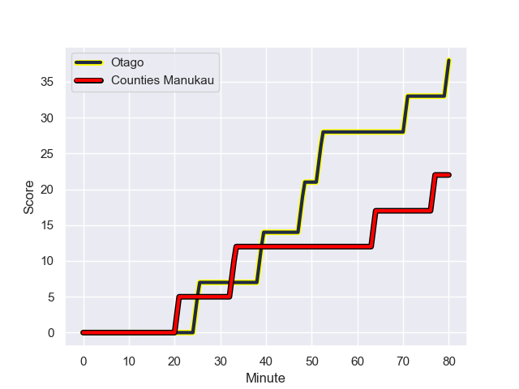
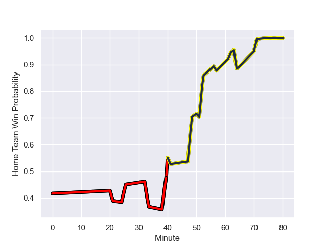

---  
layout: page  
title: Counties Manukau at Otago; 22.0-38.0  
date: 2023-10-01 18:00:00 -0500  
categories: match review  
---
# Counties Manukau at Otago; 22.0-38.0

# Club Level Predictions

The first set of predictions treats a club as the smallest object, as the club develops its members, organizes a gameplan, and deploys its players as needed for each match. This club model has a prediction of 0.536, which translates to predicting Otago to win by 1.3.

Each club has a rating and a rating deviation (simiar to a Glicko system), and expected performances can be generated. This allows for simulated matches and spreads like the ones below.
## Projected Performances - Club Model

## Projected Spreads - Club Model

## Projected Results - Club Model

# Player Level Predictions - Version 2

Treating teams instead as an entity made up of the currently active players, I have ratings for each player in an altogether different system. These can be combined to form team ratings once teamsheets are announced, weighting starters a bit higher than the reserves. After the match is played, players can be weighted by their minutes on the field, allowing for an accurate measure of the team's composition. With these compiled team ratings, we can make predictions, measure inaccuracy, and update the individual player ratings.
## Prediction with Player Minutes: Counties Manukau by 3.7

Counties Manukau by 7.1 on a neutral field
## Prediction without Player Minutes: Counties Manukau by 2.8

Counties Manukau by 6.2 on a neutral pitch

## Projected Performances - Player Model

## Projected Spreads - Player Model

## Projected Results - Player Model

## Scores over Time

## Win Probability over Time

There were 14 large changes in win probability in this match

|   Away Minutes | Away Player         |   Away elo |   Number |   Home elo | Home Player      |   Home Minutes |
|---------------:|:--------------------|-----------:|---------:|-----------:|:-----------------|---------------:|
|             41 | Ezekiel Lindenmuth  |      16.65 |        1 |      45.45 | Abraham Pole     |             47 |
|             40 | Ian West-Stevens    |      50.67 |        2 |      33.88 | Henry Bell       |             57 |
|             55 | Suetena Asomua      |      40.17 |        3 |      34.83 | Jermaine Ainsley |             47 |
|             80 | Jimmy Tupou         |      38.43 |        4 |      13.76 | Will Tucker      |             47 |
|             80 | Jim Thompson        |      53.28 |        5 |      48.71 | Fabian Holland   |             57 |
|             46 | Maama Vaipulu       |      32.7  |        6 |      31.06 | Josh Dickson     |             80 |
|             80 | Sean Reidy          |      81.6  |        7 |      36.33 | Harry Taylor     |             80 |
|             80 | Hoskins Sotutu      |      89.75 |        8 |      60.36 | Samuel Fischli   |             34 |
|             62 | Liam Daniela        |      52.52 |        9 |      41.6  | Nathan Hastie    |             65 |
|             80 | Riley Hohepa        |      36.46 |       10 |      39.51 | Ajay Faleafaga   |             80 |
|             80 | Peniasi Malimali    |      36.51 |       11 |      40.43 | Jeremiah Asi     |             80 |
|             62 | Sione Molia         |      50.76 |       12 |      35.14 | Sam Gilbert      |             80 |
|             80 | Tevita Ofa          |      47.36 |       13 |      27.01 | Josh Whaanga     |             79 |
|             46 | Josh Gray           |      51.86 |       14 |      41.91 | John Tapueluelu  |             80 |
|             80 | Etene Nanai-Seturo  |      40.03 |       15 |      29.32 | Finn Hurley      |             80 |
|             39 | Kauvaka Kaivelata   |      52.59 |       16 |      37.64 | Rohan Wingham    |             33 |
|             25 | Lionel Evans        |      47.72 |       17 |      35.98 | Saula Mau        |             33 |
|             40 | Ioane Moananu       |      50.02 |       18 |      40.99 | Ricky Jackson    |             23 |
|              5 | Adam Brash          |      42.14 |       19 |      70.57 | Tom Sanders      |             33 |
|             29 | William Furniss     |      38.37 |       20 |      36.63 | Josh Hill        |             23 |
|             18 | Cohen Brady-Leathem |      49.29 |       21 |      27.77 | James Arscott    |             15 |
|             18 | Ahsee Tuala         |      54.62 |       22 |      45.47 | Will Stodart     |             46 |
|             34 | Blake Makiri        |      48.36 |       23 |      45.48 | Caleb Leef       |              1 |

