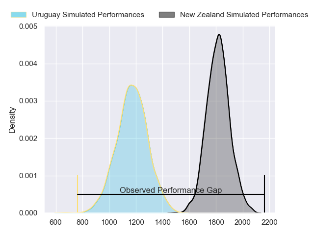
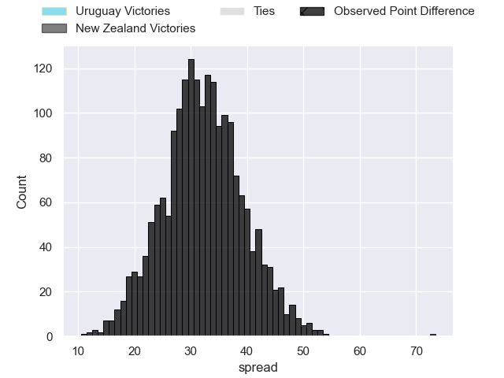
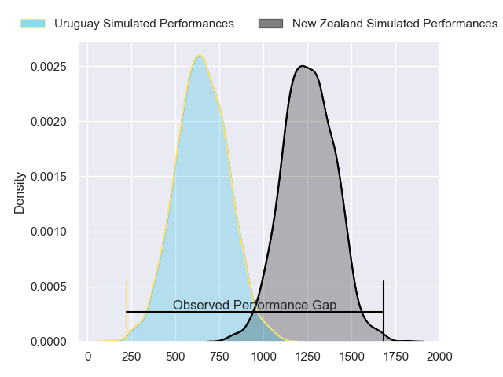
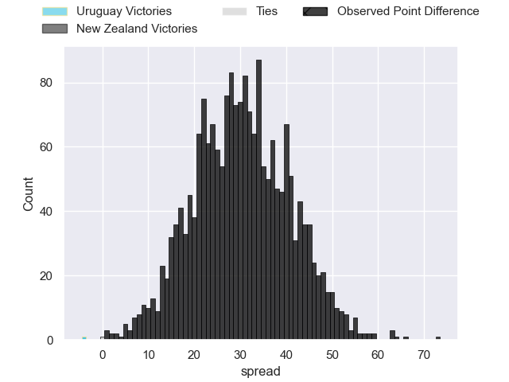
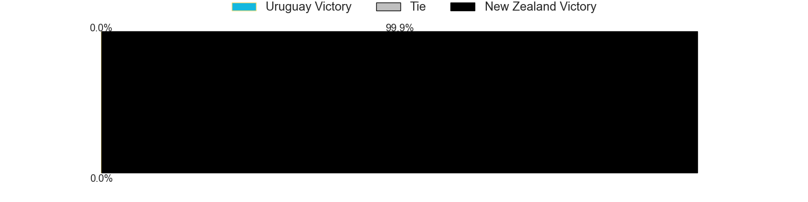
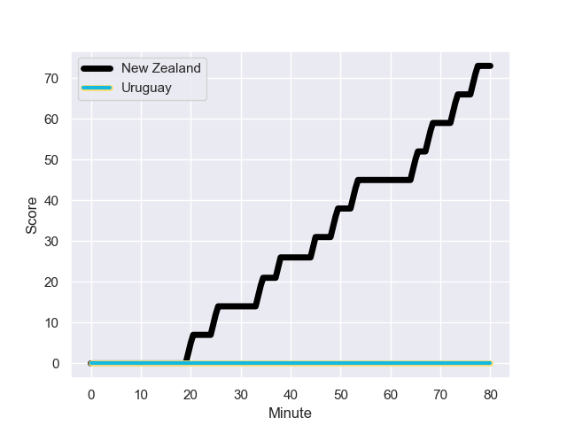
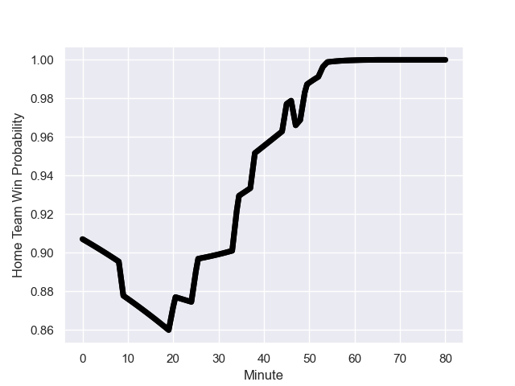

---  
layout: page  
title: Uruguay at New Zealand; 0.0-73.0  
date: 2023-10-05 18:00:00 -0500  
categories: match review  
---
# Uruguay at New Zealand; 0.0-73.0

# Club Level Predictions

The first set of predictions treats a club as the smallest object, as the club develops its members, organizes a gameplan, and deploys its players as needed for each match. This club model has a prediction of 0.971, which translates to predicting New Zealand to win by 32.2.

Each club has a rating and a rating deviation (simiar to a Glicko system), and expected performances can be generated. This allows for simulated matches and spreads like the ones below.
## Projected Performances - Club Model

## Projected Spreads - Club Model

## Projected Results - Club Model

# Player Level Predictions - Version 2

Treating teams instead as an entity made up of the currently active players, I have ratings for each player in an altogether different system. These can be combined to form team ratings once teamsheets are announced, weighting starters a bit higher than the reserves. After the match is played, players can be weighted by their minutes on the field, allowing for an accurate measure of the team's composition. With these compiled team ratings, we can make predictions, measure inaccuracy, and update the individual player ratings.
## Prediction with Player Minutes: New Zealand by 25.0

New Zealand by 25.0 on a neutral field
## Prediction without Player Minutes: New Zealand by 26.6

New Zealand by 26.6 on a neutral pitch

## Projected Performances - Player Model

## Projected Spreads - Player Model

## Projected Results - Player Model

## Scores over Time

## Win Probability over Time

|   Away Minutes | Away Player                |   Away elo |   Number |   Home elo | Home Player            |   Home Minutes |
|---------------:|:---------------------------|-----------:|---------:|-----------:|:-----------------------|---------------:|
|             64 | Mateo Sanguinetti          |      43.97 |        1 |      99.28 | Ofa Tu'ungafasi        |             47 |
|             63 | German Kessler             |      48.38 |        2 |     102.24 | Codie Taylor           |             47 |
|             59 | Diego Arbelo               |      55.44 |        3 |      68.44 | Tyrel Lomax            |              9 |
|             47 | Ignacio Dotti Uria         |       4.48 |        4 |     140.2  | Samuel Whitelock       |             63 |
|             80 | Manuel Leindekar           |      16.43 |        5 |      71.14 | Tupou Vaa'i            |             80 |
|             80 | Manuel Ardao               |      65.59 |        6 |      58.11 | Shannon Frizell        |             54 |
|             80 | Lucas Bianchi              |      70.32 |        7 |     106.52 | Sam Cane               |             80 |
|             55 | Manuel Diana Olaso         |      72.97 |        8 |      78.21 | Luke Jacobson          |             80 |
|             60 | Santiago Arata             |      52.67 |        9 |      42.66 | Cam Roigard            |             54 |
|             50 | Felipe Etcheverry          |      64.5  |       10 |     117.18 | Richie Mo'unga         |             63 |
|             80 | Nicolas Freitas            |      18.27 |       11 |      81.11 | Leicester Fainga'anuku |             80 |
|             80 | Andres Vilaseca            |      17.66 |       12 |      81.51 | Jordie Barrett         |             54 |
|             80 | Tomas Inciarte Rachetti    |      90.68 |       13 |      73.59 | Anton Lienert-Brown    |             80 |
|             59 | Gaston Mieres Valente      |       8.59 |       14 |      99.81 | Will Jordan            |             80 |
|             80 | Rodrigo Silva              |      -8.84 |       15 |     104.46 | Damian McKenzie        |             80 |
|             33 | Juan Manuel Rodriguez      |      55.56 |       16 |      21.33 | Fletcher Newell        |             71 |
|             30 | Felipe Berchesi Pisano     |      22.81 |       17 |      75.23 | Samisoni Taukei'aho    |             33 |
|             25 | Santiago Civetta           |      71.31 |       18 |      62.2  | Tamaiti Williams       |             33 |
|             21 | Ignacio Peculo             |      62.92 |       19 |      55.35 | Finlay Christie        |             26 |
|             21 | Juan Manuel Alonso Dieguez |      47.93 |       20 |      31.51 | Caleb Clarke           |             26 |
|             20 | Agustin Ormaechea          |      33.96 |       21 |     106.02 | Ethan Blackadder       |             26 |
|             17 | Guillermo Pujadas          |      88.15 |       22 |      96.92 | Scott Barrett          |             17 |
|             16 | Matias Benitez Santin      |      87.95 |       23 |     142.78 | Beauden Barrett        |             17 |

