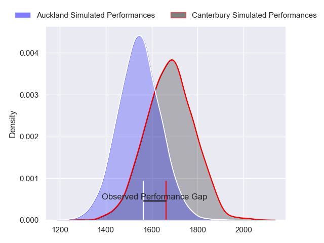
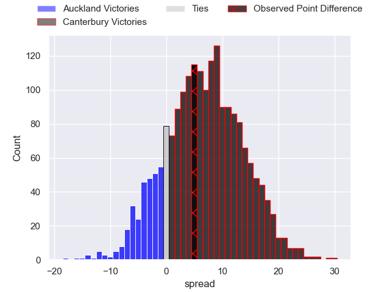
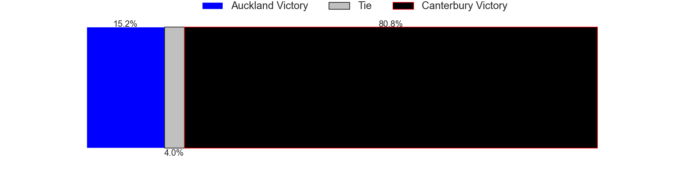
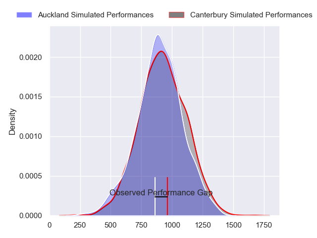
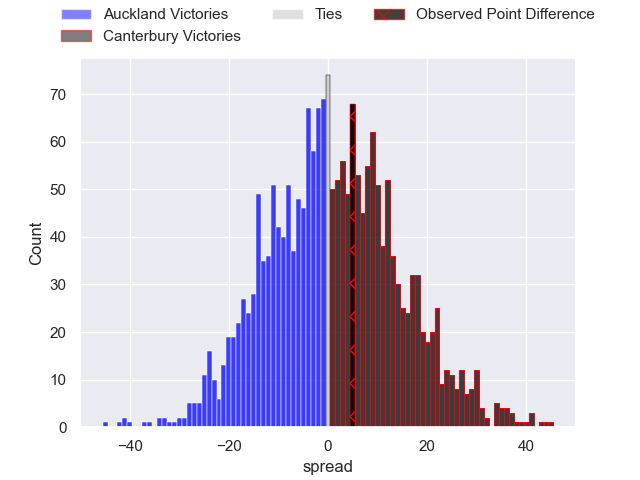

---  
layout: page  
title: Auckland at Canterbury; 24.0-29.0  
date: 2023-10-06 18:00:00 -0500  
categories: match review  
---
# Auckland at Canterbury; 24.0-29.0

# Club Level Predictions

The first set of predictions treats a club as the smallest object, as the club develops its members, organizes a gameplan, and deploys its players as needed for each match. This club model has a prediction of 0.672, which translates to predicting Canterbury to win by 6.5.

Each club has a rating and a rating deviation (simiar to a Glicko system), and expected performances can be generated. This allows for simulated matches and spreads like the ones below.
## Projected Performances - Club Model

## Projected Spreads - Club Model

## Projected Results - Club Model

# Player Level Predictions - Version 2

Treating teams instead as an entity made up of the currently active players, I have ratings for each player in an altogether different system. These can be combined to form team ratings once teamsheets are announced, weighting starters a bit higher than the reserves. After the match is played, players can be weighted by their minutes on the field, allowing for an accurate measure of the team's composition. With these compiled team ratings, we can make predictions, measure inaccuracy, and update the individual player ratings.
## Prediction with Player Minutes: Canterbury by 1.3

Auckland by 2.2 on a neutral field
## Prediction without Player Minutes: Canterbury by 1.3

Auckland by 2.2 on a neutral pitch

## Projected Performances - Player Model

## Projected Spreads - Player Model

## Projected Results - Player Model

|   Away Minutes | Away Player         |   Away elo |   Number |   Home elo | Home Player       |   Home Minutes |
|---------------:|:--------------------|-----------:|---------:|-----------:|:------------------|---------------:|
|             80 | Josh Fusitua        |      54.13 |        1 |      36.68 | Dan Lienert-Brown |             80 |
|             80 | Soane Vikena        |      58.45 |        2 |      47.62 | George Bell       |             80 |
|             80 | Angus Ta'avao       |      84.76 |        3 |      75.49 | Oli Jager         |             80 |
|             80 | Edward Annandale    |      38.04 |        4 |      35.83 | Zach Gallagher    |             80 |
|             80 | Josh Beehre         |      62.15 |        5 |      38.03 | Sam Darry         |             80 |
|             80 | Che Clark           |      44.52 |        6 |      58.83 | Billy Harmon      |             80 |
|             80 | Blake Gibson        |      75.47 |        7 |      73.22 | Tom Christie      |             80 |
|             80 | Vaiolini Ekuasi     |      39.56 |        8 |      75.5  | Cullen Grace      |             80 |
|             80 | Kalani Thomas       |      53.83 |        9 |      83.51 | Mitchell Drummond |             80 |
|             80 | Zarn Sullivan       |      67.9  |       10 |      41.39 | Fergus Burke      |             80 |
|             80 | Salesi Rayasi       |      77.22 |       11 |      74.01 | Solomon Alaimalo  |             80 |
|             80 | Bryce Heem          |     116.29 |       12 |      48.32 | Rameka Poihipi    |             80 |
|             80 | Tanielu Teleʻa      |      31.84 |       13 |      53.15 | Dallas McLeod     |             80 |
|             80 | AJ Lam              |      53.06 |       14 |      49.47 | Manasa Mataele    |             80 |
|             80 | Roger Tuivasa-Sheck |      37.5  |       15 |      51.05 | Chay Fihaki       |             80 |

