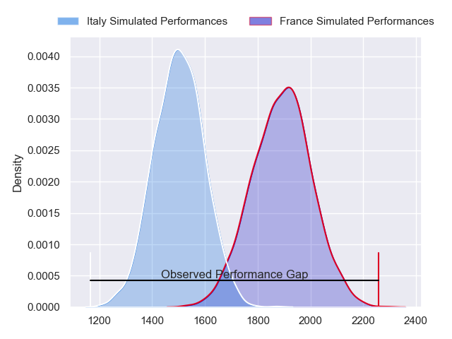
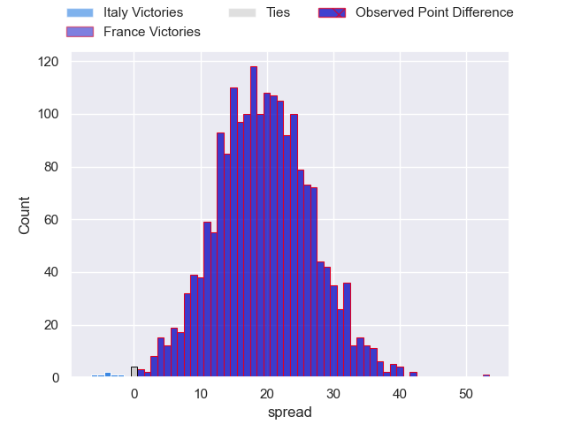
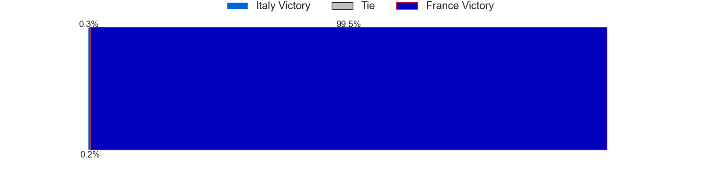
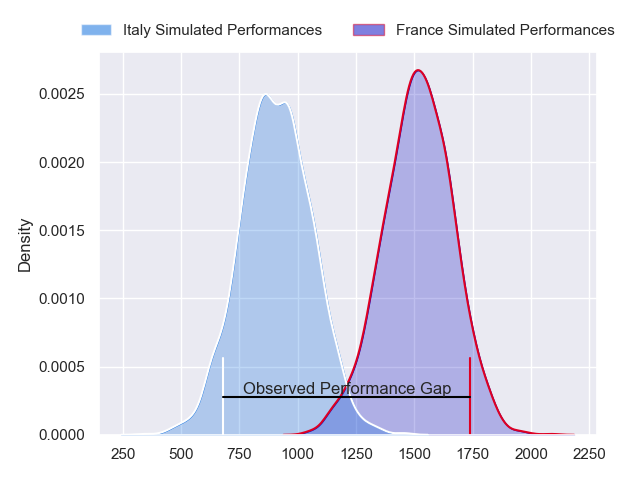
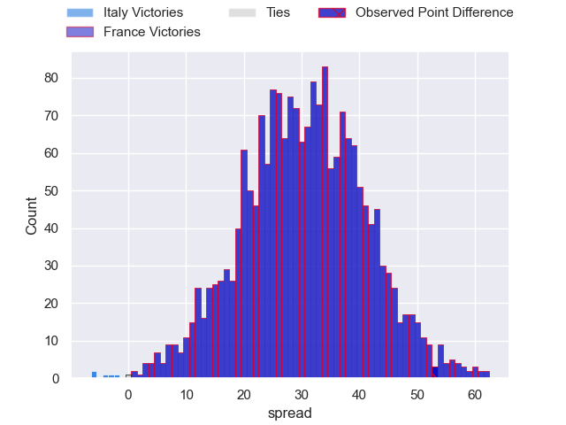
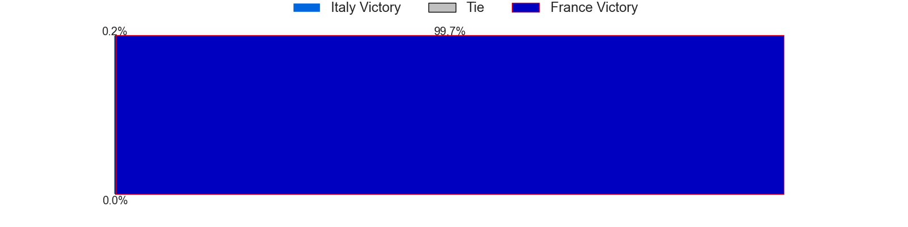
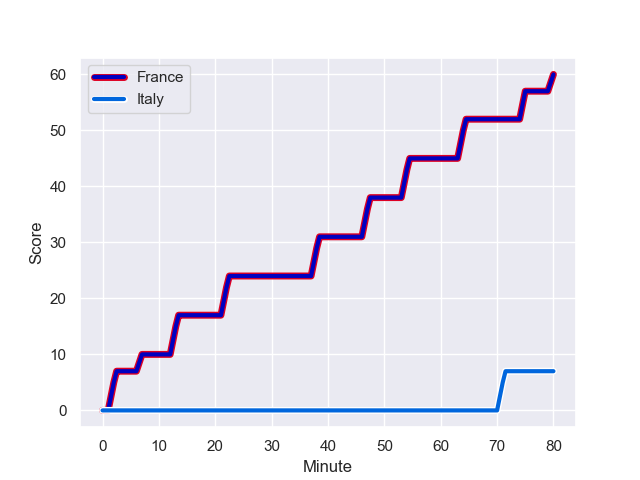
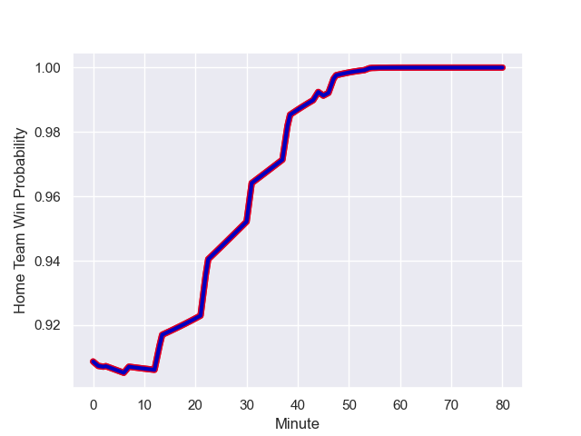

---  
layout: page  
title: Italy at France; 7.0-60.0  
date: 2023-10-06 18:00:00 -0500  
categories: match review  
---
# Italy at France; 7.0-60.0

# Club Level Predictions

The first set of predictions treats a club as the smallest object, as the club develops its members, organizes a gameplan, and deploys its players as needed for each match. This club model has a prediction of 0.893, which translates to predicting France to win by 19.2.

Each club has a rating and a rating deviation (simiar to a Glicko system), and expected performances can be generated. This allows for simulated matches and spreads like the ones below.
## Projected Performances - Club Model

## Projected Spreads - Club Model

## Projected Results - Club Model

# Player Level Predictions - Version 2

Treating teams instead as an entity made up of the currently active players, I have ratings for each player in an altogether different system. These can be combined to form team ratings once teamsheets are announced, weighting starters a bit higher than the reserves. After the match is played, players can be weighted by their minutes on the field, allowing for an accurate measure of the team's composition. With these compiled team ratings, we can make predictions, measure inaccuracy, and update the individual player ratings.
## Prediction with Player Minutes: France by 25.2

France by 21.6 on a neutral field
## Prediction without Player Minutes: France by 25.4

France by 21.8 on a neutral pitch

## Projected Performances - Player Model

## Projected Spreads - Player Model

## Projected Results - Player Model

## Scores over Time

## Win Probability over Time

|   Away Minutes | Away Player       |   Away elo |   Number |   Home elo | Home Player          |   Home Minutes |
|---------------:|:------------------|-----------:|---------:|-----------:|:---------------------|---------------:|
|             61 | Simone Ferrari    |      88.76 |        1 |      96.85 | Cyril Baille         |             56 |
|             61 | Hame Faiva        |      17.77 |        2 |      87.62 | Peato Mauvaka        |             56 |
|             56 | Pietro Ceccarelli |      48    |        3 |     126.65 | Uini Atonio          |             45 |
|             56 | Niccolo Cannone   |      40.46 |        4 |      63.97 | Cameron Woki         |             80 |
|             80 | Federico Ruzza    |      99.41 |        5 |      82.37 | Thibaud Flament      |             45 |
|             80 | Sebastian Negri   |      61.88 |        6 |     107.67 | Anthony Jelonch      |             80 |
|             44 | Michele Lamaro    |      93.98 |        7 |     113.71 | Charles Ollivon      |             56 |
|             80 | Lorenzo Cannone   |      81.43 |        8 |     114.37 | Gregory Alldritt     |             80 |
|             44 | Stephen Varney    |      33.24 |        9 |     108.27 | Maxime Lucu          |             56 |
|             80 | Tommaso Allan     |      52.46 |       10 |      98.75 | Matthieu Jalibert    |             80 |
|             80 | Monty Ioane       |     100.89 |       11 |      58.91 | Louis Bielle-Biarrey |             80 |
|             80 | Paolo Garbisi     |      61.33 |       12 |     116.81 | Jonathan Danty       |             80 |
|             80 | Juan Ignacio Brex |      90.46 |       13 |     104.64 | Gael Fickou          |             61 |
|             66 | Pierre Bruno      |      24.94 |       14 |      84.19 | Damian Penaud        |             80 |
|             31 | Ange Capuozzo     |      87.7  |       15 |     123.71 | Thomas Ramos         |             61 |
|             49 | Lorenzo Pani      |      20.51 |       16 |      49.52 | Romain Taofifenua    |             35 |
|             36 | Alessandro Fusco  |      27.78 |       17 |     102.09 | Dorian Aldegheri     |             35 |
|             36 | Manuel Zuliani    |      51.67 |       18 |      87.59 | Baptiste Couilloud   |             24 |
|             24 | Dave Sisi         |       5.79 |       19 |     123.26 | Francois Cros        |             24 |
|             24 | Marco Riccioni    |      44.27 |       20 |      82.75 | Reda Wardi           |             24 |
|             19 | Federico Zani     |      37.53 |       21 |      78.18 | Pierre Bourgarit     |             24 |
|             14 | Luca Morisi       |      84.89 |       22 |      65.99 | Melvyn Jaminet       |             19 |
|             19 | Marco Manfredi    |      13.63 |       23 |      54.67 | Yoram Moefana        |             19 |

