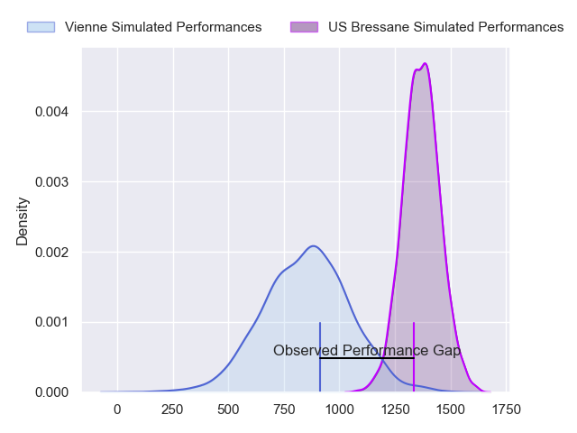
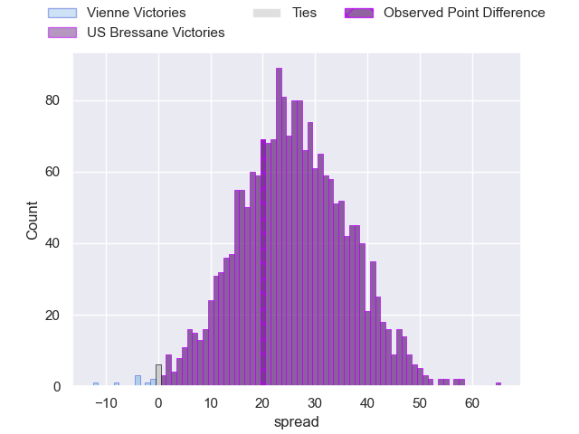
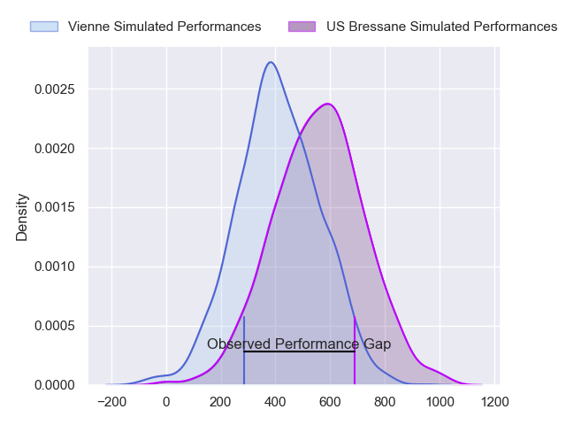
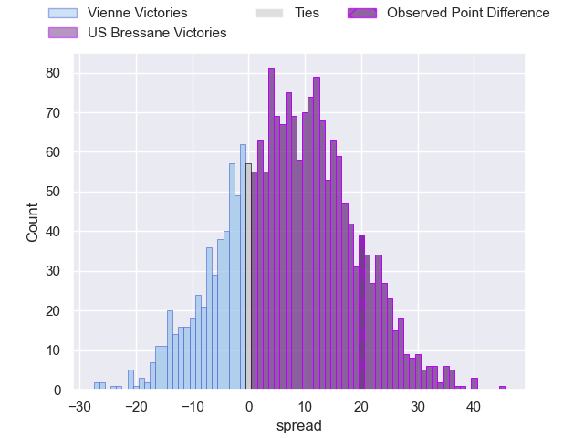
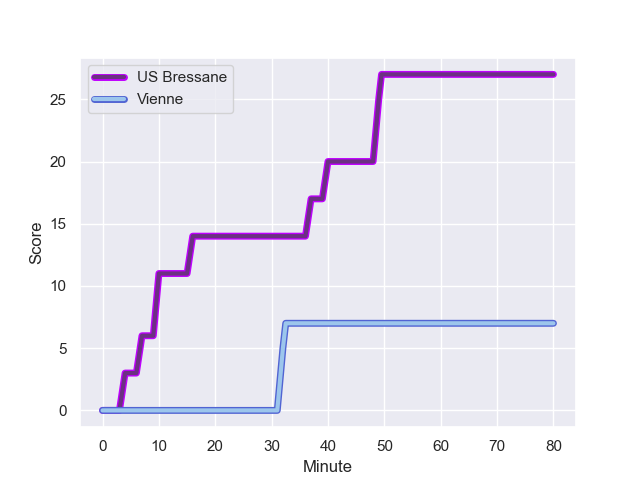
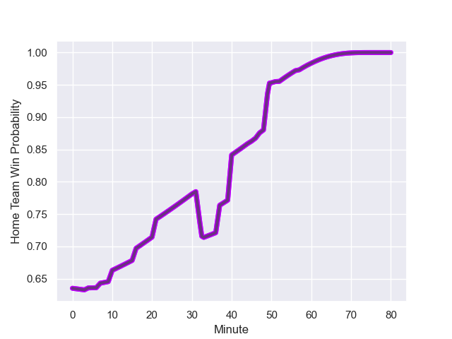

---  
layout: page  
title: Vienne at US Bressane; 7.0-27.0  
date: 2023-10-06 18:00:00 -0500  
categories: match review  
---
# Vienne at US Bressane; 7.0-27.0

# Club Level Predictions

The first set of predictions treats a club as the smallest object, as the club develops its members, organizes a gameplan, and deploys its players as needed for each match. This club model has a prediction of 0.927, which translates to predicting US Bressane to win by 25.8.

Each club has a rating and a rating deviation (simiar to a Glicko system), and expected performances can be generated. This allows for simulated matches and spreads like the ones below.
## Projected Performances - Club Model

## Projected Spreads - Club Model

## Projected Results - Club Model

# Player Level Predictions - Version 2

Treating teams instead as an entity made up of the currently active players, I have ratings for each player in an altogether different system. These can be combined to form team ratings once teamsheets are announced, weighting starters a bit higher than the reserves. After the match is played, players can be weighted by their minutes on the field, allowing for an accurate measure of the team's composition. With these compiled team ratings, we can make predictions, measure inaccuracy, and update the individual player ratings.
## Prediction with Player Minutes: US Bressane by 6.1

US Bressane by 2.6 on a neutral field
## Prediction without Player Minutes: US Bressane by 5.6

US Bressane by 2.1 on a neutral pitch

## Projected Performances - Player Model

## Projected Spreads - Player Model

## Projected Results - Player Model

## Scores over Time

## Win Probability over Time

There were 5 large changes in win probability in this match

|   Away Minutes | Away Player      |   Away elo |   Number |   Home elo | Home Player               |   Home Minutes |
|---------------:|:-----------------|-----------:|---------:|-----------:|:--------------------------|---------------:|
|             45 | Benjamin Robin   |      32.86 |        1 |      40    | Vazha Kapanadze           |             31 |
|             50 | Dimitri Gibierge |      35.03 |        2 |      45.76 | Clement Jullien           |             58 |
|             80 | Guram Kavtidze   |      29.8  |        3 |      53.62 | Ma'afu Fia                |             52 |
|             80 | Ciaran O'Flynn   |      27.1  |        4 |      18.5  | Louis Bruinsma            |             80 |
|             57 | Mathias Bastide  |      34.07 |        5 |      26.22 | Josh Peters               |             80 |
|             80 | Pierre Chapelle  |      28.49 |        6 |      32.92 | Loic Baradel              |             80 |
|             33 | Charles Massot   |      25.01 |        7 |      34.12 | Pierre Reynaud            |             60 |
|             80 | Léon Peyrat      |      30.47 |        8 |      41.71 | Nicolas Tachat            |             47 |
|             57 | Malory Piet      |      18.69 |        9 |     -10.06 | Nicolas Faure             |             40 |
|             51 | Tom Richard      |      21.74 |       10 |      17.44 | Christian Lacombe         |             80 |
|             21 | Antoine Grange   |      25.01 |       11 |      43.68 | Kavekini Tabu             |             80 |
|             80 | Matthias Giovale |      27.74 |       12 |      -3.39 | Parataiso Silafai-Lea'ana |             80 |
|             80 | Pierre Mollard   |      23.84 |       13 |      44.98 | Benjamin Doy              |             80 |
|             80 | Brandon Bellavia |      21.87 |       14 |      23.5  | Thibaut Perrette          |             80 |
|             80 | Hugo Pandolfo    |      30.94 |       15 |      43.64 | François Grange           |             80 |
|             59 | Bastien Colliat  |      -4.57 |       16 |      38.53 | Teo Bordenave             |             49 |
|             47 | Steven Giroud    |      28.99 |       17 |      42.96 | Thomas Déliance           |             40 |
|             35 | Romain Eliot     |      34.68 |       18 |      50.8  | Joseph Penitito           |             33 |
|             30 | Axel Benjamin    |      43.32 |       19 |      27.92 | Erich de Jager            |             28 |
|             29 | Julien Hervouet  |      36.68 |       20 |      32.42 | Louis Dasalmartini        |             22 |
|             23 | Romain Falcoz    |      33.65 |       21 |      45.94 | Nail Ait Naceur           |             20 |
|             23 | Enzo Ravanello   |      44.75 |       22 |     nan    | nan                       |            nan |

