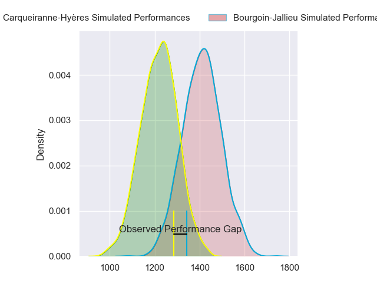
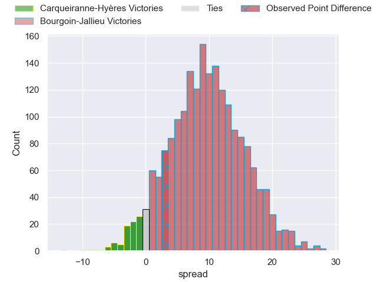
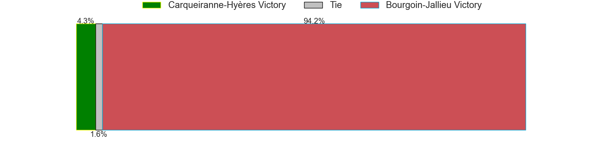
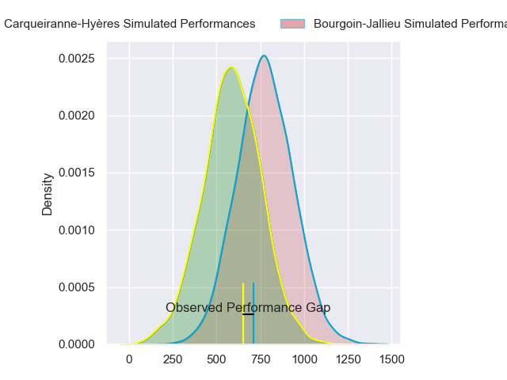
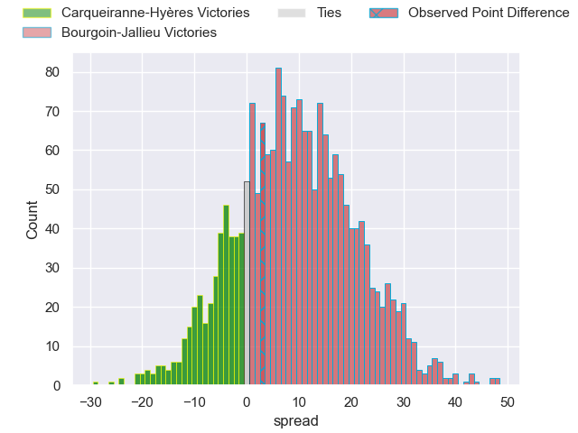
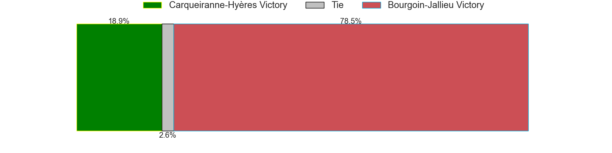
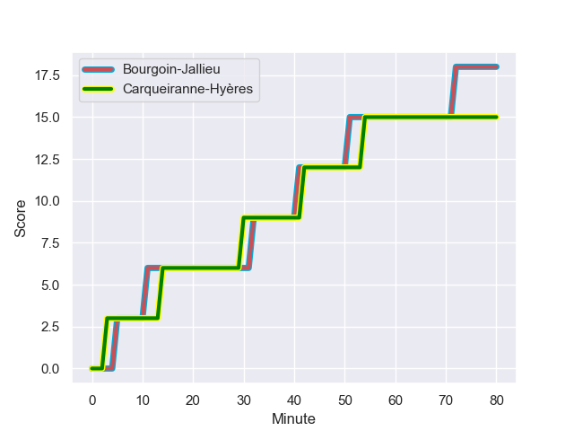
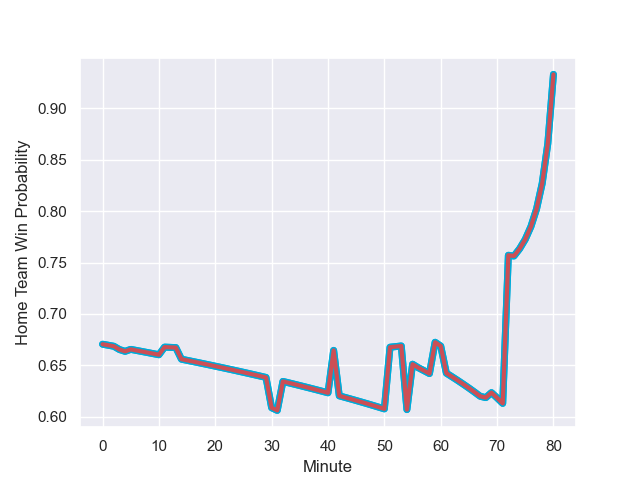

---  
layout: page  
title: Carqueiranne-Hyères at Bourgoin-Jallieu; 15.0-18.0  
date: 2023-10-07 18:00:00 -0500  
categories: match review  
---
# Carqueiranne-Hyères at Bourgoin-Jallieu; 15.0-18.0

# Club Level Predictions

The first set of predictions treats a club as the smallest object, as the club develops its members, organizes a gameplan, and deploys its players as needed for each match. This club model has a prediction of 0.74, which translates to predicting Bourgoin-Jallieu to win by 9.4.

Each club has a rating and a rating deviation (simiar to a Glicko system), and expected performances can be generated. This allows for simulated matches and spreads like the ones below.
## Projected Performances - Club Model

## Projected Spreads - Club Model

## Projected Results - Club Model

# Player Level Predictions - Version 2

Treating teams instead as an entity made up of the currently active players, I have ratings for each player in an altogether different system. These can be combined to form team ratings once teamsheets are announced, weighting starters a bit higher than the reserves. After the match is played, players can be weighted by their minutes on the field, allowing for an accurate measure of the team's composition. With these compiled team ratings, we can make predictions, measure inaccuracy, and update the individual player ratings.
## Prediction with Player Minutes: Bourgoin-Jallieu by 7.9

Bourgoin-Jallieu by 3.5 on a neutral field
## Prediction without Player Minutes: Bourgoin-Jallieu by 7.2

Bourgoin-Jallieu by 2.8 on a neutral pitch

## Projected Performances - Player Model

## Projected Spreads - Player Model

## Projected Results - Player Model

## Scores over Time

## Win Probability over Time

There were 12 large changes in win probability in this match

|   Away Minutes | Away Player              |   Away elo |   Number |   Home elo | Home Player              |   Home Minutes |
|---------------:|:-------------------------|-----------:|---------:|-----------:|:-------------------------|---------------:|
|             59 | Ferdinand Changel        |      43.06 |        1 |      38.96 | Zhorzhi (Jorji) Saldadze |             54 |
|             68 | Yan Tabarot              |      39.86 |        2 |      29.76 | Mohamed Khribache        |             80 |
|             59 | Thomas Lithaud           |      49.84 |        3 |      47.32 | Osman Dimen              |             75 |
|             80 | Lucas Cazac              |      15.86 |        4 |      47.86 | Robin Gascou             |             61 |
|             73 | Nathan Gendre            |      22.36 |        5 |       8.99 | Léandre Cotte            |             69 |
|             80 | Spike Salman             |      35.62 |        6 |      42.16 | Theophile Cotte          |             51 |
|             80 | Joachim Beaumont         |      47.7  |        7 |      67.55 | Bynjamin Rabatel         |             80 |
|             55 | Johann Afonso Grundlingh |      51.46 |        8 |      49.45 | Poutasi Luafutu          |             80 |
|             73 | Thomas Sonetti           |      55.09 |        9 |      62.89 | Tomas Munilla lo Duca    |             58 |
|             80 | Juan Kotze               |      35.61 |       10 |      59.58 | Nicolas Vuillemin        |             80 |
|             80 | Paul Gadea               |      45.35 |       11 |      26.47 | Quentin Lefort           |             80 |
|             80 | Romain Leveque           |      45.32 |       12 |      59.53 | Pieter Morton            |             80 |
|             80 | Charles Brousse          |      31.09 |       13 |      53.32 | Gaby Lovobalavu          |             65 |
|             56 | Quentin Bourdieu         |      46.21 |       14 |      49.71 | Paul-Hugo Champ          |             80 |
|             73 | Adrien Amans             |      29.57 |       15 |      45.17 | Nicolas Cachet           |             80 |
|             21 | Sti Sithole              |      43.54 |       16 |      46.78 | Romain Favaretto         |             26 |
|             12 | Theo Lachaud             |      31.21 |       17 |      -8.25 | Morgan Eames             |             19 |
|             21 | Lasha Mchelidze          |      47.55 |       18 |      51.91 | Kevin Chaudouard         |             29 |
|             25 | Marius Pellegrin         |      47.44 |       19 |      38.19 | Kemueli Lavetanakoroi    |             11 |
|              7 | Josaia Cama              |      45.14 |       20 |      46.65 | Maxime Calliet           |              5 |
|              7 | Jérémy Fleury            |      46    |       21 |      34.2  | Adrien Pontarollo        |             22 |
|             24 | Dylan Sage               |      34.1  |       22 |      31.75 | Brieuc Plessis-Couillaud |             15 |
|              7 | Enzo Miot                |      43.01 |       23 |     nan    | nan                      |            nan |

