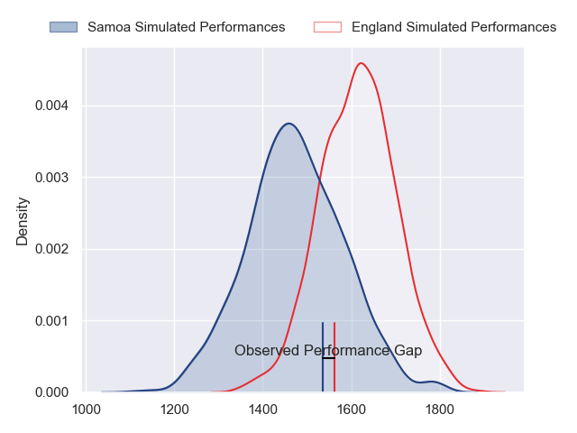
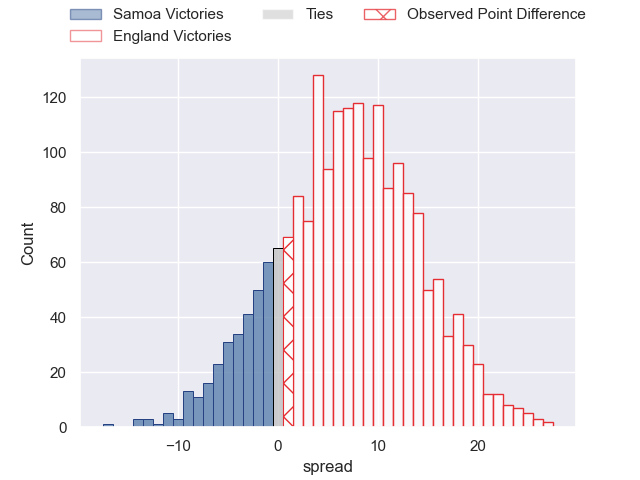
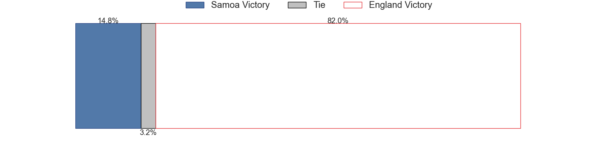
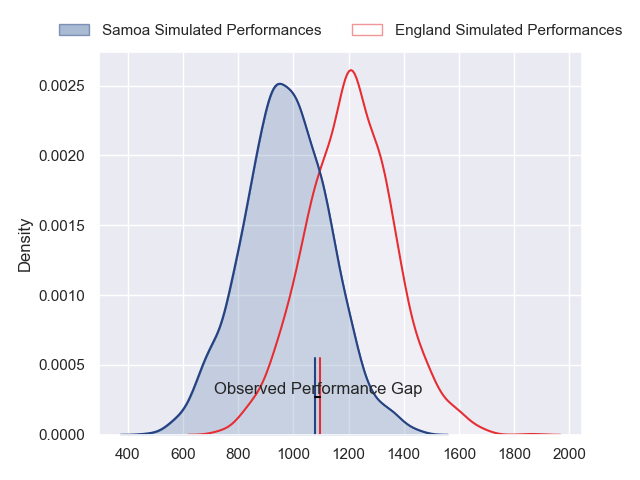
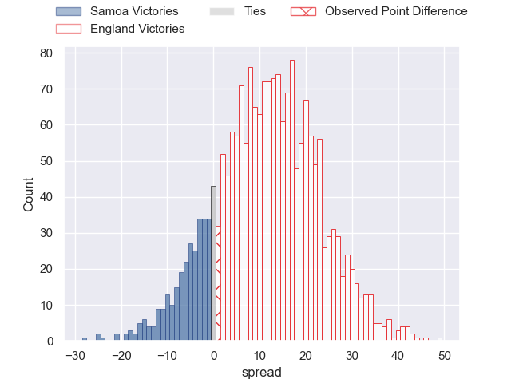
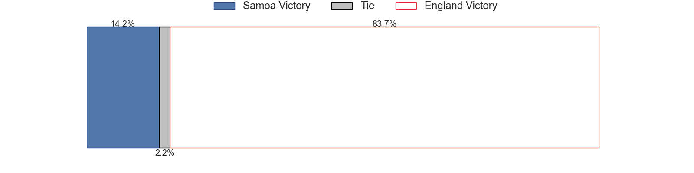
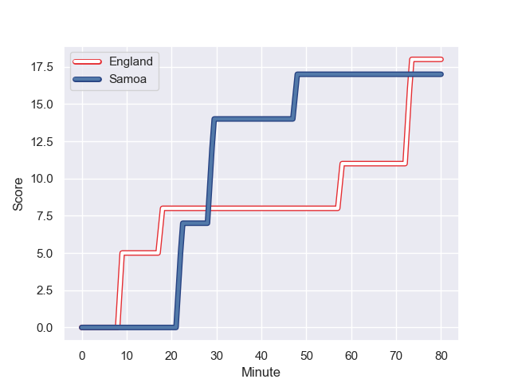
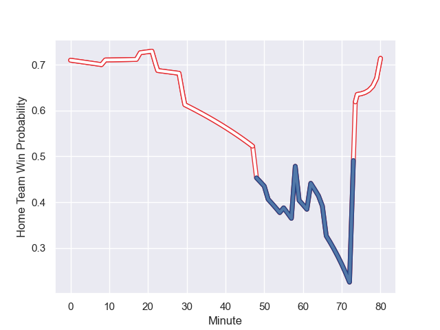

---  
layout: page  
title: Samoa at England; 17.0-18.0  
date: 2023-10-07 18:00:00 -0500  
categories: match review  
---
# Samoa at England; 17.0-18.0

# Club Level Predictions

The first set of predictions treats a club as the smallest object, as the club develops its members, organizes a gameplan, and deploys its players as needed for each match. This club model has a prediction of 0.687, which translates to predicting England to win by 7.2.

Each club has a rating and a rating deviation (simiar to a Glicko system), and expected performances can be generated. This allows for simulated matches and spreads like the ones below.
## Projected Performances - Club Model

## Projected Spreads - Club Model

## Projected Results - Club Model

# Player Level Predictions - Version 2

Treating teams instead as an entity made up of the currently active players, I have ratings for each player in an altogether different system. These can be combined to form team ratings once teamsheets are announced, weighting starters a bit higher than the reserves. After the match is played, players can be weighted by their minutes on the field, allowing for an accurate measure of the team's composition. With these compiled team ratings, we can make predictions, measure inaccuracy, and update the individual player ratings.
## Prediction with Player Minutes: England by 9.9

England by 9.9 on a neutral field
## Prediction without Player Minutes: England by 10.9

England by 10.9 on a neutral pitch

## Projected Performances - Player Model

## Projected Spreads - Player Model

## Projected Results - Player Model

## Scores over Time

## Win Probability over Time

There were 11 large changes in win probability in this match

|   Away Minutes | Away Player           |   Away elo |   Number |   Home elo | Home Player     |   Home Minutes |
|---------------:|:----------------------|-----------:|---------:|-----------:|:----------------|---------------:|
|             58 | Jordan Lay            |      32.7  |        1 |      34.72 | Ellis Genge     |             55 |
|             62 | Sama Malolo           |      66.25 |        2 |     110.88 | Jamie George    |             80 |
|             58 | Michael Ala'alatoa    |      68.44 |        3 |      47.83 | Dan Cole        |             48 |
|             58 | Sam Slade             |      22.51 |        4 |     107.68 | Maro Itoje      |             80 |
|             80 | Brian Alainu'uese     |      63.96 |        5 |      60.44 | Ollie Chessum   |             80 |
|             80 | Theo McFarland        |      60    |        6 |      87.09 | Courtney Lawes  |             59 |
|             62 | Fritz Lee             |      81.55 |        7 |      63.45 | Tom Curry       |             74 |
|             80 | Steven Luatua         |      94.79 |        8 |      95.18 | Ben Earl        |             80 |
|             62 | Jonathan Taumateine   |      40.53 |        9 |      68.18 | Alex Mitchell   |             66 |
|             80 | Lima Sopoaga          |      77.48 |       10 |      97.51 | George Ford     |             51 |
|             80 | Neria Fomai           |      74.93 |       11 |      42.16 | Jonny May       |             80 |
|             65 | Danny Toala           |      39.08 |       12 |     131.99 | Owen Farrell    |             80 |
|             80 | Tumua Manu            |      83.64 |       13 |     104.31 | Manu Tuilagi    |             58 |
|             80 | Nigel Ah Wong         |      80.6  |       14 |      82.89 | Joe Marchant    |             80 |
|             80 | Duncan Paia'aua       |      66.48 |       15 |      56.15 | Freddie Steward |             80 |
|             22 | Paul Alo-Emile        |      71.47 |       16 |      96.7  | Joe Marler      |             25 |
|             22 | James Lay             |      46.41 |       17 |      62.98 | Kyle Sinckler   |             32 |
|             22 | Miracle Faiilagi      |      61.05 |       18 |      75.9  | Marcus Smith    |             29 |
|             18 | Melani Matavao        |      50.27 |       19 |      56.12 | Ollie Lawrence  |             22 |
|             18 | Alamanda Motuga       |      52.52 |       20 |      68.08 | George Martin   |             21 |
|             18 | Seilala Lam           |      57.95 |       21 |     135.13 | Danny Care      |             14 |
|             15 | Christian Leali'ifano |      65.66 |       22 |     122.55 | Billy Vunipola  |              6 |

