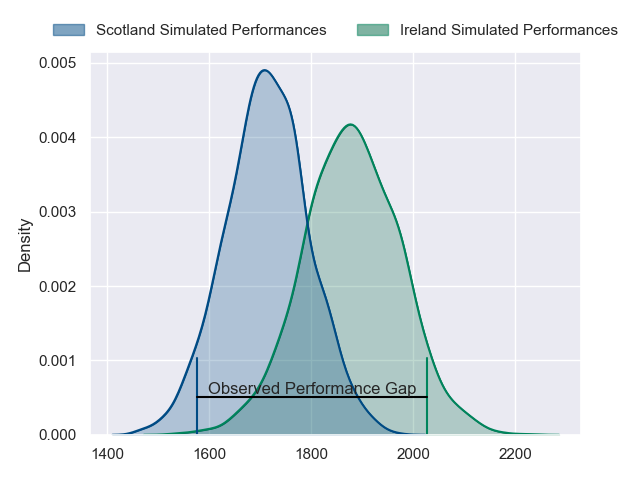
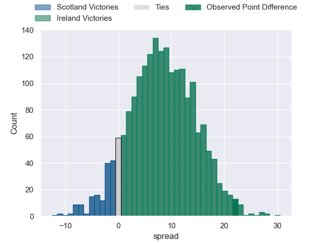
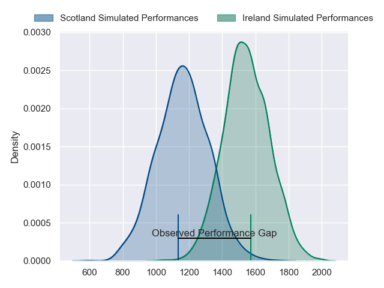
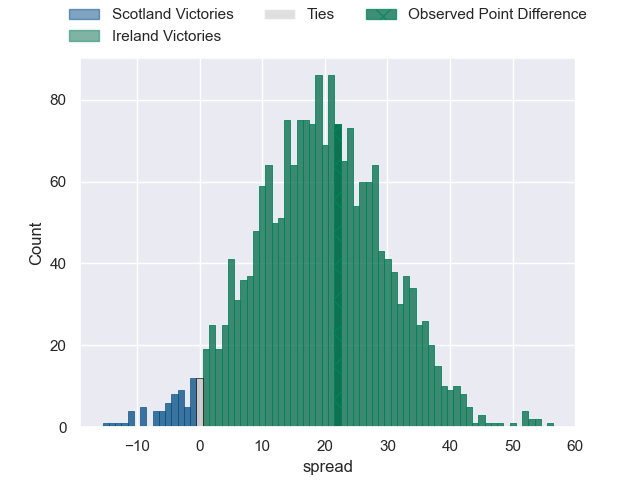
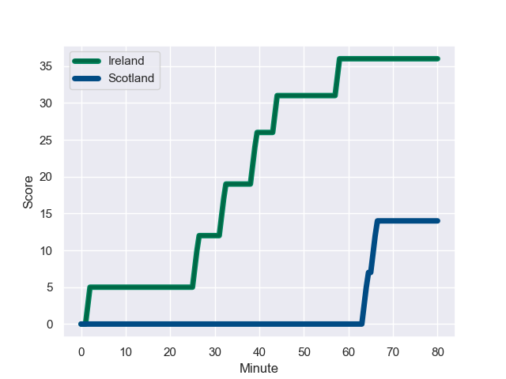
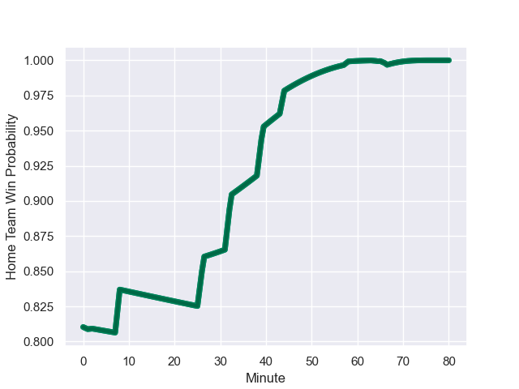

---  
layout: page  
title: Scotland at Ireland; 14.0-36.0  
date: 2023-10-07 18:00:00 -0500  
categories: match review  
---
# Scotland at Ireland; 14.0-36.0

# Club Level Predictions

The first set of predictions treats a club as the smallest object, as the club develops its members, organizes a gameplan, and deploys its players as needed for each match. This club model has a prediction of 0.719, which translates to predicting Ireland to win by 8.4.

Each club has a rating and a rating deviation (simiar to a Glicko system), and expected performances can be generated. This allows for simulated matches and spreads like the ones below.
## Projected Performances - Club Model

## Projected Spreads - Club Model

## Projected Results - Club Model

# Player Level Predictions - Version 2

Treating teams instead as an entity made up of the currently active players, I have ratings for each player in an altogether different system. These can be combined to form team ratings once teamsheets are announced, weighting starters a bit higher than the reserves. After the match is played, players can be weighted by their minutes on the field, allowing for an accurate measure of the team's composition. With these compiled team ratings, we can make predictions, measure inaccuracy, and update the individual player ratings.
## Prediction with Player Minutes: Ireland by 16.0

Ireland by 16.0 on a neutral field
## Prediction without Player Minutes: Ireland by 14.4

Ireland by 14.4 on a neutral pitch

## Projected Performances - Player Model

## Projected Spreads - Player Model

## Projected Results - Player Model

## Scores over Time

## Win Probability over Time

There were 4 large changes in win probability in this match

|   Away Minutes | Away Player         |   Away elo |   Number |   Home elo | Home Player         |   Home Minutes |
|---------------:|:--------------------|-----------:|---------:|-----------:|:--------------------|---------------:|
|             53 | Pierre Schoeman     |      50.64 |        1 |      80.6  | Andrew Porter       |             49 |
|             60 | George Turner       |     114.26 |        2 |      59.47 | Dan Sheehan         |             49 |
|             61 | Zander Fagerson     |     111.28 |        3 |      93.1  | Tadhg Furlong       |             49 |
|             80 | Richie Gray         |      64.14 |        4 |     138.31 | Tadhg Beirne        |             49 |
|             45 | Grant Gilchrist     |      99.58 |        5 |      73.11 | Iain Henderson      |             80 |
|             19 | Jamie Ritchie       |     123.23 |        6 |     100.68 | Peter O'Mahony      |             49 |
|             65 | Rory Darge          |      64.69 |        7 |     120.56 | Josh van der Flier  |             80 |
|             80 | Jack Dempsey        |      32.82 |        8 |     110.7  | Caelan Doris        |             80 |
|             80 | Ali Price           |      72.06 |        9 |     116.76 | Jamison Gibson-Park |             80 |
|             80 | Finn Russell        |     129.01 |       10 |     113.51 | Johnny Sexton       |             45 |
|             80 | Duhan van der Merwe |      74.4  |       11 |     170.5  | James Lowe          |             41 |
|             80 | Sione Tuipulotu     |      48.13 |       12 |     120.21 | Bundee Aki          |             80 |
|             80 | Huw Jones           |      43.66 |       13 |     117.36 | Garry Ringrose      |             80 |
|             51 | Darcy Graham        |      54.1  |       14 |      76.36 | Mack Hansen         |             36 |
|              8 | Blair Kinghorn      |     134.28 |       15 |     119.78 | Hugo Keenan         |             80 |
|             35 | Scott Cummings      |     109.31 |       16 |      76.4  | Stuart McCloskey    |             44 |
|             72 | Ollie Smith         |      77.77 |       17 |     112.61 | Conor Murray        |             39 |
|             61 | Matt Fagerson       |     104.4  |       18 |      56.13 | Jack Crowley        |             35 |
|             29 | George Horne        |     128.73 |       19 |      77.55 | Ronan Kelleher      |             31 |
|             27 | Rory Sutherland     |      51.56 |       20 |      81.66 | Dave Kilcoyne       |             31 |
|             19 | WP Nel              |      95.83 |       21 |      90.64 | James Ryan          |             31 |
|             20 | Ewan Ashman         |      41.88 |       22 |     109.27 | Jack Conan          |             31 |
|             15 | Luke Crosbie        |      73.29 |       23 |      90.32 | Finlay Bealham      |             31 |

