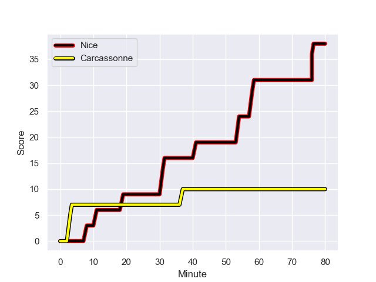
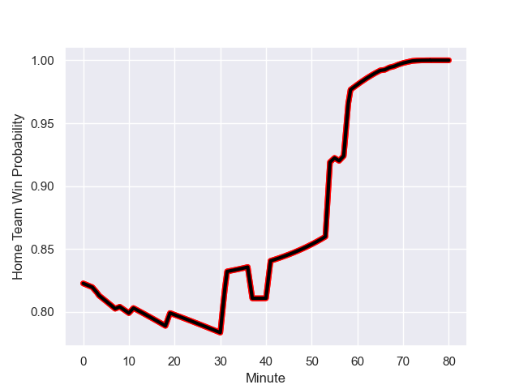

---  
layout: page  
title: Carcassonne at Nice; 10.0-38.0  
date: 2023-10-07 18:00:00 -0500  
categories: match review  
---
# Carcassonne at Nice; 10.0-38.0

# Club Level Predictions

The first set of predictions treats a club as the smallest object, as the club develops its members, organizes a gameplan, and deploys its players as needed for each match. This club model has a prediction of 0.588, which translates to predicting Nice to win by 3.1.

Each club has a rating and a rating deviation (simiar to a Glicko system), and expected performances can be generated. This allows for simulated matches and spreads like the ones below.
## Projected Performances - Club Model

## Projected Spreads - Club Model

## Projected Results - Club Model

# Player Level Predictions - Version 2

Treating teams instead as an entity made up of the currently active players, I have ratings for each player in an altogether different system. These can be combined to form team ratings once teamsheets are announced, weighting starters a bit higher than the reserves. After the match is played, players can be weighted by their minutes on the field, allowing for an accurate measure of the team's composition. With these compiled team ratings, we can make predictions, measure inaccuracy, and update the individual player ratings.
## Prediction with Player Minutes: Nice by 16.9

Nice by 13.7 on a neutral field
## Prediction without Player Minutes: Nice by 16.2

Nice by 13.0 on a neutral pitch

## Projected Performances - Player Model

## Projected Spreads - Player Model

## Projected Results - Player Model

## Scores over Time

## Win Probability over Time

There were 4 large changes in win probability in this match

|   Away Minutes | Away Player         |   Away elo |   Number |   Home elo | Home Player               |   Home Minutes |
|---------------:|:--------------------|-----------:|---------:|-----------:|:--------------------------|---------------:|
|             72 | Andrei Ursache      |      54    |        1 |      65.18 | Sunia Vola                |             53 |
|             47 | Luka Petriashvili   |      50.09 |        2 |      44.83 | Pierre Strippoli          |             66 |
|             47 | Vakhtangi Akhobadze |      22.96 |        3 |      37.07 | Luvuyo Pupuma             |             66 |
|             80 | Romain Manchia      |      20.5  |        4 |      65.57 | Yann Tivoli               |             53 |
|             54 | Romain Guyot        |      43.42 |        5 |     121.03 | Tom Murday                |             80 |
|             60 | Valentin Sese       |      44.29 |        6 |      64.56 | Arthur Vignolles          |             68 |
|             80 | Carl Fearns         |      50.99 |        7 |      77.6  | Louis Suaud               |             80 |
|             80 | Etienne Herjean     |      37.57 |        8 |      61.31 | Ramiha Tarrel Tia Smiler  |             68 |
|             56 | Gaetan Pichon       |      24.65 |        9 |      52.57 | Jules Solinas             |             80 |
|             80 | Gabin Michet        |      53.02 |       10 |      64.98 | Mathis Viard              |             80 |
|             56 | Clement Egiziano    |      61.41 |       11 |      77.33 | Andrzej Charlat           |             80 |
|             80 | Mathys Barka        |      47.14 |       12 |      58.61 | Romain Riguet             |             76 |
|             72 | Tutuila Vaea        |      41.36 |       13 |      62.41 | Nathan Courtade           |             66 |
|             80 | Mesake Kurisaru     |      49.58 |       14 |      57.28 | Simon Delas               |             80 |
|             80 | Damien Añon         |      45.47 |       15 |      77.26 | David Odiete              |             80 |
|              8 | Yan Arnold          |      46.65 |       16 |      43.38 | Santiago Benjamin Ovejero |             14 |
|             33 | Raphael Carbou      |      46.62 |       17 |      51.54 | Nicolas Ciancio           |             14 |
|             33 | Nikoloz Narmania    |      48.85 |       18 |      69.08 | Adrien Vigne              |             27 |
|             26 | Clément Fontaine    |      26.88 |       19 |      21.54 | Bastien Berenguel         |             12 |
|             20 | Gary Graham         |      68.37 |       20 |      74.49 | Laijiasa Bolenaivalu      |             12 |
|             24 | Mamoudou Niang      |      46.5  |       21 |      53.5  | Corentin Penc'hoat        |              4 |
|             24 | Martin Landajo      |      -5.41 |       22 |      54.23 | Luca Cutayar              |             14 |
|              8 | Pierre Aguillon     |      59.72 |       23 |      35    | Jules Martinez            |             27 |

