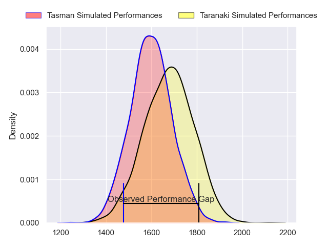
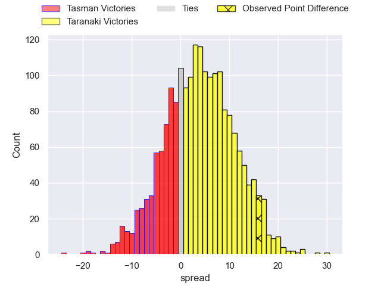
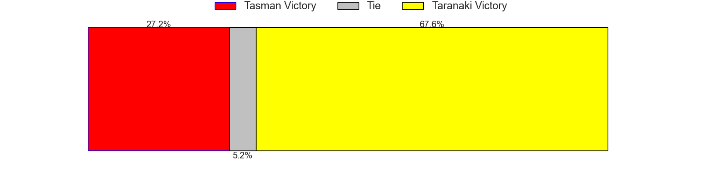
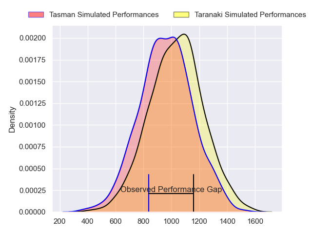
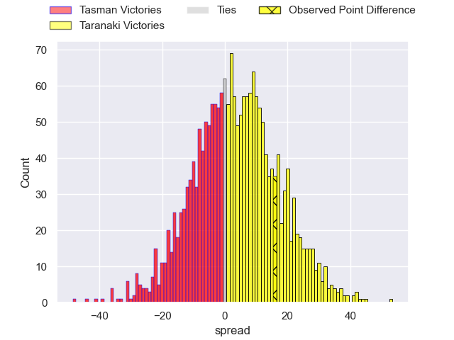

---  
layout: page  
title: Tasman at Taranaki; 18.0-34.0  
date: 2023-10-07 18:00:00 -0500  
categories: match review  
---
# Tasman at Taranaki; 18.0-34.0

# Club Level Predictions

The first set of predictions treats a club as the smallest object, as the club develops its members, organizes a gameplan, and deploys its players as needed for each match. This club model has a prediction of 0.61, which translates to predicting Taranaki to win by 4.0.

Each club has a rating and a rating deviation (simiar to a Glicko system), and expected performances can be generated. This allows for simulated matches and spreads like the ones below.
## Projected Performances - Club Model

## Projected Spreads - Club Model

## Projected Results - Club Model

# Player Level Predictions - Version 2

Treating teams instead as an entity made up of the currently active players, I have ratings for each player in an altogether different system. These can be combined to form team ratings once teamsheets are announced, weighting starters a bit higher than the reserves. After the match is played, players can be weighted by their minutes on the field, allowing for an accurate measure of the team's composition. With these compiled team ratings, we can make predictions, measure inaccuracy, and update the individual player ratings.
## Prediction with Player Minutes: Taranaki by 3.1

Tasman by 0.3 on a neutral field
## Prediction without Player Minutes: Taranaki by 3.1

Tasman by 0.3 on a neutral pitch

## Projected Performances - Player Model

## Projected Spreads - Player Model

## Projected Results - Player Model

|   Away Minutes | Away Player           |   Away elo |   Number |   Home elo | Home Player                   |   Home Minutes |
|---------------:|:----------------------|-----------:|---------:|-----------:|:------------------------------|---------------:|
|             80 | Kershawl Sykes-Martin |      63.87 |        1 |      38.98 | Jared Proffit                 |             80 |
|             80 | Feleti Kaitu'u        |      51.28 |        2 |      62.36 | Bradley Slater                |             80 |
|             80 | Samuel Matenga        |      80    |        3 |      37.51 | Reuben O'Neill                |             80 |
|             80 | Quinten Strange       |      85.17 |        4 |      96.12 | Tom Franklin                  |             80 |
|             80 | Antonio Shalfoon      |      35.67 |        5 |      64.29 | Josh Lord                     |             80 |
|             80 | Max Hicks             |      64.37 |        6 |      85.44 | Pita Gus Sowakula             |             80 |
|             80 | Anton Segner          |      56.08 |        7 |      60.88 | Tom Florence                  |             80 |
|             80 | Hugh Renton           |      28.15 |        8 |      40.83 | Michael Loft                  |             80 |
|             80 | Noah Hotham           |      66.82 |        9 |      43.94 | Adam Lennox                   |             80 |
|             80 | Mitch Hunt            |      83.93 |       10 |      58.25 | Josh Jacomb                   |             80 |
|             80 | Macca Springer        |      63.71 |       11 |      86.96 | Kini Naholo                   |             80 |
|             80 | Alex Nankivell        |      98.76 |       12 |      48.5  | Matt McKenzie                 |             80 |
|             80 | Levi Aumua            |      79.84 |       13 |      61.18 | Meihana Grindlay              |             80 |
|             80 | Timoci Tavatavanawai  |      51.62 |       14 |      68.71 | Vereniki Tikoisolomone        |             80 |
|             80 | Taine Robinson        |      55.23 |       15 |     102.73 | Jacob Ratumaitavuki-Kneepkens |             80 |

