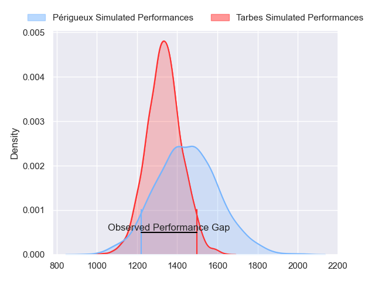
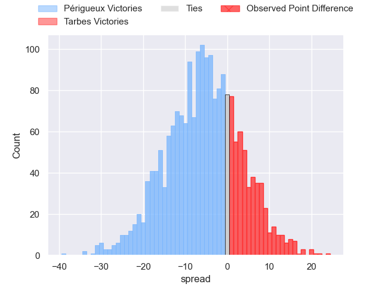
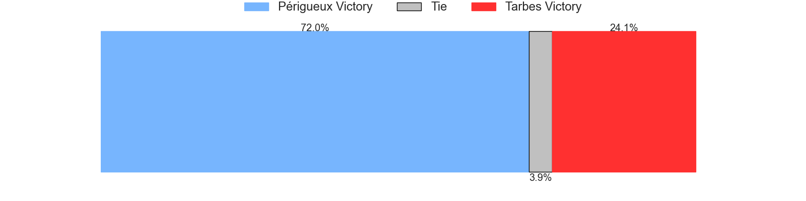
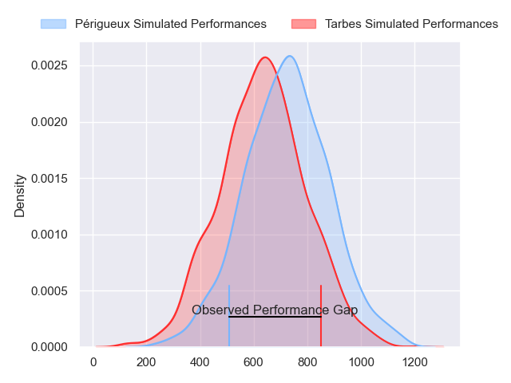
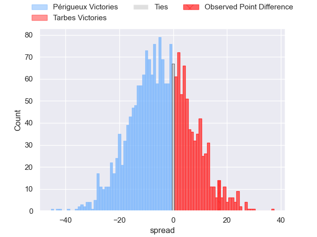
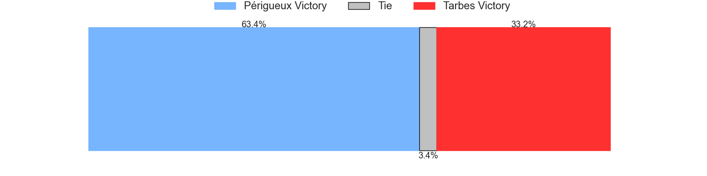
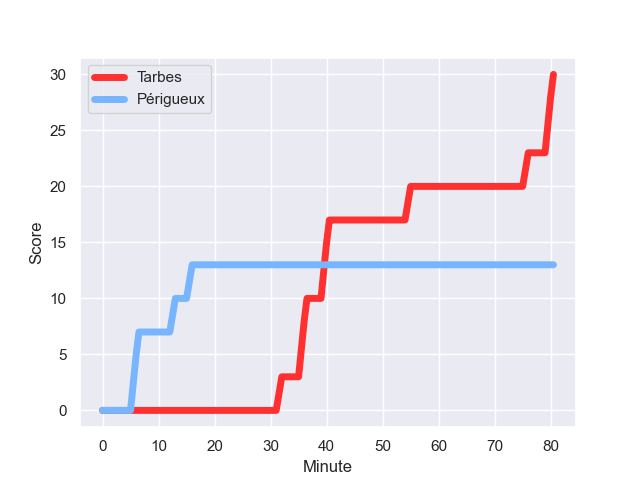
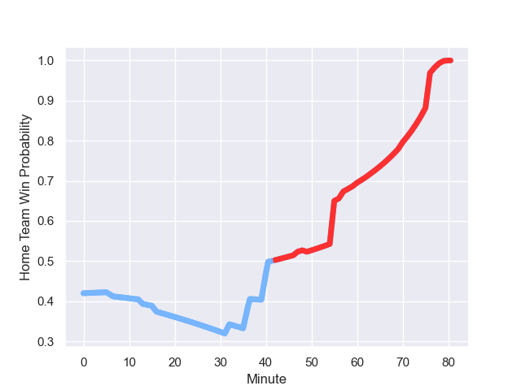

---  
layout: page  
title: Périgueux at Tarbes; 13.0-30.0  
date: 2023-10-07 18:00:00 -0500  
categories: match review  
---
# Périgueux at Tarbes; 13.0-30.0

# Club Level Predictions

The first set of predictions treats a club as the smallest object, as the club develops its members, organizes a gameplan, and deploys its players as needed for each match. This club model has a prediction of 0.365, which translates to predicting Périgueux to win by 5.4.

Each club has a rating and a rating deviation (simiar to a Glicko system), and expected performances can be generated. This allows for simulated matches and spreads like the ones below.
## Projected Performances - Club Model

## Projected Spreads - Club Model

## Projected Results - Club Model

# Player Level Predictions - Version 2

Treating teams instead as an entity made up of the currently active players, I have ratings for each player in an altogether different system. These can be combined to form team ratings once teamsheets are announced, weighting starters a bit higher than the reserves. After the match is played, players can be weighted by their minutes on the field, allowing for an accurate measure of the team's composition. With these compiled team ratings, we can make predictions, measure inaccuracy, and update the individual player ratings.
## Prediction with Player Minutes: Périgueux by 3.6

Périgueux by 7.8 on a neutral field
## Prediction without Player Minutes: Périgueux by 3.6

Périgueux by 7.9 on a neutral pitch

## Projected Performances - Player Model

## Projected Spreads - Player Model

## Projected Results - Player Model

## Scores over Time

## Win Probability over Time

There were 5 large changes in win probability in this match

|   Away Minutes | Away Player        |   Away elo |   Number |   Home elo | Home Player        |   Home Minutes |
|---------------:|:-------------------|-----------:|---------:|-----------:|:-------------------|---------------:|
|             57 | Jason Tindiliere   |      50.56 |        1 |      32.86 | Johan Mees Erasmus |             55 |
|             57 | Louis Martin       |      63.06 |        2 |      44.78 | Florian Lamothe    |             66 |
|             57 | Anthony Pelmard    |      53.37 |        3 |      42.82 | Toma Taufa         |             55 |
|             80 | Richard Fourcade   |      39.23 |        4 |      33.69 | Léo Saint-Guilhem  |             80 |
|             47 | Damien Lavergne    |      51.83 |        5 |      42.27 | Baptiste Peytavi   |             63 |
|             50 | Marius Vialle      |      37.63 |        6 |      54.52 | Alexis Armary      |             80 |
|             80 | Madioke Konate     |      50.07 |        7 |      42.24 | Aurelien Ricart    |             49 |
|             80 | Karl Lambert       |      54.71 |        8 |      29.6  | Len Massyn         |             80 |
|             60 | Enzo Hardy         |      50.1  |        9 |      30.29 | Thibaut Dulucq     |             70 |
|             60 | Yann Caillat       |      49.04 |       10 |      14.47 | Anthony Fuertes    |             80 |
|             80 | Pierre Tournebize  |      37.83 |       11 |      29.31 | Savenaca Rawaca    |             80 |
|             80 | Henry Tuilagi      |      48.62 |       12 |      41.46 | Kalione Nasoko     |             80 |
|             80 | Vincent Fouillade  |      59.71 |       13 |      19.84 | Johan Paulet       |             63 |
|             80 | Clément Cavaliere  |      46.65 |       14 |      35.66 | Clement Latorre    |             80 |
|             80 | Thibault Rabourdin |      46.43 |       15 |      42.05 | Yon Camou          |             77 |
|             23 | Baptiste Arvouet   |      47.72 |       16 |      45.57 | Antoine Palisse    |             25 |
|             23 | Martin Augeix      |      44.49 |       17 |      45.2  | Vincent Dolier     |             14 |
|             23 | Emilien Borges     |      46.65 |       18 |      30.09 | Alexandre Duny     |             25 |
|             33 | Jaco Willemse      |      40.63 |       19 |      28.7  | Jone Trevor Seuvou |             31 |
|             30 | Clement Lanen      |      30.98 |       20 |      29.71 | Dorian Bonnin      |             17 |
|             20 | Gaëtan Chapon      |      47.01 |       21 |      50.09 | Mickael Thébault   |             10 |
|             20 | Djamel Ouchene     |      46.65 |       22 |      33.76 | William Pees       |             17 |
|            nan | nan                |     nan    |       23 |      31.63 | Mathieu Berbizier  |              3 |

