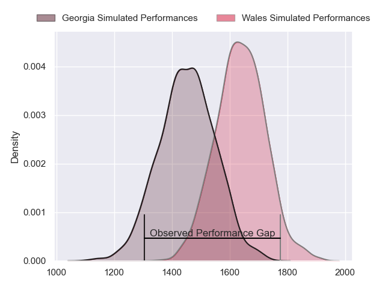
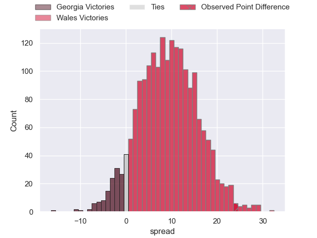
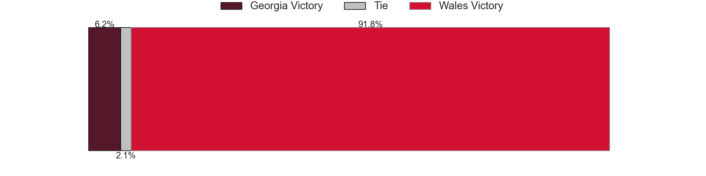
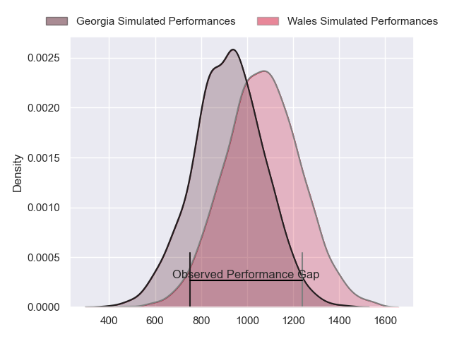
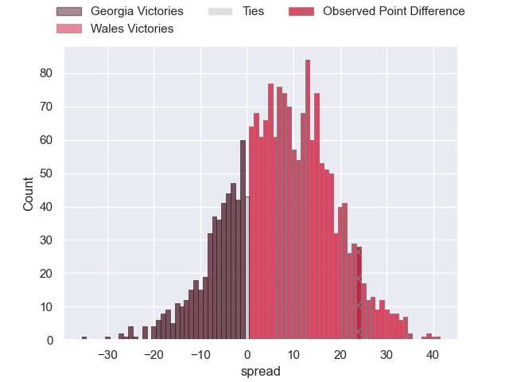
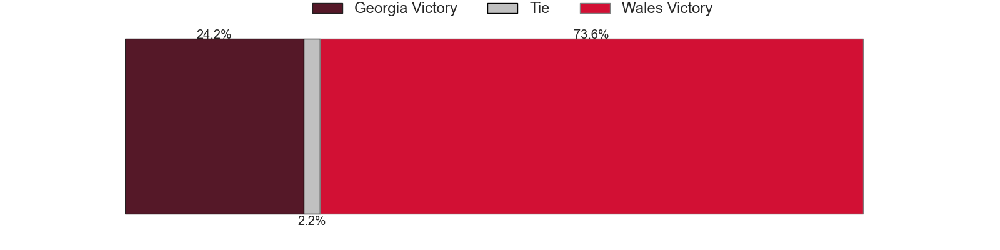
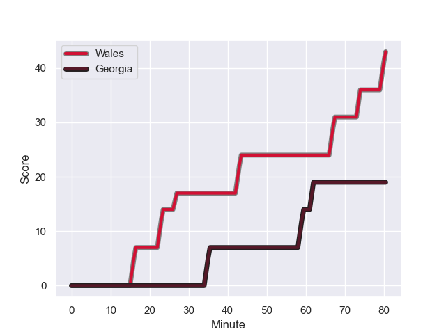
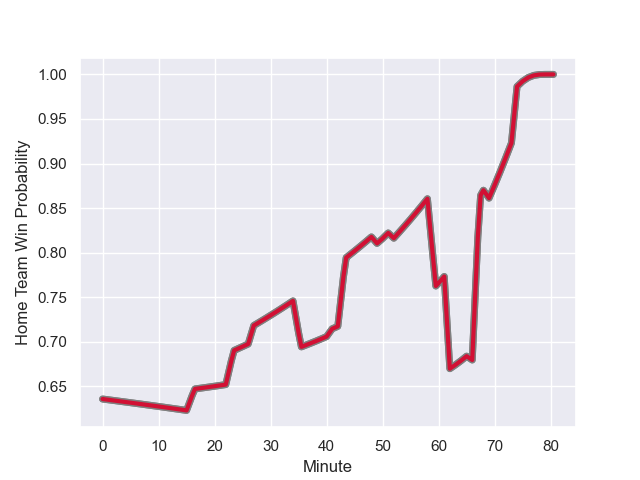

---  
layout: page  
title: Georgia at Wales; 19.0-43.0  
date: 2023-10-07 18:00:00 -0500  
categories: match review  
---
# Georgia at Wales; 19.0-43.0

# Club Level Predictions

The first set of predictions treats a club as the smallest object, as the club develops its members, organizes a gameplan, and deploys its players as needed for each match. This club model has a prediction of 0.734, which translates to predicting Wales to win by 9.2.

Each club has a rating and a rating deviation (simiar to a Glicko system), and expected performances can be generated. This allows for simulated matches and spreads like the ones below.
## Projected Performances - Club Model

## Projected Spreads - Club Model

## Projected Results - Club Model

# Player Level Predictions - Version 2

Treating teams instead as an entity made up of the currently active players, I have ratings for each player in an altogether different system. These can be combined to form team ratings once teamsheets are announced, weighting starters a bit higher than the reserves. After the match is played, players can be weighted by their minutes on the field, allowing for an accurate measure of the team's composition. With these compiled team ratings, we can make predictions, measure inaccuracy, and update the individual player ratings.
## Prediction with Player Minutes: Wales by 6.1

Wales by 6.1 on a neutral field
## Prediction without Player Minutes: Wales by 6.8

Wales by 6.8 on a neutral pitch

## Projected Performances - Player Model

## Projected Spreads - Player Model

## Projected Results - Player Model

## Scores over Time

## Win Probability over Time

There were 9 large changes in win probability in this match

|   Away Minutes | Away Player           |   Away elo |   Number |   Home elo | Home Player       |   Home Minutes |
|---------------:|:----------------------|-----------:|---------:|-----------:|:------------------|---------------:|
|             41 | Guram Gogichashvili   |      49.7  |        1 |      37.73 | Gareth Thomas     |             52 |
|             41 | Shalva Mamukashvili   |      57.99 |        2 |      36.91 | Dewi Lake         |             52 |
|             50 | Beka Gigashvili       |      54.65 |        3 |     106.01 | Tomas Francis     |             52 |
|             80 | Nodar Cheishvili      |     120.87 |        4 |      41.67 | Will Rowlands     |             80 |
|             49 | Konstantin Mikautadze |       4.1  |        5 |      65.99 | Dafydd Jenkins    |             80 |
|             69 | Mikheil Gachechiladze |     -35.59 |        6 |      72.04 | Aaron Wainwright  |             66 |
|             80 | Beka Saghinadze       |      78.75 |        7 |      60.22 | Tommy Reffell     |             80 |
|             80 | Tornike Jalagonia     |      35.62 |        8 |      81.3  | Taulupe Faletau   |             69 |
|             57 | Vasil Lobzhanidze     |      46.82 |        9 |      75.76 | Tomos Williams    |             61 |
|             69 | Luka Matkava          |      80.77 |       10 |      60.89 | Gareth Anscombe   |             80 |
|             80 | Davit Niniashvili     |      75.02 |       11 |      24.93 | Rio Dyer          |             80 |
|             80 | Merab Sharikadze      |      67.84 |       12 |     107.64 | Nick Tompkins     |             80 |
|             80 | Giorgi Kveseladze     |      83.27 |       13 |     119.82 | George North      |             80 |
|             80 | Aka Tabutsadze        |      82.79 |       14 |      86.57 | Louis Rees-Zammit |             80 |
|             41 | Lasha Khmaladze       |      96.22 |       15 |     119.44 | Liam Williams     |             69 |
|             39 | Nika Abuladze         |      66.49 |       16 |      45.42 | Nicky Smith       |             28 |
|             39 | Vano Karkadze         |      41.69 |       17 |      52.79 | Henry Thomas      |             28 |
|             39 | Demur Tapladze        |      81.56 |       18 |      70.76 | Elliot Dee        |             28 |
|             31 | Lado Chachanidze      |      47.74 |       19 |      41.64 | Gareth Davies     |             19 |
|             30 | Irakli Aptsiauri      |      56.56 |       20 |      35.47 | Taine Basham      |             14 |
|             23 | Gela Aprasidze        |      49.86 |       21 |      70.91 | Mason Grady       |             11 |
|             11 | Tedo Abzhandadze      |      53.58 |       22 |      49.17 | Christ Tshiunza   |             11 |
|             11 | Giorgi Tsutskiridze   |      56.86 |       23 |     nan    | nan               |            nan |

