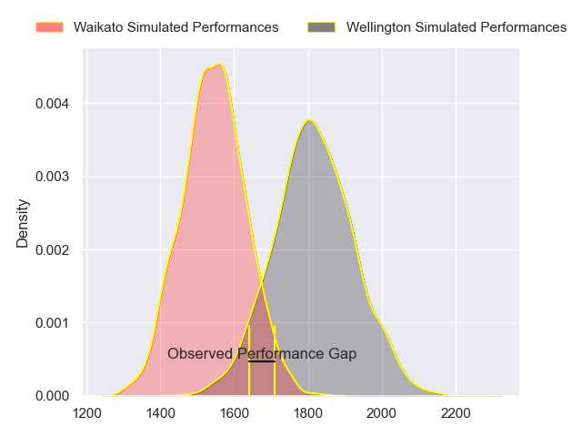
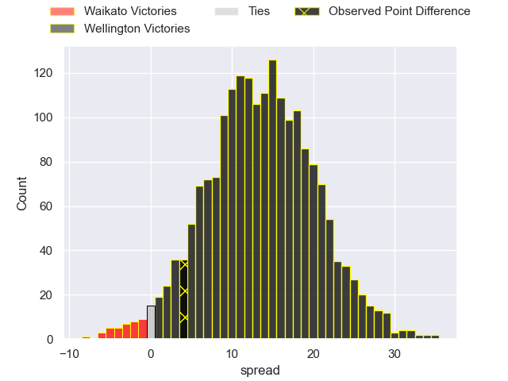
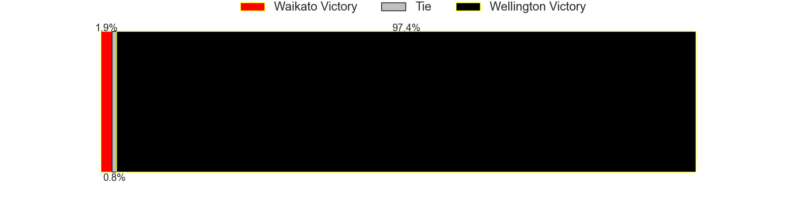
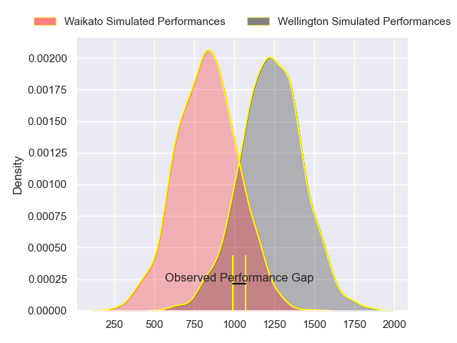
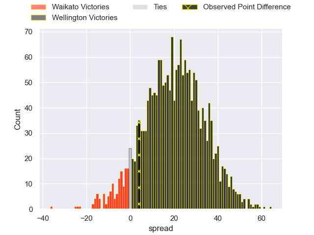

---  
layout: page  
title: Waikato at Wellington; 28.0-32.0  
date: 2023-10-07 18:00:00 -0500  
categories: match review  
---
# Waikato at Wellington; 28.0-32.0

# Club Level Predictions

The first set of predictions treats a club as the smallest object, as the club develops its members, organizes a gameplan, and deploys its players as needed for each match. This club model has a prediction of 0.817, which translates to predicting Wellington to win by 13.4.

Each club has a rating and a rating deviation (simiar to a Glicko system), and expected performances can be generated. This allows for simulated matches and spreads like the ones below.
## Projected Performances - Club Model

## Projected Spreads - Club Model

## Projected Results - Club Model

# Player Level Predictions - Version 2

Treating teams instead as an entity made up of the currently active players, I have ratings for each player in an altogether different system. These can be combined to form team ratings once teamsheets are announced, weighting starters a bit higher than the reserves. After the match is played, players can be weighted by their minutes on the field, allowing for an accurate measure of the team's composition. With these compiled team ratings, we can make predictions, measure inaccuracy, and update the individual player ratings.
## Prediction with Player Minutes: Wellington by 16.4

Wellington by 13.0 on a neutral field
## Prediction without Player Minutes: Wellington by 16.4

Wellington by 13.0 on a neutral pitch

## Projected Performances - Player Model

## Projected Spreads - Player Model

## Projected Results - Player Model

|   Away Minutes | Away Player        |   Away elo |   Number |   Home elo | Home Player            |   Home Minutes |
|---------------:|:-------------------|-----------:|---------:|-----------:|:-----------------------|---------------:|
|             80 | Ayden Johnstone    |      86.51 |        1 |      86.14 | Xavier Numia           |             80 |
|             80 | Pita Anae Ah-Sue   |      61.2  |        2 |      42.45 | James O'Reilly         |             80 |
|             80 | George Dyer        |      61.99 |        3 |      50.77 | Siale Lauaki           |             80 |
|             80 | James Tucker       |      70.1  |        4 |      93.04 | Dominic Bird           |             80 |
|             80 | Hamilton Burr      |      45.26 |        5 |      51.25 | Teofilo Paulo          |             80 |
|             80 | Samipeni Finau     |      77.49 |        6 |      62.99 | Caleb Delany           |             80 |
|             80 | Joe Johnston       |      35.36 |        7 |      84.94 | Du'Plessis Kirifi      |             80 |
|             80 | Simon Parker       |      40.81 |        8 |      88.22 | Brad Shields           |             80 |
|             80 | Cortez Ratima      |      58.07 |        9 |      73.61 | Kemara Hauiti-Parapara |             80 |
|             80 | Taha Kemara        |      35.97 |       10 |      64.9  | Aidan Morgan           |             80 |
|             80 | Tepaea Cook-Savage |      46.93 |       11 |      82.4  | Riley Higgins          |             80 |
|             80 | Mason Tupaea       |      37.25 |       12 |      53.08 | Peter Umaga-Jensen     |             80 |
|             80 | Tana Tuhakaraina   |      59.28 |       13 |      82.78 | Billy Proctor          |             80 |
|             80 | Gideon Wrampling   |      57.24 |       14 |     140.34 | Julian Savea           |             80 |
|             80 | Daniel Sinkinson   |      56.41 |       15 |      87.19 | Ruben Love             |             80 |

