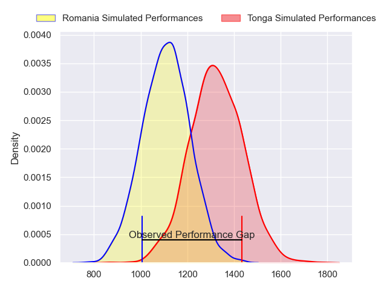
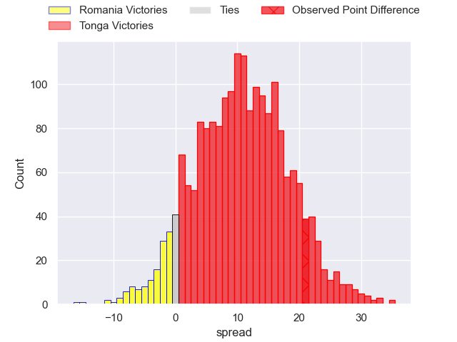
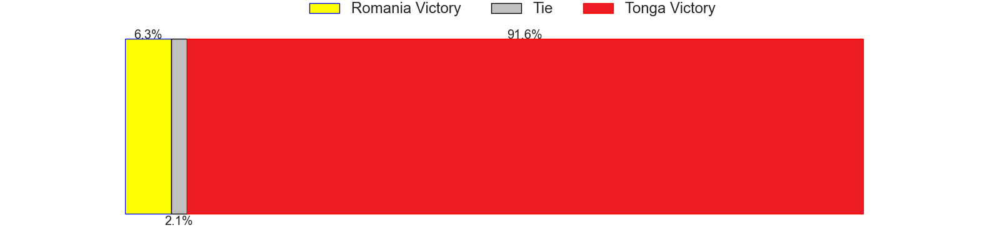
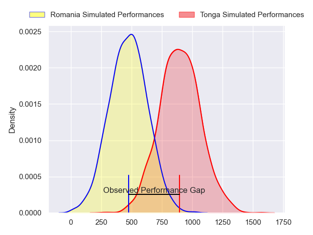
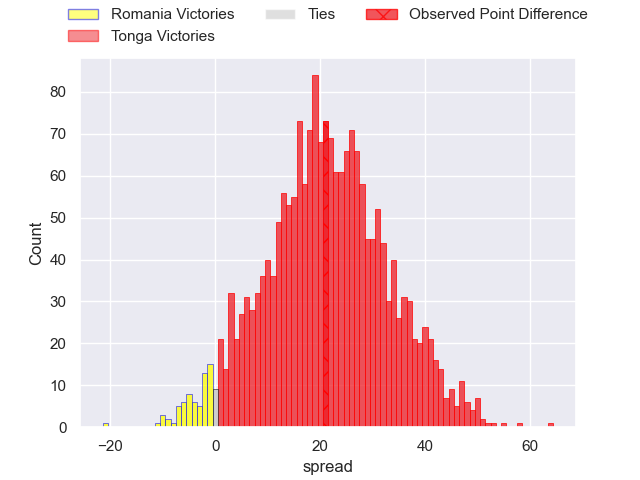
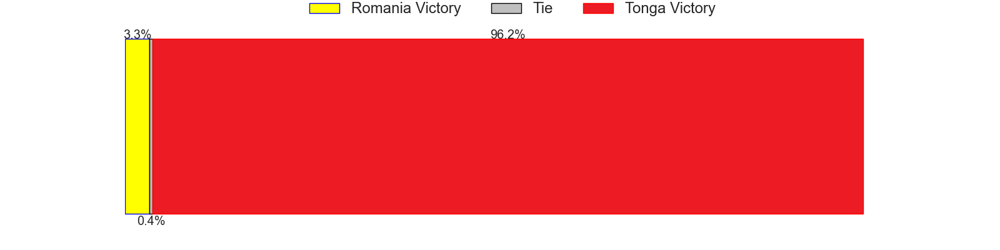
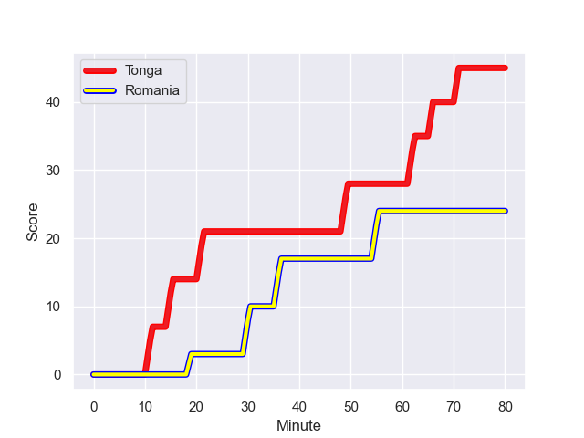
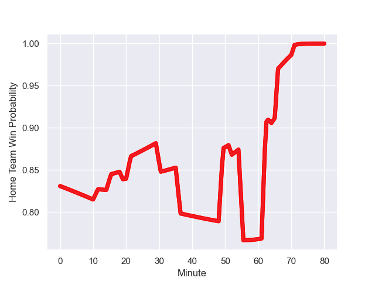

---  
layout: page  
title: Romania at Tonga; 24.0-45.0  
date: 2023-10-08 18:00:00 -0500  
categories: match review  
---
# Romania at Tonga; 24.0-45.0

# Club Level Predictions

The first set of predictions treats a club as the smallest object, as the club develops its members, organizes a gameplan, and deploys its players as needed for each match. This club model has a prediction of 0.76, which translates to predicting Tonga to win by 10.5.

Each club has a rating and a rating deviation (simiar to a Glicko system), and expected performances can be generated. This allows for simulated matches and spreads like the ones below.
## Projected Performances - Club Model

## Projected Spreads - Club Model

## Projected Results - Club Model

# Player Level Predictions - Version 2

Treating teams instead as an entity made up of the currently active players, I have ratings for each player in an altogether different system. These can be combined to form team ratings once teamsheets are announced, weighting starters a bit higher than the reserves. After the match is played, players can be weighted by their minutes on the field, allowing for an accurate measure of the team's composition. With these compiled team ratings, we can make predictions, measure inaccuracy, and update the individual player ratings.
## Prediction with Player Minutes: Tonga by 17.5

Tonga by 17.5 on a neutral field
## Prediction without Player Minutes: Tonga by 17.0

Tonga by 17.0 on a neutral pitch

## Projected Performances - Player Model

## Projected Spreads - Player Model

## Projected Results - Player Model

## Scores over Time

## Win Probability over Time

There were 7 large changes in win probability in this match

|   Away Minutes | Away Player       |   Away elo |   Number |   Home elo | Home Player          |   Home Minutes |
|---------------:|:------------------|-----------:|---------:|-----------:|:---------------------|---------------:|
|             59 | Alexandru Savin   |      34.32 |        1 |      42.9  | Siegfried Fisi'ihoi  |             72 |
|             59 | Ovidiu Cojocaru   |      27.25 |        2 |      61.48 | Paula Ngauamo        |             74 |
|             64 | Alex Gordas       |      61.34 |        3 |      84.83 | Ben Tameifuna        |             71 |
|             61 | Adrian Motoc      |       3.79 |        4 |      12.9  | Leva Fifita          |             72 |
|             80 | Marius Iftimiciuc |      24.75 |        5 |     119.28 | Adam Coleman         |             80 |
|             80 | Vlad Neculau      |      36.06 |        6 |      45.82 | Semisi Paea          |             80 |
|             80 | Cristi Boboc      |      52.78 |        7 |      95.88 | Sione Havili Talitui |             80 |
|             59 | Andre Gorin       |      45.62 |        8 |      44.75 | Sione Vailanu        |             59 |
|             52 | Florin Surugiu    |      -2.03 |        9 |      12.09 | Sonatane Takulua     |             64 |
|             80 | Alin Conache      |      38    |       10 |      51.84 | William Havili       |             80 |
|             64 | Taliauli Sikuea   |      34.43 |       11 |      68.71 | Afusipa Taumoepeau   |             80 |
|             71 | Tangimana Fonovai |      31.97 |       12 |      38.97 | Pita Ahki            |             80 |
|             80 | Tevita Manumua    |       8.35 |       13 |      95.46 | George Moala         |             80 |
|             80 | Nicolas Onutu     |      43.58 |       14 |      46.45 | Solomone Kata        |             68 |
|             80 | Marius Simionescu |       4.82 |       15 |      70.99 | Charles Piutau       |             71 |
|             21 | Damian Stratila   |      51.49 |       16 |      42.14 | Manu Paea            |             16 |
|             28 | Alexandru Bucur   |      50.18 |       17 |      37.45 | Penitoa Finau        |             21 |
|             21 | Iulian Hartig     |      36.2  |       18 |      50.35 | Kyren Taumoefolau    |             12 |
|             21 | Rob Irimescu      |      44.85 |       19 |      86.41 | Patrick Pellegrini   |              9 |
|             19 | Stefan Iancu      |      24.49 |       20 |      31.11 | Paula Latu           |              8 |
|             16 | Costel Burtila    |      47.76 |       21 |      36.7  | Steve Mafi           |              8 |
|             16 | Gabriel Rupanu    |      42.88 |       22 |      63.79 | Sione Anga'aelangi   |              6 |
|              9 | Paul Mihai Graure |      35.58 |       23 |      73.14 | Siate Tokolahi       |              9 |

