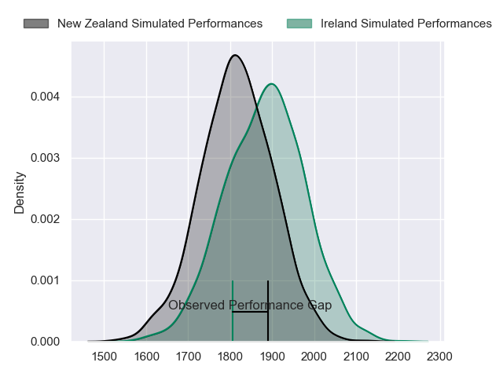
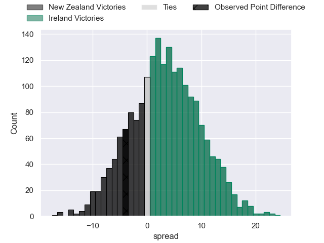
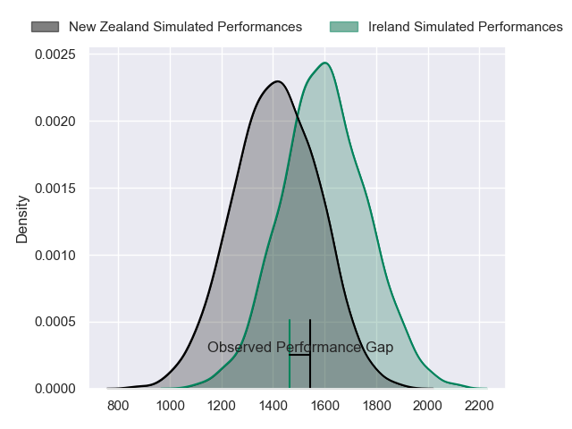
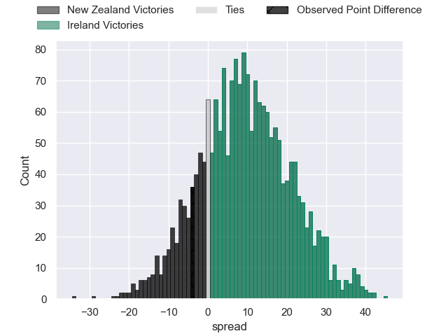
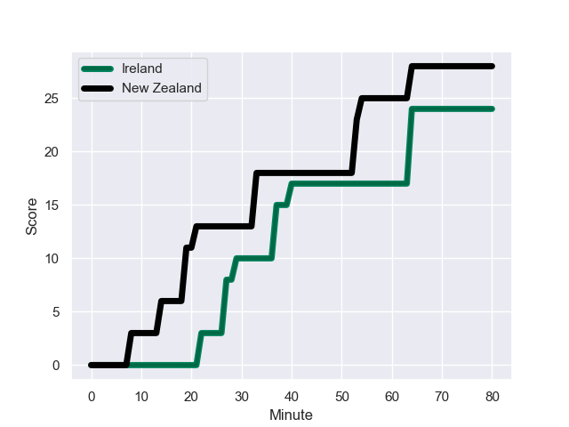
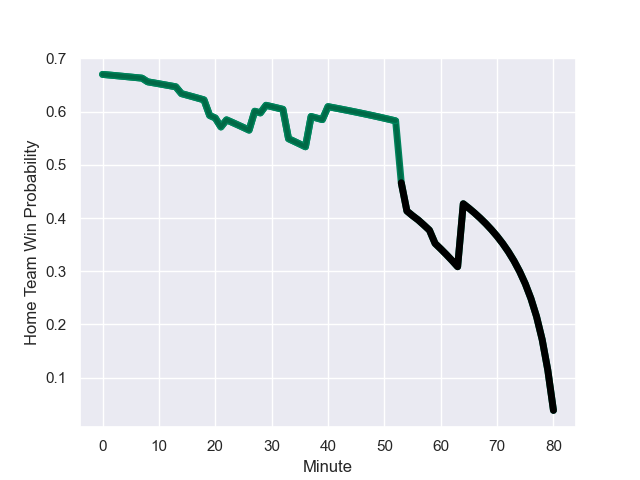

---  
layout: page  
title: New Zealand at Ireland; 28.0-24.0  
date: 2023-10-14 18:00:00 -0500  
categories: match review  
---
# New Zealand at Ireland; 28.0-24.0

# Club Level Predictions

The first set of predictions treats a club as the smallest object, as the club develops its members, organizes a gameplan, and deploys its players as needed for each match. This club model has a prediction of 0.589, which translates to predicting Ireland to win by 3.2.

Each club has a rating and a rating deviation (similar to a Glicko rating), and expected performances can be generated. This allows for simulated matches and spreads like the ones below.
## Projected Performances - Club Model

## Projected Spreads - Club Model

## Projected Results - Club Model

# Player Level Predictions - Version 2

Treating teams instead as an entity made up of the currently active players, I have ratings for each player in an altogether different system. These can be combined to form team ratings once teamsheets are announced, weighting starters a bit higher than the reserves. After the match is played, players can be weighted by their minutes on the field, allowing for an accurate measure of the team's composition. With these compiled team ratings, we can make predictions, measure inaccuracy, and update the individual player ratings.
## Prediction with Player Minutes: Ireland by 7.8

Ireland by 7.8 on a neutral field
## Prediction without Player Minutes: Ireland by 7.2

Ireland by 7.2 on a neutral pitch

## Projected Performances - Player Model

## Projected Spreads - Player Model

## Projected Results - Player Model

## Scores over Time

## Win Probability over Time

There were 12 large changes in win probability in this match

|   Away Minutes | Away Player            |   Away elo |   Number |   Home elo | Home Player         |   Home Minutes |
|---------------:|:-----------------------|-----------:|---------:|-----------:|:--------------------|---------------:|
|             64 | Ethan de Groot         |      50.05 |        1 |      80.6  | Andrew Porter       |             76 |
|             75 | Codie Taylor           |     102.24 |        2 |      59.47 | Dan Sheehan         |             64 |
|             64 | Tyrel Lomax            |      68.44 |        3 |      93.1  | Tadhg Furlong       |             53 |
|             70 | Brodie Retallick       |     138.29 |        4 |     138.31 | Tadhg Beirne        |             80 |
|             80 | Scott Barrett          |      96.92 |        5 |      73.11 | Iain Henderson      |             59 |
|             59 | Shannon Frizell        |      58.11 |        6 |     100.68 | Peter O'Mahony      |             80 |
|             75 | Sam Cane               |     106.52 |        7 |     120.56 | Josh van der Flier  |             59 |
|             80 | Ardie Savea            |     101.84 |        8 |     110.7  | Caelan Doris        |             80 |
|             80 | Aaron Smith            |     101.83 |        9 |     116.76 | Jamison Gibson-Park |             61 |
|             80 | Richie Mo'unga         |     117.18 |       10 |     113.51 | Johnny Sexton       |             80 |
|             64 | Leicester Fainga'anuku |      81.11 |       11 |     170.5  | James Lowe          |             80 |
|             80 | Jordie Barrett         |      81.51 |       12 |     120.21 | Bundee Aki          |             80 |
|             80 | Rieko Ioane            |      55.21 |       13 |     117.36 | Garry Ringrose      |             80 |
|             80 | Will Jordan            |      99.81 |       14 |      76.36 | Mack Hansen         |             56 |
|             80 | Beauden Barrett        |     142.78 |       15 |     119.78 | Hugo Keenan         |             80 |
|             15 | Dane Coles             |     122.68 |       16 |      77.55 | Ronan Kelleher      |             16 |
|             16 | Tamaiti Williams       |      62.2  |       17 |      81.66 | Dave Kilcoyne       |              4 |
|             16 | Fletcher Newell        |      21.33 |       18 |      90.32 | Finlay Bealham      |             27 |
|             21 | Samuel Whitelock       |     140.2  |       19 |      48.62 | Joe McCarthy        |             21 |
|              5 | Dalton Papalii         |     108.5  |       20 |     109.27 | Jack Conan          |             21 |
|              0 | Finlay Christie        |      55.35 |       21 |     112.61 | Conor Murray        |             19 |
|              0 | Damian McKenzie        |     104.46 |       22 |      56.13 | Jack Crowley        |              0 |
|             16 | Anton Lienert-Brown    |      73.59 |       23 |      78.67 | Jimmy O'Brien       |             24 |

