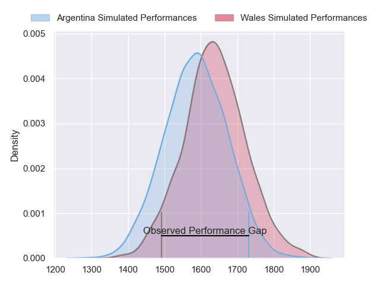
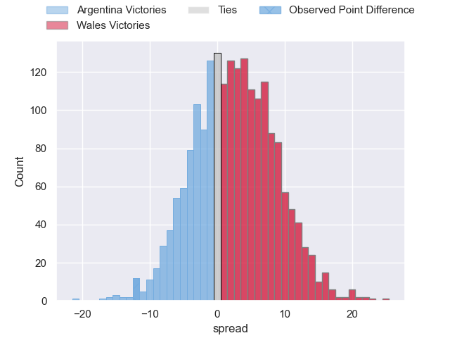
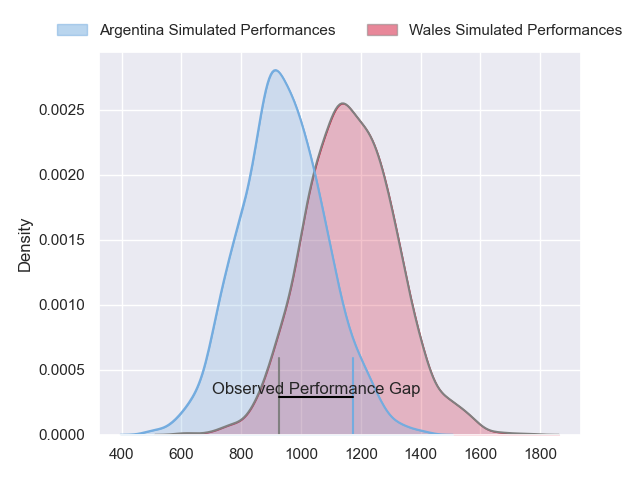
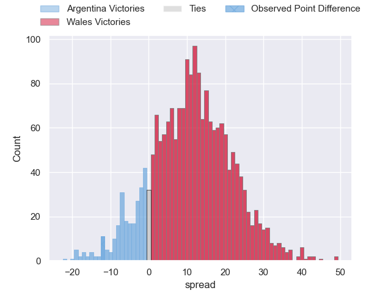
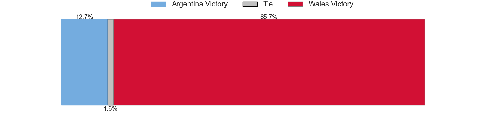
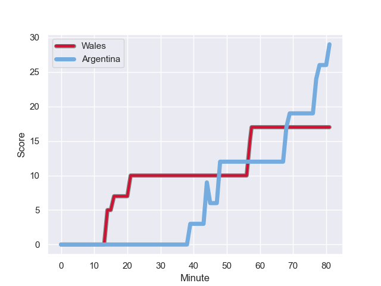
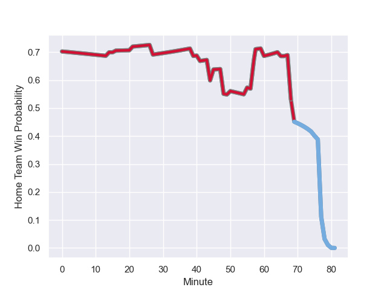

---  
layout: page  
title: Argentina at Wales; 29.0-17.0  
date: 2023-10-14 18:00:00 -0500  
categories: match review  
---
# Argentina at Wales; 29.0-17.0

# Club Level Predictions

The first set of predictions treats a club as the smallest object, as the club develops its members, organizes a gameplan, and deploys its players as needed for each match. This club model has a prediction of 0.567, which translates to predicting Wales to win by 2.4.

Each club has a rating and a rating deviation (similar to a Glicko rating), and expected performances can be generated. This allows for simulated matches and spreads like the ones below.
## Projected Performances - Club Model

## Projected Spreads - Club Model

## Projected Results - Club Model

# Player Level Predictions - Version 2

Treating teams instead as an entity made up of the currently active players, I have ratings for each player in an altogether different system. These can be combined to form team ratings once teamsheets are announced, weighting starters a bit higher than the reserves. After the match is played, players can be weighted by their minutes on the field, allowing for an accurate measure of the team's composition. With these compiled team ratings, we can make predictions, measure inaccuracy, and update the individual player ratings.
## Prediction with Player Minutes: Wales by 9.4

Wales by 9.4 on a neutral field
## Prediction without Player Minutes: Wales by 10.1

Wales by 10.1 on a neutral pitch

## Projected Performances - Player Model

## Projected Spreads - Player Model

## Projected Results - Player Model

## Scores over Time

## Win Probability over Time

There were 12 large changes in win probability in this match

|   Away Minutes | Away Player            |   Away elo |   Number |   Home elo | Home Player       |   Home Minutes |
|---------------:|:-----------------------|-----------:|---------:|-----------:|:------------------|---------------:|
|             67 | Thomas Gallo           |      58.82 |        1 |      37.73 | Gareth Thomas     |             57 |
|             67 | Julian Montoya         |      79.48 |        2 |      85.08 | Ryan Elias        |             41 |
|             55 | Francisco Gomez Kodela |      75.87 |        3 |     106.2  | Tomas Francis     |             66 |
|             81 | Guido Petti            |      51.86 |        4 |      41.67 | Will Rowlands     |             81 |
|             55 | Tomas Lavanini         |      61.84 |        5 |      63.1  | Adam Beard        |             66 |
|             81 | Juan Martin Gonzalez   |      68.47 |        6 |      78.1  | Jac Morgan        |             81 |
|             81 | Marcos Kremer          |      40.02 |        7 |      60.22 | Tommy Reffell     |             57 |
|             55 | Facundo Isa            |      93.9  |        8 |      72.04 | Aaron Wainwright  |             81 |
|             55 | Tomas Cubelli          |      45.57 |        9 |      41.75 | Gareth Davies     |             50 |
|             69 | Santiago Carreras      |      71.02 |       10 |     130.26 | Dan Biggar        |             75 |
|             81 | Mateo Carreras         |      47.64 |       11 |      67.1  | Josh Adams        |             81 |
|             27 | Santiago Chocobares    |      33.95 |       12 |     107.64 | Nick Tompkins     |             71 |
|             81 | Lucio Cinti            |      46.09 |       13 |     119.82 | George North      |             81 |
|             81 | Emiliano Boffelli      |      47.61 |       14 |      87.06 | Louis Rees-Zammit |             81 |
|             81 | Juan Cruz Mallia       |      85.39 |       15 |     119.44 | Liam Williams     |             60 |
|             14 | Agustin Creevy         |      88.11 |       16 |      37.22 | Dewi Lake         |             40 |
|             14 | Joel Sclavi            |      59.72 |       17 |      60.09 | Corey Domachowski |             24 |
|             26 | Eduardo Bello          |      11.2  |       18 |      82.95 | Dillon Lewis      |             15 |
|             26 | Matias Alemanno        |      54.29 |       19 |      66.3  | Dafydd Jenkins    |             15 |
|             26 | Rodrigo Bruni          |      92.14 |       20 |      49.68 | Christ Tshiunza   |             24 |
|             26 | Lautaro Bazan Velez    |      49    |       21 |      76.15 | Tomos Williams    |             31 |
|             12 | Nicolas Sanchez        |      91.09 |       22 |      40.78 | Sam Costelow      |             16 |
|             54 | Matias Moroni          |     108.1  |       23 |      25.43 | Rio Dyer          |             21 |

