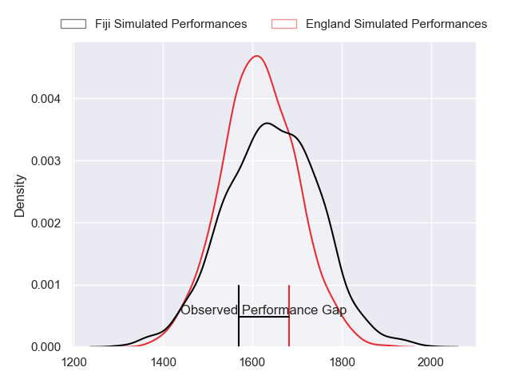
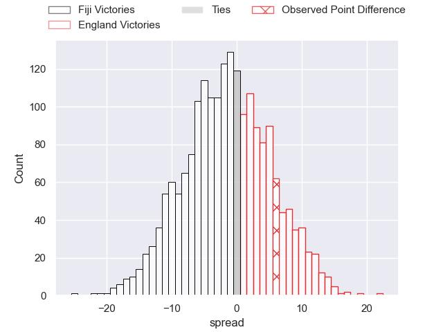
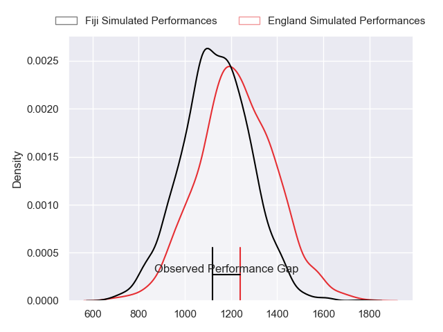
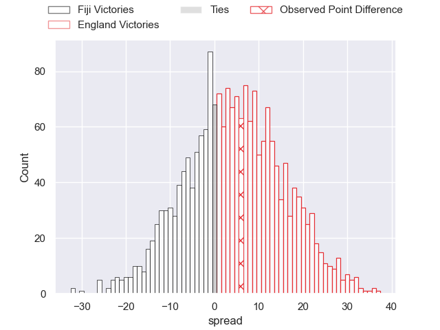
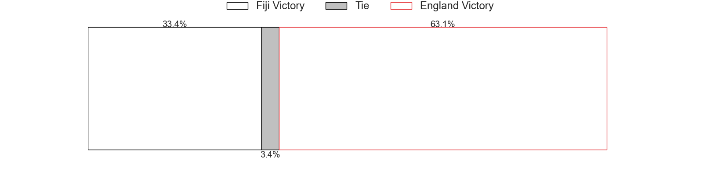
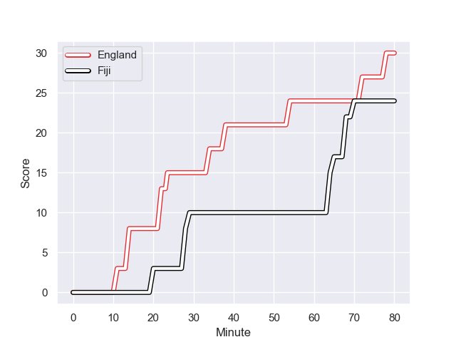
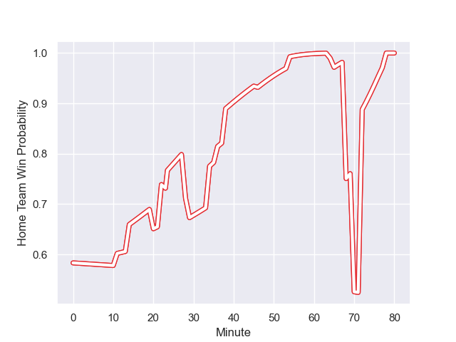

---  
layout: page  
title: Fiji at England; 24.0-30.0  
date: 2023-10-15 18:00:00 -0500  
categories: match review  
---
# Fiji at England; 24.0-30.0

# Club Level Predictions

The first set of predictions treats a club as the smallest object, as the club develops its members, organizes a gameplan, and deploys its players as needed for each match. This club model has a prediction of 0.457, which translates to predicting Fiji to win by 1.6.

Each club has a rating and a rating deviation (similar to a Glicko rating), and expected performances can be generated. This allows for simulated matches and spreads like the ones below.
## Projected Performances - Club Model

## Projected Spreads - Club Model

## Projected Results - Club Model

# Player Level Predictions - Version 2

Treating teams instead as an entity made up of the currently active players, I have ratings for each player in an altogether different system. These can be combined to form team ratings once teamsheets are announced, weighting starters a bit higher than the reserves. After the match is played, players can be weighted by their minutes on the field, allowing for an accurate measure of the team's composition. With these compiled team ratings, we can make predictions, measure inaccuracy, and update the individual player ratings.
## Prediction with Player Minutes: England by 3.7

England by 3.7 on a neutral field
## Prediction without Player Minutes: England by 3.5

England by 3.5 on a neutral pitch

## Projected Performances - Player Model

## Projected Spreads - Player Model

## Projected Results - Player Model

## Scores over Time

## Win Probability over Time

There were 13 large changes in win probability in this match

|   Away Minutes | Away Player                    |   Away elo |   Number |   Home elo | Home Player    |   Home Minutes |
|---------------:|:-------------------------------|-----------:|---------:|-----------:|:---------------|---------------:|
|             49 | Eroni Mawi                     |      45.75 |        1 |      34.52 | Ellis Genge    |             61 |
|             49 | Tevita Ikanivere               |      68.14 |        2 |     110.62 | Jamie George   |             80 |
|             23 | Luke Tagi                      |      51.5  |        3 |      47.65 | Dan Cole       |             60 |
|             80 | Isoa Nasilasila                |      69.05 |        4 |     107.39 | Maro Itoje     |             80 |
|             76 | Albert Tuisue                  |      85.29 |        5 |      60.23 | Ollie Chessum  |             70 |
|             56 | Lekima Tagitagivalu            |      77.03 |        6 |      86.85 | Courtney Lawes |             80 |
|             80 | Levani Botia                   |     110.61 |        7 |      67.86 | Tom Curry      |             74 |
|             80 | Viliame Mata                   |      40.99 |        8 |      94.9  | Ben Earl       |             80 |
|             56 | Frank Lomani                   |      49.65 |        9 |      67.96 | Alex Mitchell  |             60 |
|             80 | Vilimoni Botitu                |      64.16 |       10 |     131.99 | Owen Farrell   |             80 |
|             80 | Semi Radradra                  |     127.56 |       11 |      64.11 | Elliot Daly    |             80 |
|             72 | Josua Tuisova                  |     103.93 |       12 |     104.06 | Manu Tuilagi   |             80 |
|             80 | Waisea Nayacalevu Vuidravuwalu |     132.11 |       13 |      82.6  | Joe Marchant   |             80 |
|             46 | Vinaya Habosi                  |      56.46 |       14 |      41.87 | Jonny May      |             65 |
|             80 | Ilaisa Droasese                |      61.05 |       15 |      75.88 | Marcus Smith   |             67 |
|             31 | Sam Matavesi                   |      60.81 |       16 |      44.25 | Theo Dan       |              0 |
|             31 | Peni Ravai Kovekalou           |      40.93 |       17 |      96.6  | Joe Marler     |             19 |
|             57 | Mesake Doge                    |      40.67 |       18 |      62.98 | Kyle Sinckler  |             20 |
|             24 | Ratu Meli Derenalagi           |      68.45 |       19 |      68    | George Martin  |             10 |
|              4 | Vilive Miramira                |      55.26 |       20 |     122.55 | Billy Vunipola |              6 |
|             24 | Simione Kuruvoli               |      47.46 |       21 |     135.06 | Danny Care     |             20 |
|              8 | Iosefo Masi                    |      61.6  |       22 |      97.24 | George Ford    |              0 |
|             34 | Sireli Maqala                  |      72.98 |       23 |      56.08 | Ollie Lawrence |             28 |

