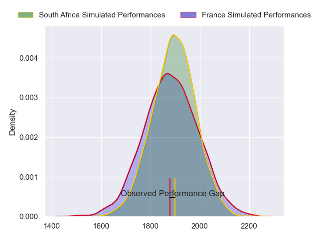
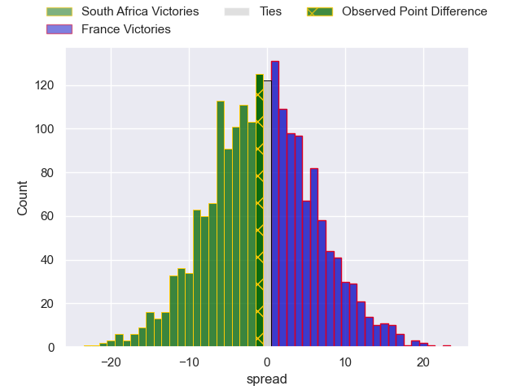
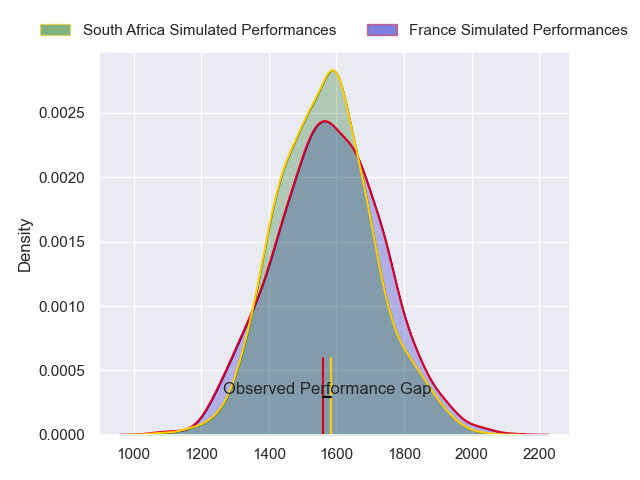
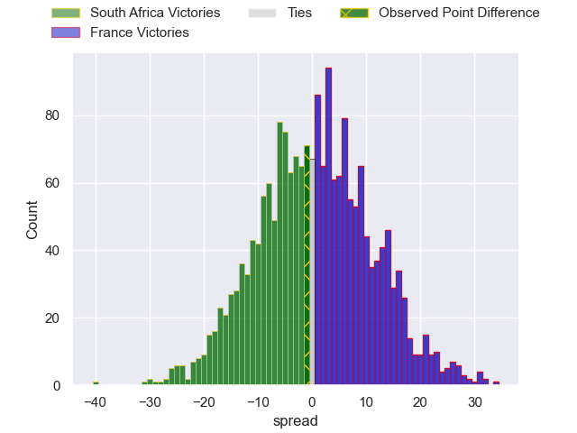
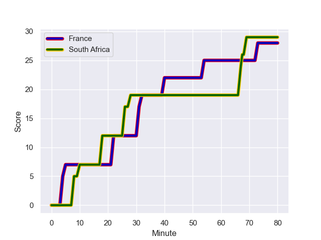
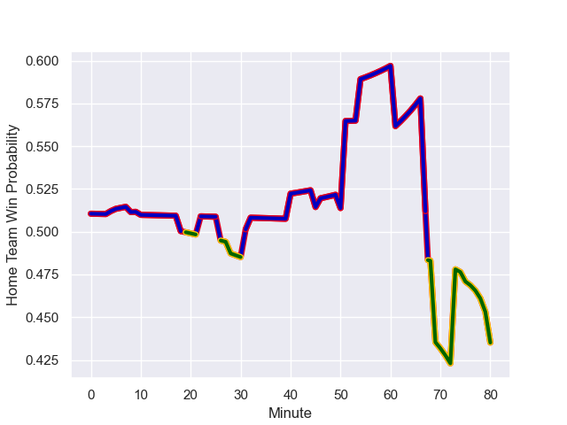

---  
layout: page  
title: South Africa at France; 29.0-28.0  
date: 2023-10-15 18:00:00 -0500  
categories: match review  
---
# South Africa at France; 29.0-28.0

# Club Level Predictions

The first set of predictions treats a club as the smallest object, as the club develops its members, organizes a gameplan, and deploys its players as needed for each match. This club model has a prediction of 0.485, which translates to predicting South Africa to win by 0.5.

Each club has a rating and a rating deviation (similar to a Glicko rating), and expected performances can be generated. This allows for simulated matches and spreads like the ones below.
## Projected Performances - Club Model

## Projected Spreads - Club Model

## Projected Results - Club Model

# Player Level Predictions - Version 2

Treating teams instead as an entity made up of the currently active players, I have ratings for each player in an altogether different system. These can be combined to form team ratings once teamsheets are announced, weighting starters a bit higher than the reserves. After the match is played, players can be weighted by their minutes on the field, allowing for an accurate measure of the team's composition. With these compiled team ratings, we can make predictions, measure inaccuracy, and update the individual player ratings.
## Prediction with Player Minutes: France by 0.5

South Africa by 3.2 on a neutral field
## Prediction without Player Minutes: France by 1.1

South Africa by 2.5 on a neutral pitch

## Projected Performances - Player Model

## Projected Spreads - Player Model

## Projected Results - Player Model

## Scores over Time

## Win Probability over Time

There were 6 large changes in win probability in this match

|   Away Minutes | Away Player          |   Away elo |   Number |   Home elo | Home Player          |   Home Minutes |
|---------------:|:---------------------|-----------:|---------:|-----------:|:---------------------|---------------:|
|             51 | Steven Kitshoff      |      97.03 |        1 |      96.85 | Cyril Baille         |             50 |
|             75 | Bongi Mbonambi       |     101.24 |        2 |      87.62 | Peato Mauvaka        |             64 |
|             63 | Frans Malherbe       |      84.96 |        3 |     126.65 | Uini Atonio          |             58 |
|             80 | Eben Etzebeth        |     111.79 |        4 |      63.97 | Cameron Woki         |             80 |
|             45 | Franco Mostert       |     113.79 |        5 |      82.37 | Thibaud Flament      |             50 |
|             46 | Siya Kolisi          |     114.4  |        6 |     107.67 | Anthony Jelonch      |             51 |
|             66 | Pieter-Steph du Toit |      78.79 |        7 |     113.71 | Charles Ollivon      |             80 |
|             70 | Duane Vermeulen      |     126.15 |        8 |     114.37 | Gregory Alldritt     |             69 |
|             45 | Cobus Reinach        |      87.32 |        9 |     139.1  | Antoine Dupont       |             80 |
|             45 | Manie Libbok         |      74.83 |       10 |      98.75 | Matthieu Jalibert    |             73 |
|             80 | Cheslin Kolbe        |     136.39 |       11 |      58.9  | Louis Bielle-Biarrey |             80 |
|             80 | Damian de Allende    |      88.57 |       12 |     116.81 | Jonathan Danty       |             80 |
|             80 | Jesse Kriel          |     134.39 |       13 |     104.64 | Gael Fickou          |             80 |
|             80 | Kurt-Lee Arendse     |     109.93 |       14 |      84.19 | Damian Penaud        |             80 |
|             51 | Damian Willemse      |     111.9  |       15 |     123.71 | Thomas Ramos         |             80 |
|             34 | Deon Fourie          |      91.37 |       16 |      78.18 | Pierre Bourgarit     |             16 |
|             29 | Ox Nche              |     107.71 |       17 |      82.75 | Reda Wardi           |             30 |
|             17 | Vincent Koch         |      48.27 |       18 |     102.08 | Dorian Aldegheri     |             22 |
|             35 | RG Snyman            |     117.09 |       19 |      49.51 | Romain Taofifenua    |             30 |
|             29 | Kwagga Smith         |      68.96 |       20 |     123.26 | Francois Cros        |             29 |
|             35 | Faf de Klerk         |     108.42 |       21 |      86.91 | Sekou Macalou        |             11 |
|             35 | Handre Pollard       |     103.35 |       22 |     108.26 | Maxime Lucu          |              0 |
|             29 | Willie le Roux       |     106.34 |       23 |      54.66 | Yoram Moefana        |              7 |

