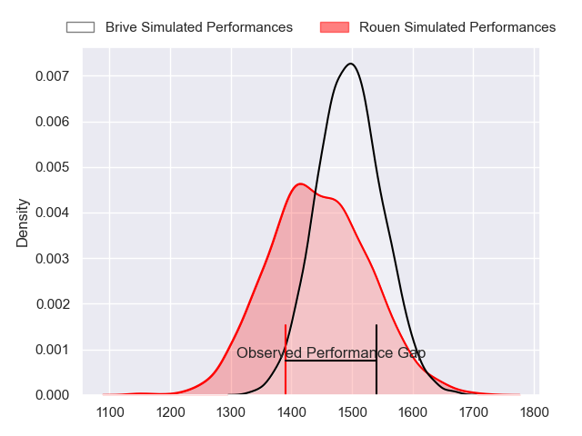
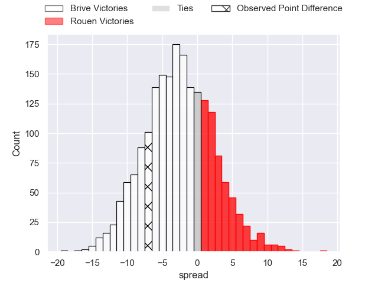
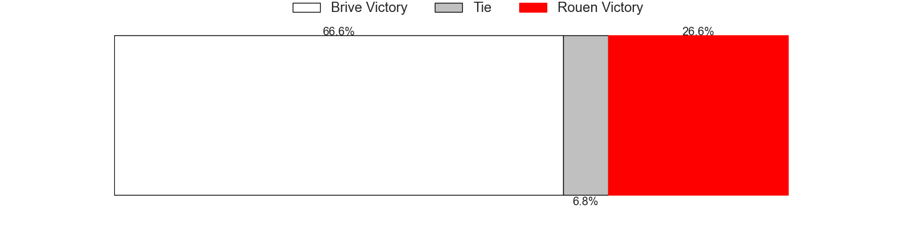
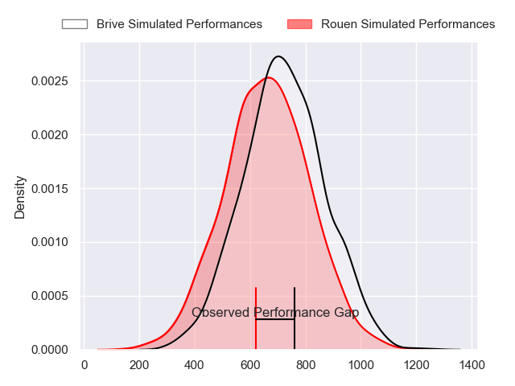
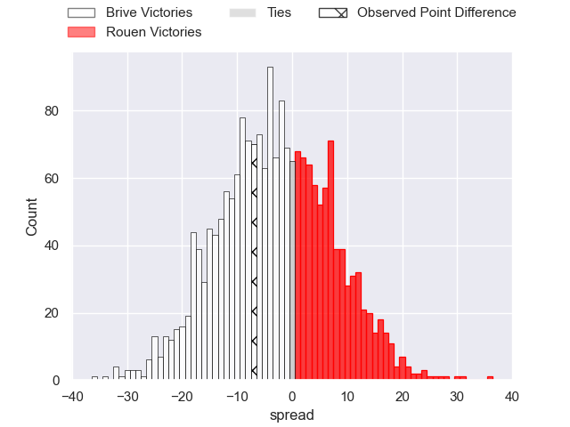
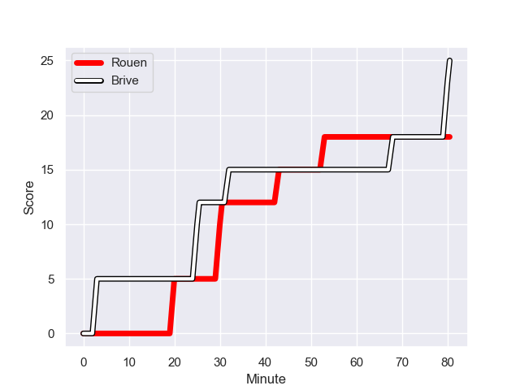
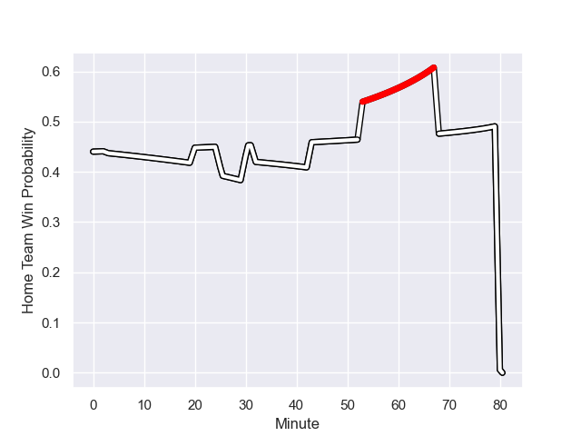

---  
layout: page  
title: Brive at Rouen; 25.0-18.0  
date: 2023-10-18 18:00:00 -0500  
categories: "Pro D2 2023" match review  
---
# Brive at Rouen; 25.0-18.0

# Club Level Predictions

The first set of predictions treats a club as the smallest object, as the club develops its members, organizes a gameplan, and deploys its players as needed for each match. This club model has a prediction of 0.423, which translates to predicting Brive to win by 2.7.

Each club has a rating and a rating deviation (similar to a Glicko rating), and expected performances can be generated. This allows for simulated matches and spreads like the ones below.
## Projected Performances - Club Model

## Projected Spreads - Club Model

## Projected Results - Club Model

# Player Level Predictions - Version 2

Treating teams instead as an entity made up of the currently active players, I have ratings for each player in an altogether different system. These can be combined to form team ratings once teamsheets are announced, weighting starters a bit higher than the reserves. After the match is played, players can be weighted by their minutes on the field, allowing for an accurate measure of the team's composition. With these compiled team ratings, we can make predictions, measure inaccuracy, and update the individual player ratings.
## Prediction with Player Minutes: Brive by 2.6

Brive by 6.0 on a neutral field
## Prediction without Player Minutes: Brive by 2.9

Brive by 6.3 on a neutral pitch

## Projected Performances - Player Model

## Projected Spreads - Player Model

## Projected Results - Player Model

## Scores over Time

## Win Probability over Time

There were 8 large changes in win probability in this match

|   Away Minutes | Away Player               |   Away elo |   Number |   Home elo | Home Player         |   Home Minutes |
|---------------:|:--------------------------|-----------:|---------:|-----------:|:--------------------|---------------:|
|             53 | Vakh Abdaladze            |      50.46 |        1 |      22.1  | Elias El Ansari     |             60 |
|             53 | Issam Hamel               |      53.47 |        2 |      45.14 | Mathieu Bonnot      |             53 |
|             53 | Marcel van der Merwe      |      25.07 |        3 |      38.7  | Cody Thomas         |             64 |
|             80 | Renger Van Eerten         |      39.1  |        4 |      16.55 | Will Witty          |             80 |
|             39 | Sitaleki Timani           |      60.48 |        5 |      53.42 | Toby Salmon         |             62 |
|             47 | Sasha Gue                 |      29.54 |        6 |      45.93 | Tienie Burger       |             80 |
|             47 | Said Hireche              |      81.44 |        7 |      21.66 | Samuel Maximin      |             80 |
|             80 | Taniela Sadrugu           |      46.65 |        8 |      64.38 | Julien Ruaud        |             60 |
|             53 | Leo Carbonneau            |       5.47 |        9 |      32.16 | Florent Campeggia   |             53 |
|             80 | Stuart Olding             |      67.11 |       10 |      47.21 | Hugo Aubry          |             64 |
|             80 | Asaeli Tuivuaka           |      36.21 |       11 |      66.59 | Benito Masilevu     |             80 |
|             80 | Sam Johnson               |      72.26 |       12 |      19.67 | JT Jackson          |             80 |
|             80 | Georges Shvelidze         |      43.03 |       13 |     -26.9  | Opetera Peleseuma   |             53 |
|             80 | Mathis Ferté              |      33.76 |       14 |      73.48 | Kevin Bly           |             80 |
|             60 | Thomas Laranjeira         |      72.56 |       15 |      50.36 | Baptiste Mouchous   |             80 |
|             41 | Retief Marais             |      44.77 |       16 |      39.23 | Lucas Malbert       |             27 |
|             33 | Rahboni Warren-Vosayaco   |      52.24 |       17 |      54.98 | Maxime Sidobre      |             27 |
|             33 | Ross Moriarty             |      78.88 |       18 |       5.48 | Alex Luatua         |             27 |
|             27 | Francisco Coria Marchetti |      35.48 |       19 |      30.38 | Antoine Fournier    |             20 |
|             27 | Wesley Tapueluelu         |      41.77 |       20 |      35.57 | Abdelkarim Fofana   |             20 |
|             27 | Julien Blanc              |      46.41 |       21 |      47.5  | Raphaël Vieilledent |             18 |
|             27 | Adrien Pelissie           |      58.72 |       22 |      21.22 | Luka Azariashvili   |             16 |
|             20 | Tom Raffy                 |      31.94 |       23 |      50.89 | Franck Pourteau     |             16 |

