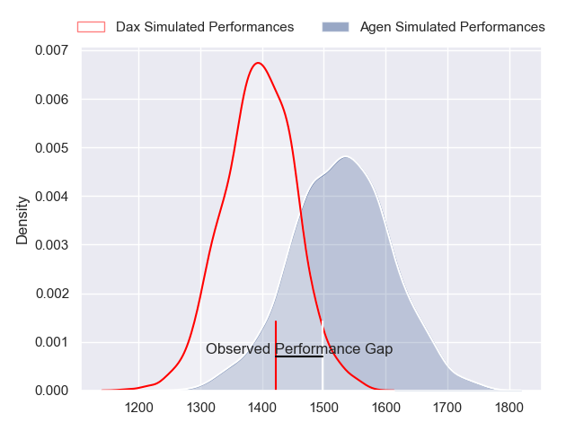
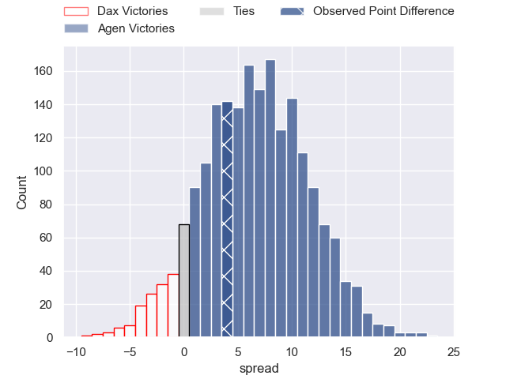
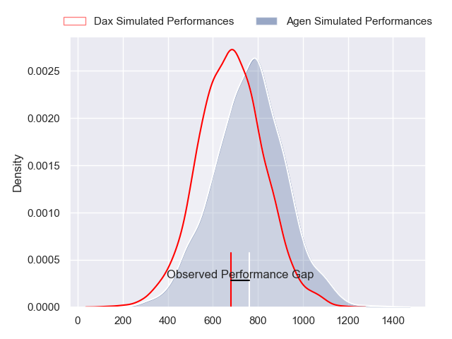
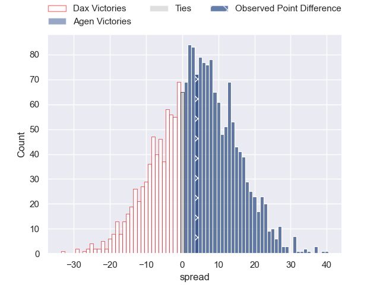
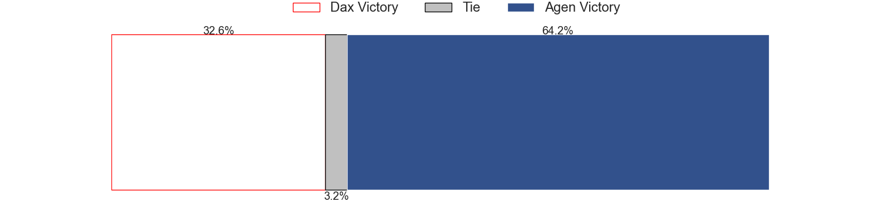
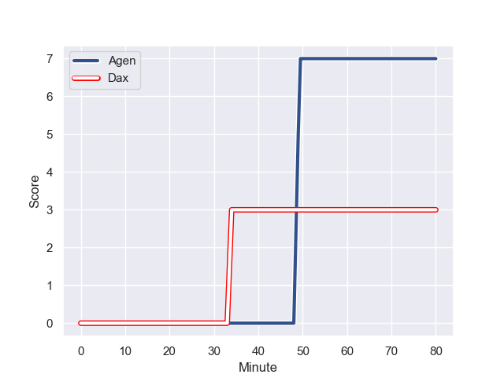
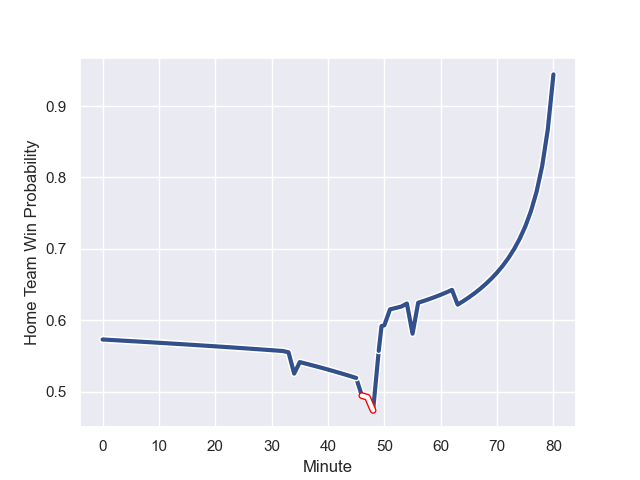

---  
layout: page  
title: Dax at Agen; 3.0-7.0  
date: 2023-10-19 18:00:00 -0500  
categories: "Pro D2 2023" match review  
---
# Dax at Agen; 3.0-7.0

# Club Level Predictions

The first set of predictions treats a club as the smallest object, as the club develops its members, organizes a gameplan, and deploys its players as needed for each match. This club model has a prediction of 0.679, which translates to predicting Agen to win by 6.6.

Each club has a rating and a rating deviation (similar to a Glicko rating), and expected performances can be generated. This allows for simulated matches and spreads like the ones below.
## Projected Performances - Club Model

## Projected Spreads - Club Model

## Projected Results - Club Model

# Player Level Predictions - Version 2

Treating teams instead as an entity made up of the currently active players, I have ratings for each player in an altogether different system. These can be combined to form team ratings once teamsheets are announced, weighting starters a bit higher than the reserves. After the match is played, players can be weighted by their minutes on the field, allowing for an accurate measure of the team's composition. With these compiled team ratings, we can make predictions, measure inaccuracy, and update the individual player ratings.
## Prediction with Player Minutes: Agen by 3.2

Dax by 1.6 on a neutral field
## Prediction without Player Minutes: Agen by 3.8

Dax by 1.0 on a neutral pitch

## Projected Performances - Player Model

## Projected Spreads - Player Model

## Projected Results - Player Model

## Scores over Time

## Win Probability over Time

There were 9 large changes in win probability in this match

|   Away Minutes | Away Player          |   Away elo |   Number |   Home elo | Home Player        |   Home Minutes |
|---------------:|:---------------------|-----------:|---------:|-----------:|:-------------------|---------------:|
|             54 | Asa Faitotoa         |      30.57 |        1 |      26.19 | Florent Guion      |             57 |
|             51 | Louis Barrere        |      37.58 |        2 |      -0.28 | Mike Sosene-Feagai |             67 |
|             51 | Diogo Hasse Ferreira |      46.78 |        3 |      52.71 | Alex Burin         |             55 |
|             33 | Mattieu Bidau        |      48.98 |        4 |      50.4  | Zak Farrance       |             67 |
|             80 | Mat Luamanu          |      47.69 |        5 |      76.93 | William Demotte    |             48 |
|             80 | Arnaud Aletti        |      52.41 |        6 |      34.9  | Julien Lebian      |             80 |
|             80 | Théo Tremeau         |      43.5  |        7 |      51.29 | Valentin Gayraud   |             80 |
|             35 | Genesis Mamea Lemalu |      84.44 |        8 |      33.93 | Fotu Lokotui       |             80 |
|             51 | Simon Garrouteigt    |      65.62 |        9 |      48.03 | Dorian Bellot      |             63 |
|             80 | Romuald Séguy        |      39.83 |       10 |      57.9  | Thomas Vincent     |             80 |
|             56 | Guillaume Bouche     |      54.06 |       11 |      78.09 | Henry Purdy        |             80 |
|             63 | Theo Dachary         |      21.03 |       12 |      55.99 | Clement Garrigues  |             80 |
|             80 | Hugo Fourquet        |      70.25 |       13 |      40.37 | Theo Belan         |             46 |
|             80 | Alexandre Pilati     |      32.77 |       14 |      -9.9  | Loris Tolot        |             80 |
|             80 | Maxime Oltmann       |      18.9  |       15 |      81.03 | Mathieu Lamoulie   |             46 |
|             45 | Brice Ferrer         |      52.02 |       16 |      35.15 | Kolinio Ramoka     |             34 |
|             47 | Étienne Loiret       |      51.14 |       17 |      42.69 | Ben Volavola       |             34 |
|             29 | Iban Hiriart-Urruty  |      51.19 |       18 |      -0.32 | Evan Olmstead      |             32 |
|             29 | Sylvère Reteau       |      49.95 |       19 |      47.48 | Théo Sauzaret      |             25 |
|             29 | David Lolohea        |      27.43 |       20 |      54.48 | Hans Lombard-Buret |             23 |
|             26 | Louis Mary           |      57.54 |       21 |      41.47 | Malik Hamadache    |             13 |
|             24 | Bastien Daguerre     |      54.97 |       22 |      28.7  | Andre Warner       |             17 |
|             17 | Ratu Nacika          |      40.49 |       23 |      92.83 | Antoine Erbani     |             13 |

