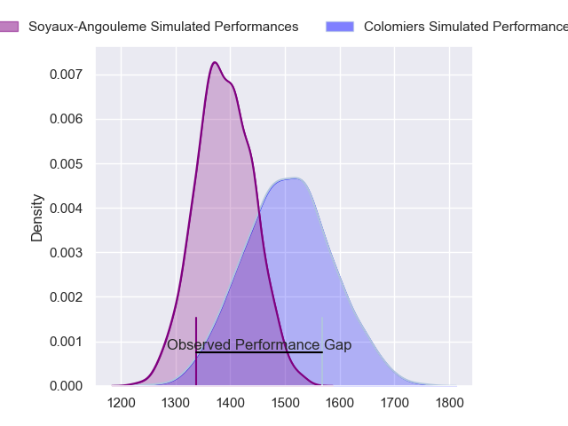
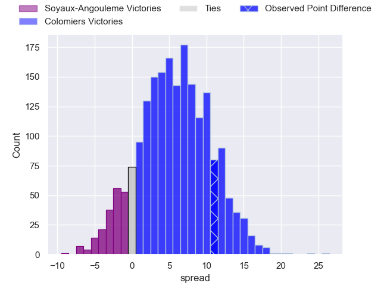
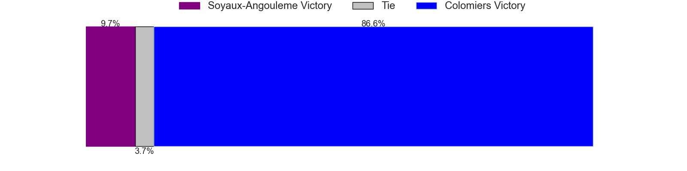
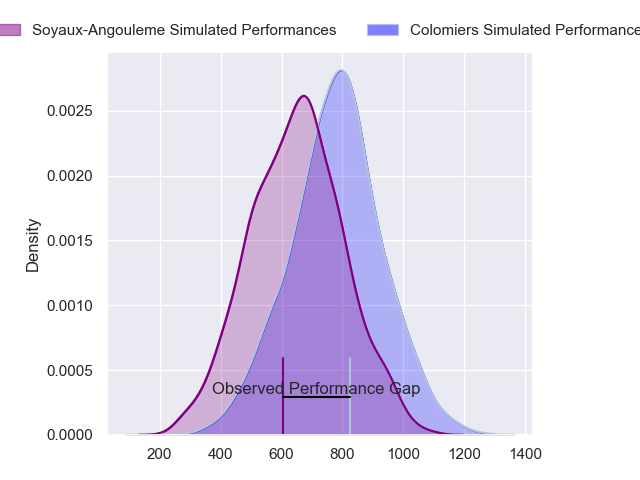
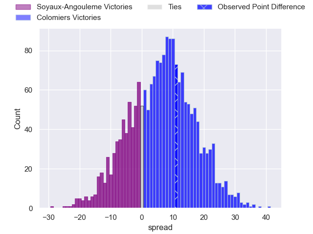
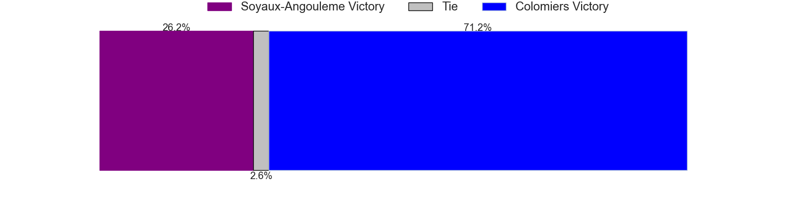
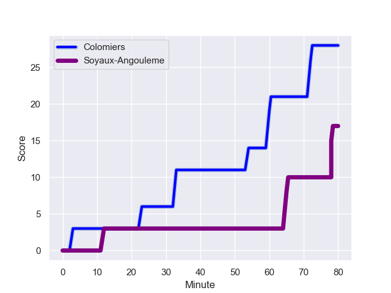
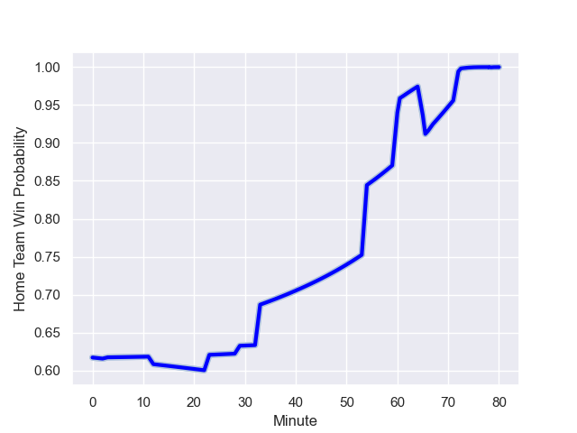

---  
layout: page  
title: Soyaux-Angouleme at Colomiers; 17.0-28.0  
date: 2023-10-19 18:00:00 -0500  
categories: "Pro D2 2023" match review  
---
# Soyaux-Angouleme at Colomiers; 17.0-28.0

# Club Level Predictions

The first set of predictions treats a club as the smallest object, as the club develops its members, organizes a gameplan, and deploys its players as needed for each match. This club model has a prediction of 0.657, which translates to predicting Colomiers to win by 5.7.

Each club has a rating and a rating deviation (similar to a Glicko rating), and expected performances can be generated. This allows for simulated matches and spreads like the ones below.
## Projected Performances - Club Model

## Projected Spreads - Club Model

## Projected Results - Club Model

# Player Level Predictions - Version 2

Treating teams instead as an entity made up of the currently active players, I have ratings for each player in an altogether different system. These can be combined to form team ratings once teamsheets are announced, weighting starters a bit higher than the reserves. After the match is played, players can be weighted by their minutes on the field, allowing for an accurate measure of the team's composition. With these compiled team ratings, we can make predictions, measure inaccuracy, and update the individual player ratings.
## Prediction with Player Minutes: Colomiers by 5.2

Colomiers by 0.7 on a neutral field
## Prediction without Player Minutes: Colomiers by 5.5

Colomiers by 0.9 on a neutral pitch

## Projected Performances - Player Model

## Projected Spreads - Player Model

## Projected Results - Player Model

## Scores over Time

## Win Probability over Time

There were 5 large changes in win probability in this match

|   Away Minutes | Away Player            |   Away elo |   Number |   Home elo | Home Player           |   Home Minutes |
|---------------:|:-----------------------|-----------:|---------:|-----------:|:----------------------|---------------:|
|             29 | Khatchik Vartanov      |      26.46 |        1 |      43.83 | Thomas Dubois         |             33 |
|             80 | Rayne Barka            |      55.23 |        2 |      -3.8  | Thomas Larrieu        |             48 |
|             29 | Omar Dahir             |      50.66 |        3 |      65.42 | Michael Simutoga      |             48 |
|             80 | Matt Beukeboom         |      37.31 |        4 |      62.17 | Maxime Granouillet    |             61 |
|             48 | Will Spencer           |      53.97 |        5 |      31.47 | Janse Roux            |             80 |
|             54 | Germain Burgaud        |      52.83 |        6 |      77.64 | Rob Harley            |             61 |
|             80 | Nicolas Martins        |      51.92 |        7 |      43.81 | Jeremy Bechu          |             80 |
|             80 | Matt Va'ai             |      21.38 |        8 |      53.02 | Aldric Lescure        |             54 |
|             47 | Adrien Bau             |      13.08 |        9 |      33.18 | Ugo Seguela           |             67 |
|             80 | Ben Botica             |      62.06 |       10 |      13.31 | Maxime Javaux         |             80 |
|             54 | Eoghan Barrett         |      42.07 |       11 |      89.57 | Rodrigo Marta         |             80 |
|             80 | Mathis Lafon           |      40.47 |       12 |      39.3  | Ray Nu'u              |             61 |
|             80 | Inaki Ayarza Saporta   |      43.39 |       13 |      42.55 | Enzo Salles           |             80 |
|             80 | Matthys Gratien        |      56.79 |       14 |      58.56 | Vincent Pinto         |             80 |
|             57 | Rémi Brosset           |      47.43 |       15 |      26.22 | Thomas Girard         |             80 |
|             51 | Yassine Boutemane      |      20.03 |       16 |      41.19 | Pierre-Samuel Pacheco |             47 |
|             51 | Seydou Diakité         |      35.98 |       17 |      32.35 | Andrew Ready          |             32 |
|             33 | Manu Saubusse          |      55.34 |       18 |      42.59 | Hugo Pirlet           |             32 |
|             32 | William Greatbanks     |      44.91 |       19 |      43.67 | Waël Ponpon           |             26 |
|             26 | Akuila Joeli Tabualevu |      55.85 |       20 |      50.03 | Jean Thomas           |             19 |
|             26 | Patxi Bidart           |      43.4  |       21 |      49.77 | Romain Bezian         |             19 |
|             23 | Jacob Botica           |      38.29 |       22 |      43.99 | Dorian Laborde        |             19 |
|            nan | nan                    |     nan    |       23 |      46.57 | Arthur Diaz           |             13 |

