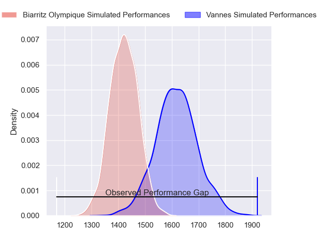
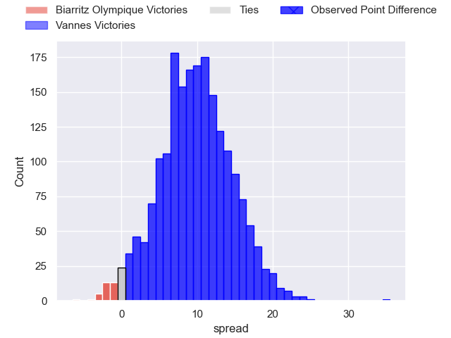
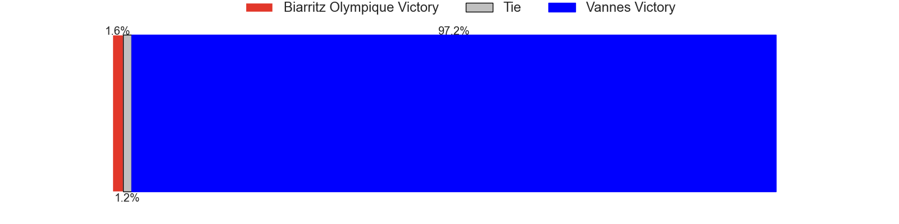
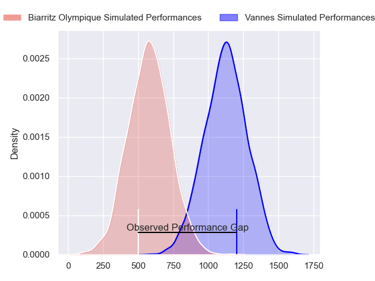
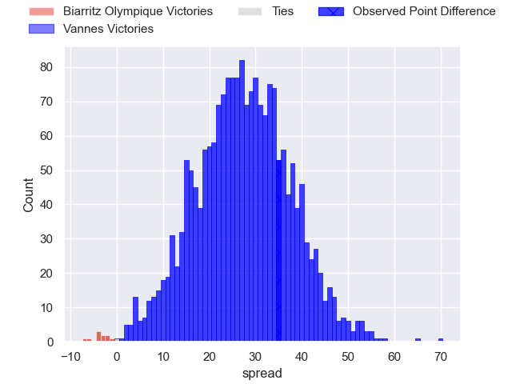
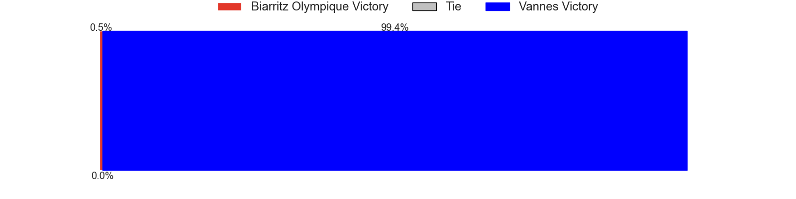
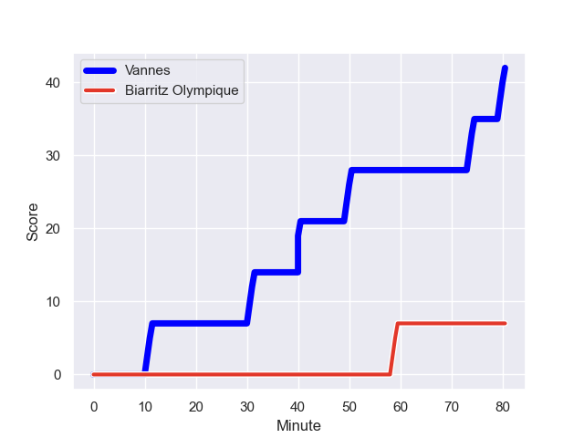
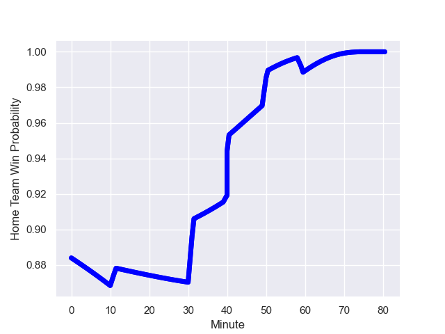

---  
layout: page  
title: Biarritz Olympique at Vannes; 7.0-42.0  
date: 2023-10-19 18:00:00 -0500  
categories: "Pro D2 2023" match review  
---
# Biarritz Olympique at Vannes; 7.0-42.0

# Club Level Predictions

The first set of predictions treats a club as the smallest object, as the club develops its members, organizes a gameplan, and deploys its players as needed for each match. This club model has a prediction of 0.752, which translates to predicting Vannes to win by 9.8.

Each club has a rating and a rating deviation (similar to a Glicko rating), and expected performances can be generated. This allows for simulated matches and spreads like the ones below.
## Projected Performances - Club Model

## Projected Spreads - Club Model

## Projected Results - Club Model

# Player Level Predictions - Version 2

Treating teams instead as an entity made up of the currently active players, I have ratings for each player in an altogether different system. These can be combined to form team ratings once teamsheets are announced, weighting starters a bit higher than the reserves. After the match is played, players can be weighted by their minutes on the field, allowing for an accurate measure of the team's composition. With these compiled team ratings, we can make predictions, measure inaccuracy, and update the individual player ratings.
## Prediction with Player Minutes: Vannes by 22.2

Vannes by 18.6 on a neutral field
## Prediction without Player Minutes: Vannes by 20.4

Vannes by 16.8 on a neutral pitch

## Projected Performances - Player Model

## Projected Spreads - Player Model

## Projected Results - Player Model

## Scores over Time

## Win Probability over Time

There were 1 large changes in win probability in this match

|   Away Minutes | Away Player       |   Away elo |   Number |   Home elo | Home Player             |   Home Minutes |
|---------------:|:------------------|-----------:|---------:|-----------:|:------------------------|---------------:|
|             51 | Giorgi Nutsubidze |      34.29 |        1 |      66.09 | Andy Bordelai           |             49 |
|             67 | Thomas Sauveterre |      54.88 |        2 |      72.69 | Pat Leafa               |             49 |
|             51 | Alfie Petch       |      33.18 |        3 |      70.1  | Paga Tafili             |             58 |
|             44 | Johan Aliouat     |      44.91 |        4 |      61.99 | Darren O'Shea           |             69 |
|             80 | Charlie Francoz   |      25.1  |        5 |      58    | Anton Bresler           |             52 |
|             80 | Simon Augry       |      43.37 |        6 |      40.75 | Juan Bautista Pedemonte |             49 |
|             47 | Thomas Hebert     |      42.04 |        7 |     115.68 | Francisco Gorrissen     |             80 |
|             80 | Temo Matiu        |      47.36 |        8 |      82.97 | Joe Edwards             |             80 |
|             47 | Imanol Biscay     |      46.65 |        9 |      86.02 | Michael Ruru            |             80 |
|             80 | Chris Hilsenbeck  |      11.29 |       10 |      98.42 | Maxime Lafage           |             80 |
|             80 | Yohann Artru      |      10.22 |       11 |      65.12 | Théo Bastardie          |             80 |
|             64 | Jonathan Joseph   |      78.03 |       12 |      72.51 | Sacha Valleau           |             80 |
|             40 | Tyler Morgan      |      64.83 |       13 |       2.85 | Arthur Proult           |             52 |
|             80 | Baptiste Fariscot |      51.58 |       14 |      49.3  | Paul Surano             |             80 |
|             80 | Gervais Cordin    |      35.32 |       15 |     118.81 | Gwenaël Duplenne        |             58 |
|             40 | Ilian Perraux     |      54.85 |       16 |      45.08 | Charles-Henri Berguet   |             31 |
|             36 | Johnny Dyer       |       9.84 |       17 |      48.83 | Théo Beziat             |             31 |
|             33 | Adrian Motoc      |       3.79 |       18 |      46.03 | Léon Boulier            |             31 |
|             33 | Pierre Pages      |      40.2  |       19 |      45.57 | Mattéo Desjeux          |             28 |
|             29 | Zakaria El Fakir  |      33.16 |       20 |      50.42 | Jules Le Bail           |             28 |
|             29 | Lasha Tabidze     |      50.56 |       21 |      57.03 | Jérémy Boyadjis         |             22 |
|             16 | Joe Jonas         |      53.99 |       22 |      48.14 | Romaric Camou           |             22 |
|             13 | Brendan Lebrun    |      37.14 |       23 |      40.2  | Gregoire Bazin          |             11 |

