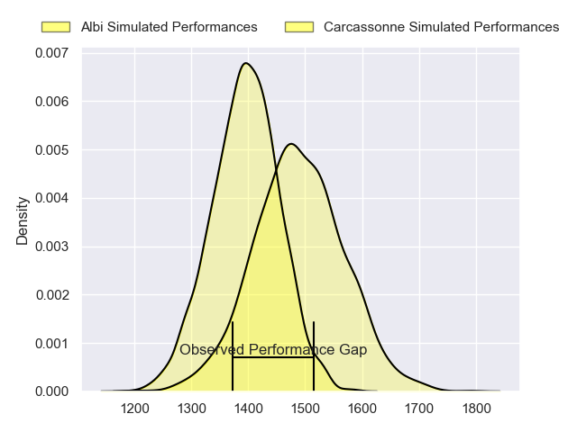
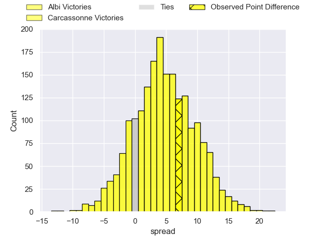
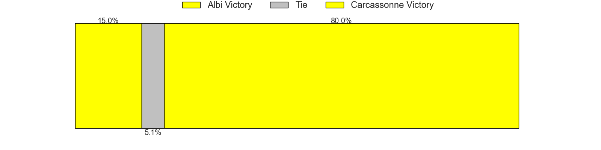
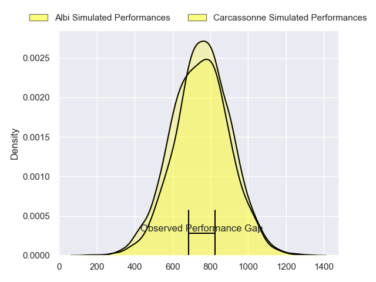
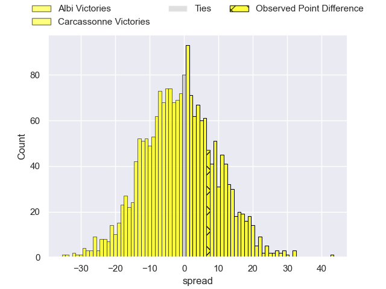
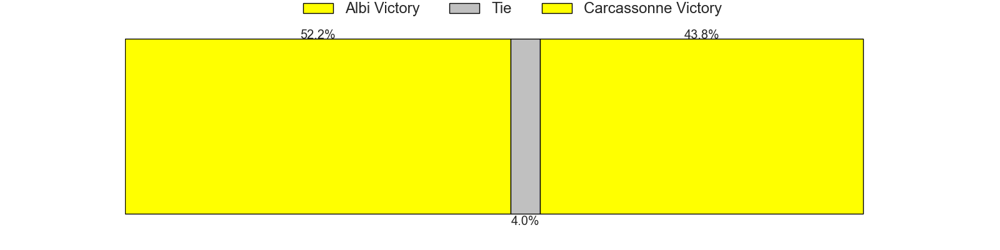
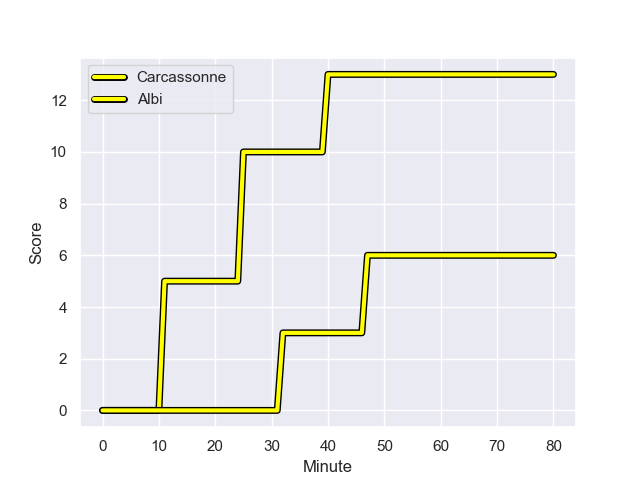
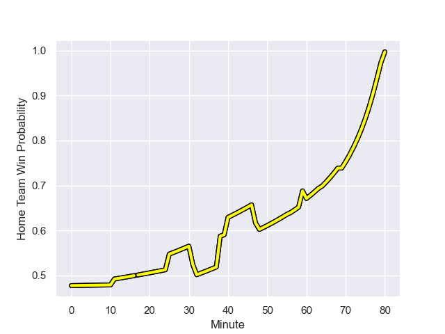

---  
layout: page  
title: Albi at Carcassonne; 6.0-13.0  
date: 2023-10-20 18:00:00 -0500  
categories: "Nationale 2023" match review  
---
# Albi at Carcassonne; 6.0-13.0

# Club Level Predictions

The first set of predictions treats a club as the smallest object, as the club develops its members, organizes a gameplan, and deploys its players as needed for each match. This club model has a prediction of 0.63, which translates to predicting Carcassonne to win by 4.7.

Each club has a rating and a rating deviation (similar to a Glicko rating), and expected performances can be generated. This allows for simulated matches and spreads like the ones below.
## Projected Performances - Club Model

## Projected Spreads - Club Model

## Projected Results - Club Model

# Player Level Predictions - Version 2

Treating teams instead as an entity made up of the currently active players, I have ratings for each player in an altogether different system. These can be combined to form team ratings once teamsheets are announced, weighting starters a bit higher than the reserves. After the match is played, players can be weighted by their minutes on the field, allowing for an accurate measure of the team's composition. With these compiled team ratings, we can make predictions, measure inaccuracy, and update the individual player ratings.
## Prediction with Player Minutes: Albi by 1.0

Albi by 5.2 on a neutral field
## Prediction without Player Minutes: Albi by 1.6

Albi by 5.9 on a neutral pitch

## Projected Performances - Player Model

## Projected Spreads - Player Model

## Projected Results - Player Model

## Scores over Time

## Win Probability over Time

There were 10 large changes in win probability in this match

|   Away Minutes | Away Player             |   Away elo |   Number |   Home elo | Home Player         |   Home Minutes |
|---------------:|:------------------------|-----------:|---------:|-----------:|:--------------------|---------------:|
|             38 | Thibaud Sebire          |      53.62 |        1 |      54    | Andrei Ursache      |             60 |
|             48 | Reinach Venter          |      35.36 |        2 |      46.62 | Raphael Carbou      |             56 |
|             48 | Dimitri Tchapnga        |      69.35 |        3 |      48.85 | Nikoloz Narmania    |             56 |
|             80 | Pierre Roussel          |      24.09 |        4 |      20.5  | Romain Manchia      |             60 |
|             48 | Dion Evrard Oulai       |      19.3  |        5 |      26.88 | Clément Fontaine    |             56 |
|             80 | Vincent Calas           |      51.49 |        6 |      45.06 | Bilal Fadli         |             31 |
|             80 | Simon Meka              |      62.23 |        7 |      44.29 | Valentin Sese       |             80 |
|             48 | Camille Jarreau         |      56    |        8 |      37.57 | Etienne Herjean     |             80 |
|             40 | Titouan Pouzoullic      |      58.02 |        9 |      24.65 | Gaetan Pichon       |             80 |
|             59 | Benjamin Pehau          |      59.32 |       10 |      53.02 | Gabin Michet        |             64 |
|             80 | Sean Robinson           |      30.62 |       11 |      71.55 | Léo Darrelatour     |             80 |
|             80 | Baptiste Couchinave     |      78.15 |       12 |      18.58 | Jordan Puletua      |             80 |
|              3 | Wandile Mjekevu         |      52.83 |       13 |      47.14 | Mathys Barka        |             69 |
|             80 | Simon Hartmann          |      63.18 |       14 |      46.5  | Mamoudou Niang      |             80 |
|             80 | Enzo Marzocca           |      60.42 |       15 |      55.89 | Maxime Gianet       |             80 |
|             42 | Antoine Soave           |      57.78 |       16 |      39.2  | Florent Lorenzon    |             20 |
|             32 | Romain Maurice          |      60.08 |       17 |      50.09 | Luka Petriashvili   |             24 |
|             32 | Jean Baptiste De Clercq |      54.18 |       18 |      22.96 | Vakhtangi Akhobadze |             24 |
|             32 | Jacques Engelbrecht     |      16.52 |       19 |      43.42 | Romain Guyot        |             20 |
|             32 | Sandrick Maciotta       |      77.2  |       20 |      24.75 | Marius Iftimiciuc   |             24 |
|             40 | Gilen Queheille         |      64.67 |       21 |      68.37 | Gary Graham         |             49 |
|             21 | James Haydn Tedder      |      33    |       22 |      -5.41 | Martin Landajo      |             16 |
|             77 | Jarrod Poi              |      32.17 |       23 |      41.36 | Tutuila Vaea        |             11 |

