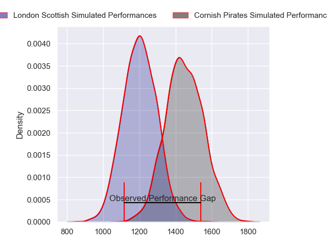
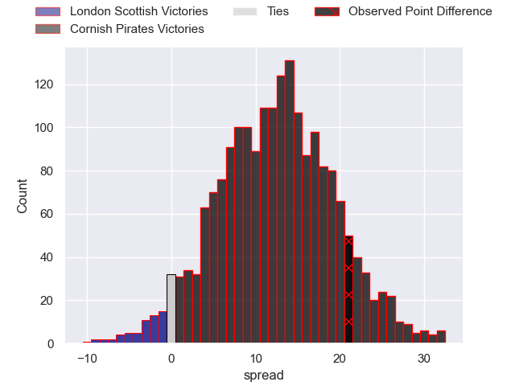
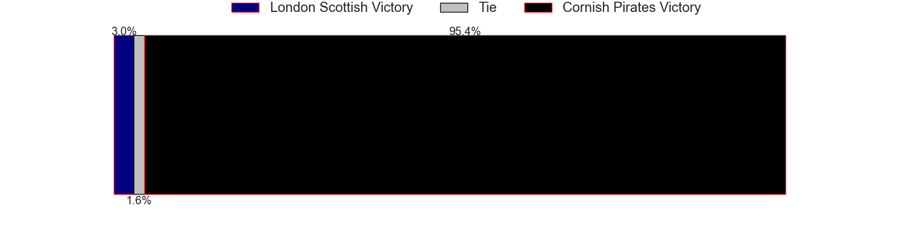
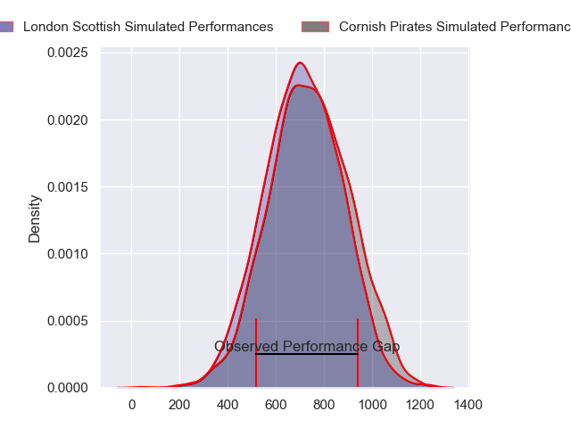
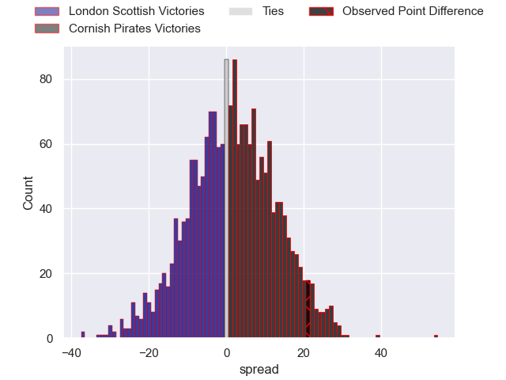
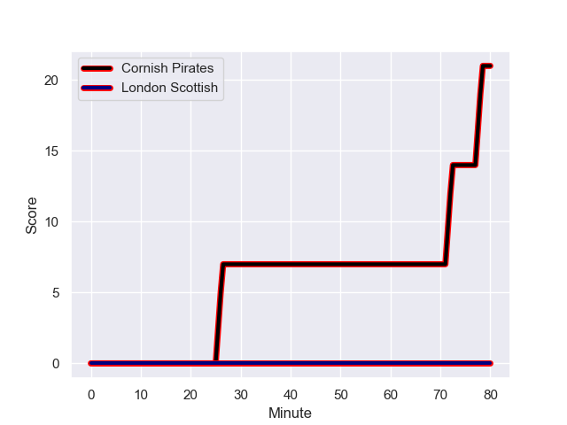
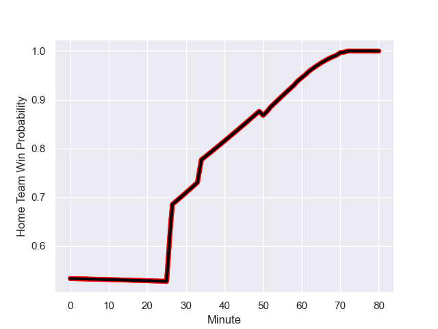

---  
layout: page  
title: London Scottish at Cornish Pirates; 0.0-21.0  
date: 2023-10-20 18:00:00 -0500  
categories: "RFU Championship 2023" match review  
---
# London Scottish at Cornish Pirates; 0.0-21.0

# Club Level Predictions

The first set of predictions treats a club as the smallest object, as the club develops its members, organizes a gameplan, and deploys its players as needed for each match. This club model has a prediction of 0.793, which translates to predicting Cornish Pirates to win by 12.1.

Each club has a rating and a rating deviation (similar to a Glicko rating), and expected performances can be generated. This allows for simulated matches and spreads like the ones below.
## Projected Performances - Club Model

## Projected Spreads - Club Model

## Projected Results - Club Model

# Player Level Predictions - Version 2

Treating teams instead as an entity made up of the currently active players, I have ratings for each player in an altogether different system. These can be combined to form team ratings once teamsheets are announced, weighting starters a bit higher than the reserves. After the match is played, players can be weighted by their minutes on the field, allowing for an accurate measure of the team's composition. With these compiled team ratings, we can make predictions, measure inaccuracy, and update the individual player ratings.
## Prediction with Player Minutes: Cornish Pirates by 1.5

London Scottish by 1.9 on a neutral field
## Prediction without Player Minutes: Cornish Pirates by 1.9

London Scottish by 1.4 on a neutral pitch

## Projected Performances - Player Model

## Projected Spreads - Player Model

## Projected Results - Player Model

## Scores over Time

## Win Probability over Time

There were 3 large changes in win probability in this match

|   Away Minutes | Away Player           |   Away elo |   Number |   Home elo | Home Player       |   Home Minutes |
|---------------:|:----------------------|-----------:|---------:|-----------:|:------------------|---------------:|
|             34 | Will Prior            |      57.65 |        1 |      46.71 | Lefty Zigiriadis  |             52 |
|             72 | George Head           |      50.24 |        2 |      44.74 | Morgan Nelson     |             72 |
|             70 | Ashley Challenger     |      42.51 |        3 |      48.56 | Matt Johnson      |             52 |
|             80 | Jonny Green           |      46.65 |        4 |      46.65 | Josh King         |             59 |
|             70 | Matas Jurevicius      |      28.41 |        5 |      48.49 | Steele Barker     |             80 |
|             80 | Bailey Ransom         |      63.5  |        6 |      46.65 | Harry Dugmore     |             59 |
|             50 | Ioan Rhys Davies      |      46.65 |        7 |      57.51 | Will Gibson       |             80 |
|             80 | Will Trenholm         |      43.02 |        8 |      46.65 | Peter Everett     |             80 |
|             50 | Jonny Law             |      46.74 |        9 |      43.97 | Ruaridh Dawson    |             72 |
|             80 | Cameron Anderson      |      26.51 |       10 |      46.65 | Iwan Jenkins      |             80 |
|             80 | Luke Mehson           |      49.29 |       11 |      23.14 | Matthew McNab     |             80 |
|             50 | Robert David McCallum |      28.33 |       12 |      37.94 | Joe Elderkin      |             80 |
|             80 | Ben Waghorn           |      46.65 |       13 |      46.65 | Ioan Evans        |             75 |
|             70 | Will Brown            |      73.04 |       14 |      45.78 | Will Trewin       |             62 |
|             80 | William Talbot-Davies |      82.93 |       15 |      33.53 | Dan John          |             80 |
|             46 | George Cave           |      30.74 |       16 |      46.65 | Finlay Richardson |             28 |
|             30 | Will Simonds          |      47.58 |       17 |      51.46 | Jack Andrew       |             28 |
|             30 | Lewis Gjaltema        |      47.01 |       18 |      51.13 | Josh Williams     |             21 |
|             30 | Silas Pill            |      46.65 |       19 |      46.65 | Hugh Bokenham     |             21 |
|             10 | Rhys Charalambous     |      48.34 |       20 |      49.99 | Arthur Relton     |             18 |
|             10 | Lewis Barrett         |      36.13 |       21 |      42.18 | Alex Schwarz      |              8 |
|             10 | Noah Ferdinand        |     -20.24 |       22 |      46.65 | Rhys Williams     |              8 |
|              8 | Garin Lloyd           |      46.65 |       23 |      54.21 | Tom Pittman       |              5 |

