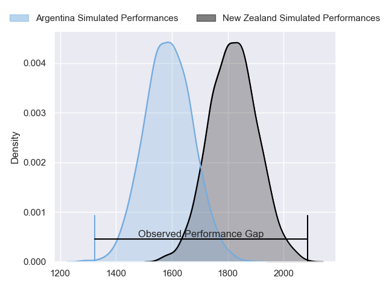
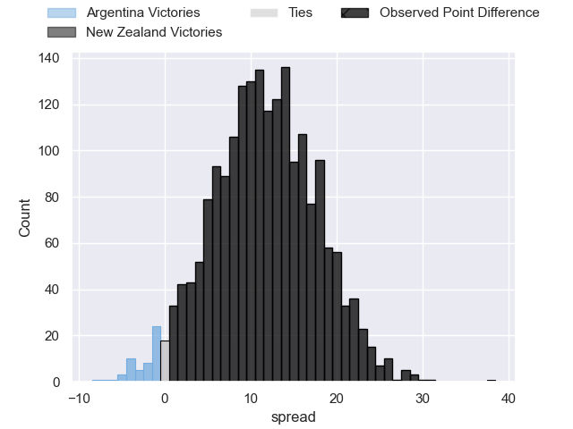
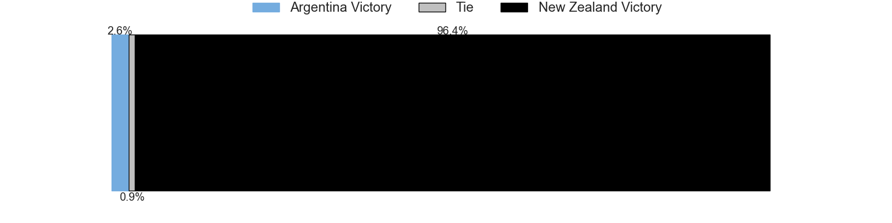
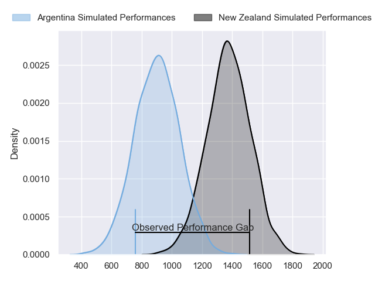
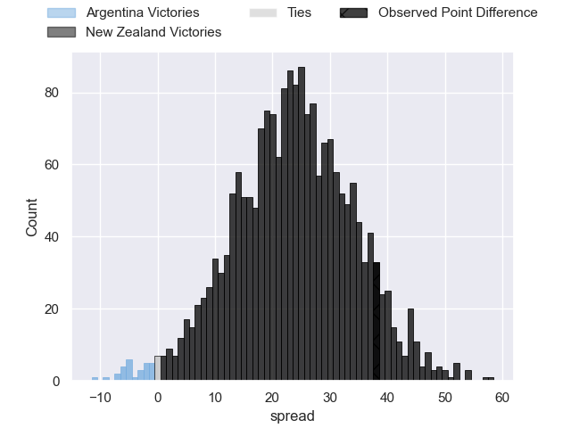
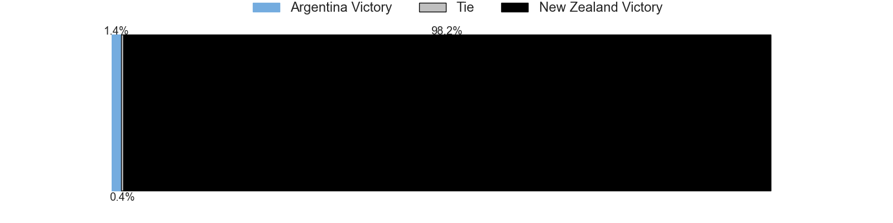
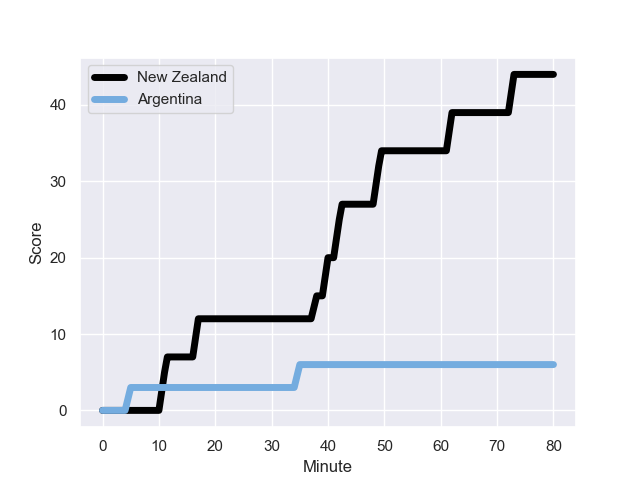
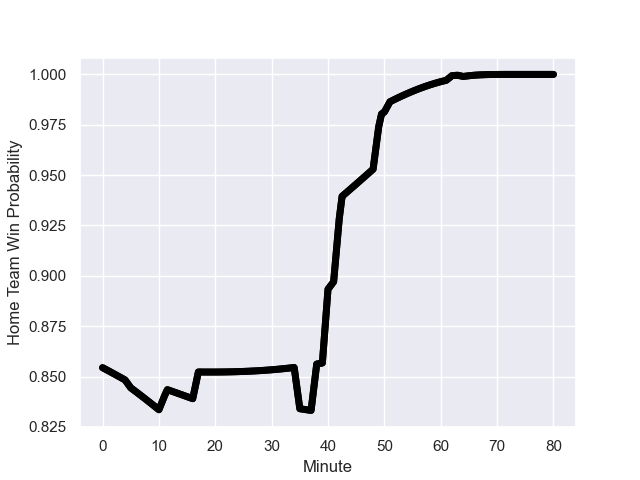

---  
layout: page  
title: Argentina at New Zealand; 6.0-44.0  
date: 2023-10-20 18:00:00 -0500  
categories: "Rugby World Cup 2023" match review  
---
# Argentina at New Zealand; 6.0-44.0

# Club Level Predictions

The first set of predictions treats a club as the smallest object, as the club develops its members, organizes a gameplan, and deploys its players as needed for each match. This club model has a prediction of 0.779, which translates to predicting New Zealand to win by 11.3.

Each club has a rating and a rating deviation (similar to a Glicko rating), and expected performances can be generated. This allows for simulated matches and spreads like the ones below.
## Projected Performances - Club Model

## Projected Spreads - Club Model

## Projected Results - Club Model

# Player Level Predictions - Version 2

Treating teams instead as an entity made up of the currently active players, I have ratings for each player in an altogether different system. These can be combined to form team ratings once teamsheets are announced, weighting starters a bit higher than the reserves. After the match is played, players can be weighted by their minutes on the field, allowing for an accurate measure of the team's composition. With these compiled team ratings, we can make predictions, measure inaccuracy, and update the individual player ratings.
## Prediction with Player Minutes: New Zealand by 19.4

New Zealand by 19.4 on a neutral field
## Prediction without Player Minutes: New Zealand by 19.0

New Zealand by 19.0 on a neutral pitch

## Projected Performances - Player Model

## Projected Spreads - Player Model

## Projected Results - Player Model

## Scores over Time

## Win Probability over Time

There were 2 large changes in win probability in this match

|   Away Minutes | Away Player            |   Away elo |   Number |   Home elo | Home Player         |   Home Minutes |
|---------------:|:-----------------------|-----------:|---------:|-----------:|:--------------------|---------------:|
|             67 | Thomas Gallo           |      58.81 |        1 |      50.05 | Ethan de Groot      |             56 |
|             64 | Julian Montoya         |      79.46 |        2 |     102.24 | Codie Taylor        |             51 |
|             51 | Francisco Gomez Kodela |      75.86 |        3 |      68.44 | Tyrel Lomax         |             56 |
|             80 | Guido Petti            |      51.95 |        4 |     140.2  | Samuel Whitelock    |             61 |
|             41 | Tomas Lavanini         |      61.83 |        5 |      96.92 | Scott Barrett       |             80 |
|             80 | Juan Martin Gonzalez   |      68.45 |        6 |      58.11 | Shannon Frizell     |             80 |
|             80 | Marcos Kremer          |      40.1  |        7 |     106.52 | Sam Cane            |             66 |
|             64 | Facundo Isa            |      93.99 |        8 |     101.84 | Ardie Savea         |             80 |
|             51 | Gonzalo Bertranou      |      51.9  |        9 |     101.83 | Aaron Smith         |             56 |
|             66 | Santiago Carreras      |      71    |       10 |     117.18 | Richie Mo'unga      |             80 |
|             80 | Mateo Carreras         |      47.73 |       11 |      94.55 | Mark Telea          |             80 |
|             64 | Santiago Chocobares    |      34.03 |       12 |      81.51 | Jordie Barrett      |             80 |
|             80 | Lucio Cinti            |      46.07 |       13 |      55.21 | Rieko Ioane         |             61 |
|             80 | Emiliano Boffelli      |      47.6  |       14 |      99.81 | Will Jordan         |             80 |
|             80 | Juan Cruz Mallia       |      85.46 |       15 |     142.78 | Beauden Barrett     |             56 |
|             29 | Eduardo Bello          |      11.29 |       16 |      55.35 | Finlay Christie     |             24 |
|             29 | Lautaro Bazan Velez    |      49    |       17 |     104.46 | Damian McKenzie     |             24 |
|             39 | Matias Alemanno        |      54.28 |       18 |      62.2  | Tamaiti Williams    |             24 |
|             14 | Nicolas Sanchez        |      91.19 |       19 |      75.23 | Samisoni Taukei'aho |             29 |
|             16 | Agustin Creevy         |      88.21 |       20 |      21.33 | Fletcher Newell     |             24 |
|             16 | Matias Moroni          |     108.16 |       21 |      73.59 | Anton Lienert-Brown |             19 |
|             13 | Joel Sclavi            |      59.82 |       22 |     138.29 | Brodie Retallick    |             19 |
|             16 | Rodrigo Bruni          |      92.24 |       23 |     108.5  | Dalton Papalii      |             14 |

