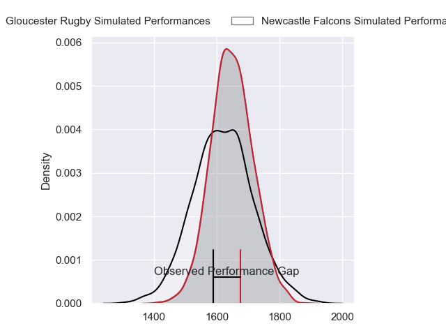
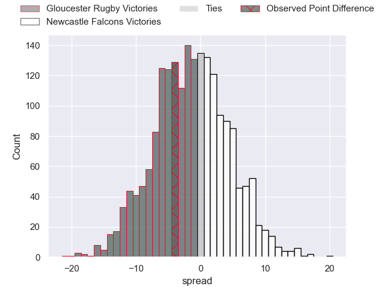
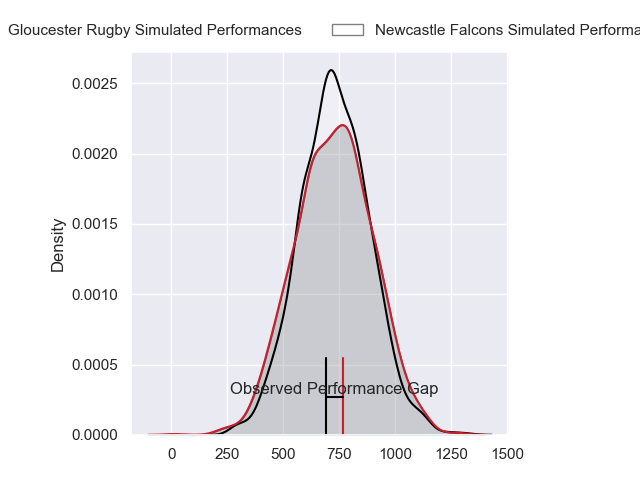
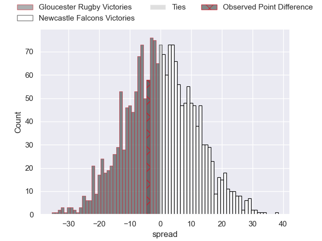
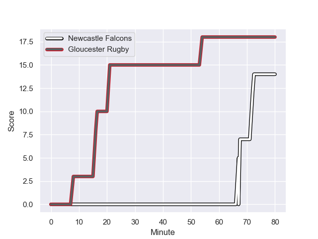
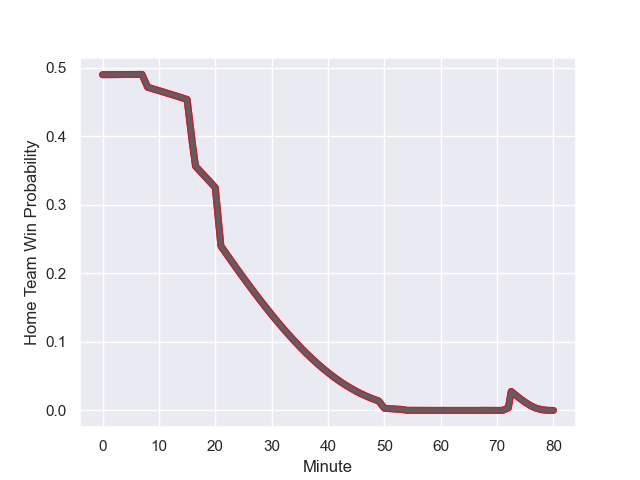

---  
layout: page  
title: Gloucester Rugby at Newcastle Falcons; 18.0-14.0  
date: 2023-10-20 18:00:00 -0500  
categories: "Gallagher Premiership 2023" match review  
---
# Gloucester Rugby at Newcastle Falcons; 18.0-14.0

# Club Level Predictions

The first set of predictions treats a club as the smallest object, as the club develops its members, organizes a gameplan, and deploys its players as needed for each match. This club model has a prediction of 0.453, which translates to predicting Gloucester Rugby to win by 1.7.

Each club has a rating and a rating deviation (similar to a Glicko rating), and expected performances can be generated. This allows for simulated matches and spreads like the ones below.
## Projected Performances - Club Model

## Projected Spreads - Club Model

## Projected Results - Club Model

# Player Level Predictions - Version 2

Treating teams instead as an entity made up of the currently active players, I have ratings for each player in an altogether different system. These can be combined to form team ratings once teamsheets are announced, weighting starters a bit higher than the reserves. After the match is played, players can be weighted by their minutes on the field, allowing for an accurate measure of the team's composition. With these compiled team ratings, we can make predictions, measure inaccuracy, and update the individual player ratings.
## Prediction with Player Minutes: Gloucester Rugby by 0.4

Gloucester Rugby by 5.0 on a neutral field
## Prediction without Player Minutes: Newcastle Falcons by 2.2

Gloucester Rugby by 2.4 on a neutral pitch

## Projected Performances - Player Model

## Projected Spreads - Player Model

## Projected Results - Player Model

## Scores over Time

## Win Probability over Time

There were 3 large changes in win probability in this match

|   Away Minutes | Away Player         |   Away elo |   Number |   Home elo | Home Player         |   Home Minutes |
|---------------:|:--------------------|-----------:|---------:|-----------:|:--------------------|---------------:|
|             56 | Jamal Ford-Robinson |      17.32 |        1 |      19.86 | Adam Brocklebank    |             50 |
|             78 | George McGuigan     |      55.47 |        2 |      29.97 | Jamie Blamire       |             76 |
|             71 | Fraser Balmain      |      42.17 |        3 |      54.3  | Murray McCallum     |             50 |
|             80 | Freddie Clarke      |      38.42 |        4 |      27.53 | Philip van der Walt |             80 |
|             80 | Freddie Clarke      |      38.42 |        4 |      27.53 | Philip van der Walt |             80 |
|             69 | Freddie Clarke      |      38.42 |        5 |      18.21 | Sebastian de Chaves |             50 |
|             69 | Freddie Clarke      |      38.42 |        5 |      18.21 | Sebastian de Chaves |             50 |
|             54 | Ben Donnell         |      50.81 |        6 |      43    | Freddie Lockwood    |             50 |
|             80 | Lewis Ludlow        |      46.46 |        7 |      41.26 | Guy Pepper          |             80 |
|             80 | Zach Mercer         |      51.31 |        8 |      37.86 | Callum Chick        |             80 |
|             69 | Stephen Varney      |      33.24 |        9 |      45.91 | Hugh O'Sullivan     |             50 |
|             80 | George Barton       |      53.67 |       10 |      34.29 | Brett Connon        |             80 |
|             69 | Ollie Thorley       |      77.62 |       11 |      29.58 | Ben Stevenson       |             80 |
|             80 | Sebastien Atkinson  |      24.94 |       12 |      55.54 | Rory Jennings       |             69 |
|             80 | Chris Harris        |      73.16 |       13 |      77.47 | Tom Penny           |             80 |
|             80 | Jake Morris         |      12.01 |       14 |      73.01 | Adam Radwan         |             80 |
|             22 | Lloyd Evans         |      57.19 |       15 |      46.65 | Ben Redshaw         |             46 |
|             24 | Val Rapava-Ruskin   |      62.52 |       16 |      39.5  | Phil Brantingham    |             30 |
|              2 | Max Llewellyn       |      77.49 |       17 |      48.08 | Michael van Vuuren  |              4 |
|              9 | Ciaran Knight       |      29.63 |       18 |      28.15 | Mark Tampin         |             30 |
|             11 | Freddie Thomas      |      43.3  |       19 |      38.84 | Kiran McDonald      |             30 |
|             26 | Jack Clement        |      44.76 |       20 |      47.5  | Sam Cross           |             30 |
|             11 | Charlie Chapman     |      40.63 |       21 |      -5.09 | Sam Stuart          |             30 |
|             11 | Sebastian Blake     |      32.75 |       22 |      30.88 | Matias Orlando      |             11 |
|             58 | Alex Hearle         |      39.49 |       23 |      37.05 | Elliott Obatoyinbo  |             34 |

