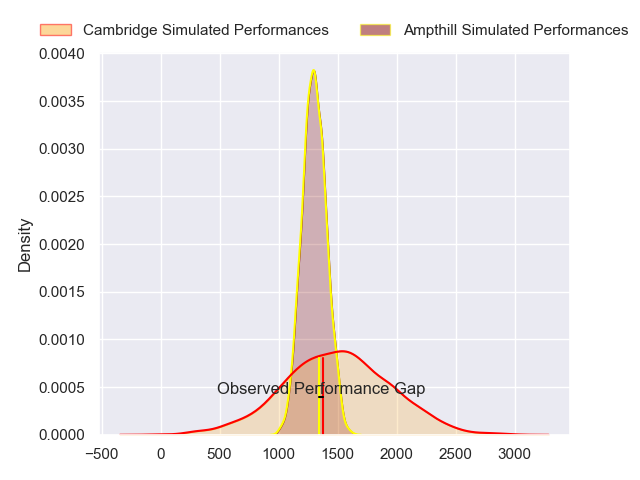
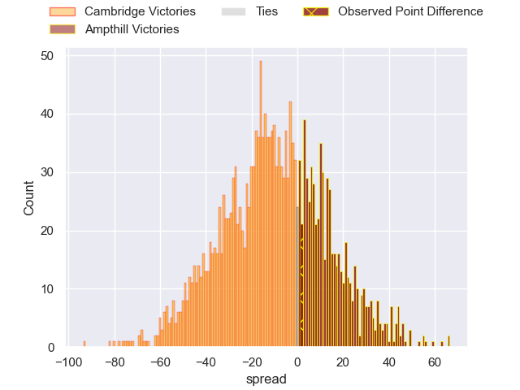
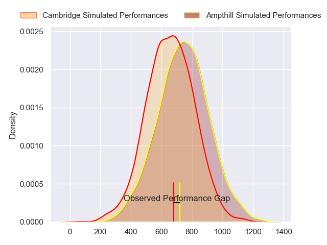
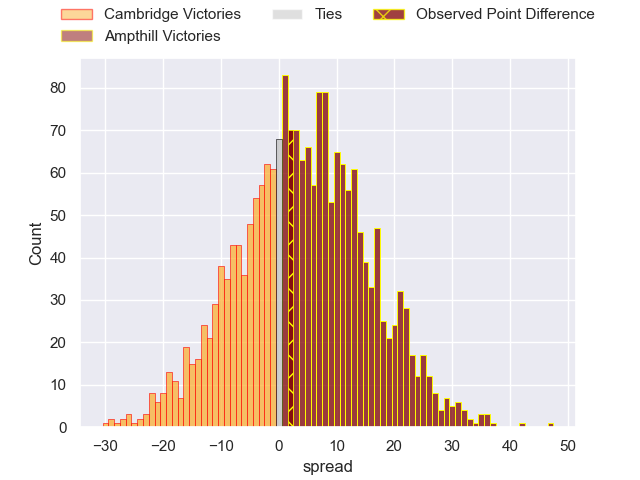
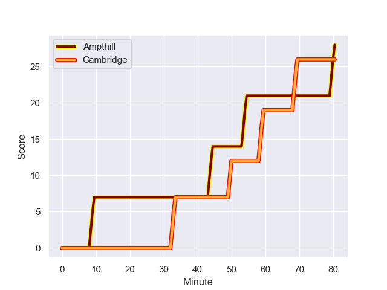
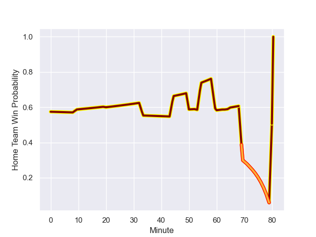

---  
layout: page  
title: Cambridge at Ampthill; 26.0-28.0  
date: 2023-10-21 18:00:00 -0500  
categories: "RFU Championship 2023" match review  
---
# Cambridge at Ampthill; 26.0-28.0

# Club Level Predictions

The first set of predictions treats a club as the smallest object, as the club develops its members, organizes a gameplan, and deploys its players as needed for each match. This club model has a prediction of 0.341, which translates to predicting Cambridge to win by 9.9.

Each club has a rating and a rating deviation (similar to a Glicko rating), and expected performances can be generated. This allows for simulated matches and spreads like the ones below.
## Projected Performances - Club Model

## Projected Spreads - Club Model

## Projected Results - Club Model

# Player Level Predictions - Version 2

Treating teams instead as an entity made up of the currently active players, I have ratings for each player in an altogether different system. These can be combined to form team ratings once teamsheets are announced, weighting starters a bit higher than the reserves. After the match is played, players can be weighted by their minutes on the field, allowing for an accurate measure of the team's composition. With these compiled team ratings, we can make predictions, measure inaccuracy, and update the individual player ratings.
## Prediction with Player Minutes: Ampthill by 3.3

Ampthill by 0.1 on a neutral field
## Prediction without Player Minutes: Ampthill by 3.4

Ampthill by 0.2 on a neutral pitch

## Projected Performances - Player Model

## Projected Spreads - Player Model

## Projected Results - Player Model

## Scores over Time

## Win Probability over Time

There were 16 large changes in win probability in this match

|   Away Minutes | Away Player          |   Away elo |   Number |   Home elo | Home Player                 |   Home Minutes |
|---------------:|:---------------------|-----------:|---------:|-----------:|:----------------------------|---------------:|
|             63 | Jake Elwood          |      46.65 |        1 |      46.65 | Jasper McGuire              |             20 |
|             63 | Benjamin Brownlie    |      42.44 |        2 |      46.65 | Benjamin Chapman            |             64 |
|             63 | Billy Walker         |      45.57 |        3 |      42.88 | Harvey Beaton               |             60 |
|             80 | Kieran Frost         |      46.65 |        4 |      46.65 | Joe Peard                   |             80 |
|             80 | George Bretag-Norris |      46.65 |        5 |      46.65 | Kaden Pearce-Paul           |             68 |
|             80 | Geordie Irvine       |      55.99 |        6 |      40.37 | Iestyn Rees                 |             80 |
|             60 | Ben Adams            |      25.29 |        7 |      30.7  | Josh Smart                  |             64 |
|             53 | Jared Cardew         |      38    |        8 |      36.76 | Morgan Strong               |             80 |
|             44 | Kieran Duffin        |      46.65 |        9 |      46.65 | Charlie Bracken             |             65 |
|             44 | Steffan James        |      46.65 |       10 |      45.12 | Gwyn Parks                  |             80 |
|             80 | Matthew Hema         |      46.65 |       11 |      37.02 | Ben Harris                  |             72 |
|             80 | Matt Williams        |      46.65 |       12 |      72.9  | Fraser James Kevin Strachan |             80 |
|             80 | Sam Hanks            |      27.24 |       13 |      30.46 | Oli Morris                  |             80 |
|             80 | Kwaku Asiedu         |      45.37 |       14 |      46.65 | Francis Moore               |             80 |
|             80 | Elias Caven          |      48.4  |       15 |      50.12 | Tomas Bacon                 |             80 |
|             36 | Toby Dabell          |      46.65 |       16 |      40.57 | Jevaughn Warren             |             60 |
|             36 | Jamie Benson         |      37.61 |       17 |      37.83 | Dominic Hardman             |             20 |
|             27 | Matthew Dawson       |      46.65 |       18 |      45.66 | Izaiha Moore-Aiono          |             16 |
|             20 | Benjamin Hoppe       |      46.65 |       19 |      30.98 | Beck Cutting                |             16 |
|             17 | Sebastian Brownhill  |      46.65 |       20 |      64.72 | Peter White                 |             15 |
|             17 | Morgan Veness        |      46.65 |       21 |      44.42 | Alex Wardell                |             12 |
|             17 | Matt Collins         |      46.25 |       22 |      31.17 | Josh Skelcey                |              8 |

