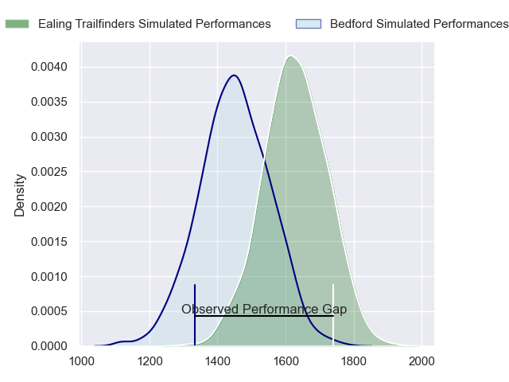
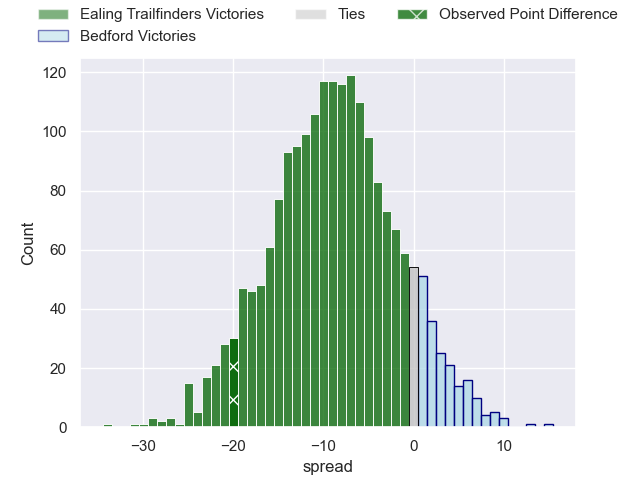
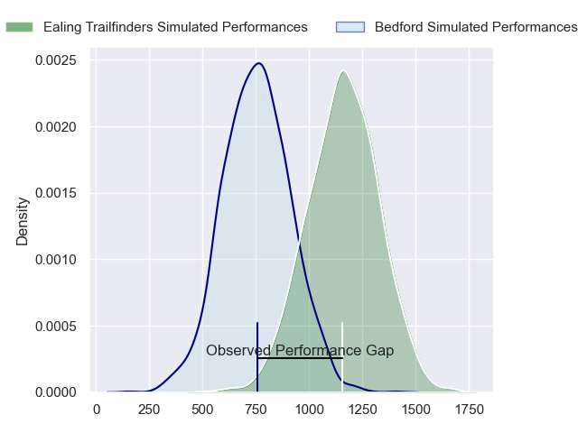
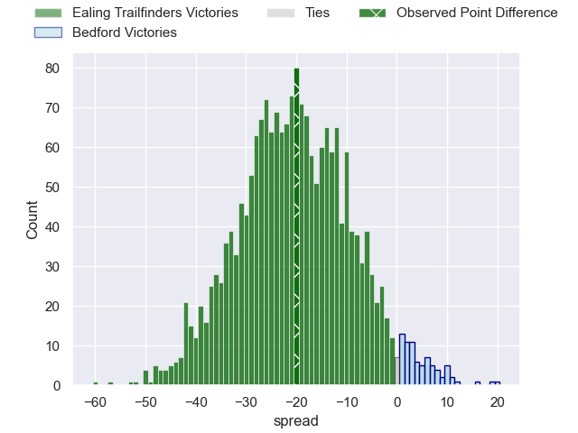
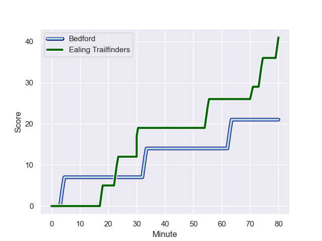
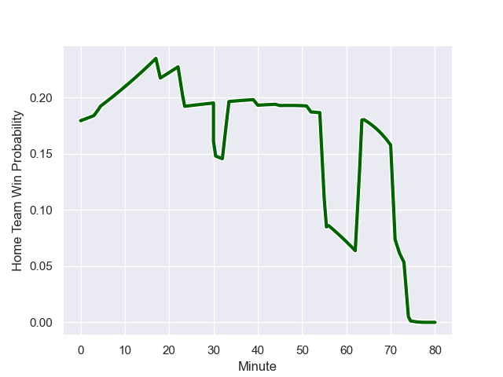

---  
layout: page  
title: Ealing Trailfinders at Bedford; 41.0-21.0  
date: 2023-10-21 18:00:00 -0500  
categories: "RFU Championship 2023" match review  
---
# Ealing Trailfinders at Bedford; 41.0-21.0

# Club Level Predictions

The first set of predictions treats a club as the smallest object, as the club develops its members, organizes a gameplan, and deploys its players as needed for each match. This club model has a prediction of 0.271, which translates to predicting Ealing Trailfinders to win by 9.0.

Each club has a rating and a rating deviation (similar to a Glicko rating), and expected performances can be generated. This allows for simulated matches and spreads like the ones below.
## Projected Performances - Club Model

## Projected Spreads - Club Model

## Projected Results - Club Model

# Player Level Predictions - Version 2

Treating teams instead as an entity made up of the currently active players, I have ratings for each player in an altogether different system. These can be combined to form team ratings once teamsheets are announced, weighting starters a bit higher than the reserves. After the match is played, players can be weighted by their minutes on the field, allowing for an accurate measure of the team's composition. With these compiled team ratings, we can make predictions, measure inaccuracy, and update the individual player ratings.
## Prediction with Player Minutes: Ealing Trailfinders by 16.9

Ealing Trailfinders by 20.2 on a neutral field
## Prediction without Player Minutes: Ealing Trailfinders by 15.0

Ealing Trailfinders by 18.4 on a neutral pitch

## Projected Performances - Player Model

## Projected Spreads - Player Model

## Projected Results - Player Model

## Scores over Time

## Win Probability over Time

There were 7 large changes in win probability in this match

|   Away Minutes | Away Player          |   Away elo |   Number |   Home elo | Home Player          |   Home Minutes |
|---------------:|:---------------------|-----------:|---------:|-----------:|:---------------------|---------------:|
|             60 | Will Goodrick-Clarke |      35.52 |        1 |      50.98 | Joey Conway          |             45 |
|             60 | Mike Willemse        |      54.41 |        2 |      40.98 | James Fish           |             60 |
|             45 | Biyi Alo             |      78.63 |        3 |      63.29 | Oisin Heffernan      |             45 |
|             80 | Bobby de Wee         |      84    |        4 |      57.54 | Robin Williams       |             52 |
|             75 | Barney Maddison      |      90.52 |        5 |      28.14 | Jordan Onojaife      |             80 |
|             75 | Callum Chick         |      37.86 |        6 |      15.53 | Luke Frost           |             80 |
|             64 | Ollie Newman         |      56.4  |        7 |      52.84 | Kieran Curran        |             40 |
|             80 | Ryan Smid            |     123.84 |        8 |      13.07 | Cameron King         |             80 |
|             72 | Craig Hampson        |      74.88 |        9 |      60.25 | Alex Day             |             71 |
|             80 | Craig Willis         |     118.1  |       10 |      59.79 | William Maisey       |             71 |
|             80 | Cian Kelleher        |     105.49 |       11 |      60.67 | Dean Adamson         |             80 |
|             80 | Billy Twelvetrees    |      77.99 |       12 |      44.85 | Jordan Venter        |             56 |
|             80 | Reuben Bird-Tulloch  |      62.83 |       13 |      60.7  | Michael Le Bourgeois |             80 |
|             80 | Jonah Holmes         |      73.03 |       14 |      38.27 | Sean French          |             80 |
|             75 | Tom Collins          |      96.98 |       15 |      46.02 | Matthew Worley       |             80 |
|             35 | Jimmy Roots          |      44.81 |       16 |      41.5  | Jac Arthur           |             40 |
|             20 | Matthew Cornish      |      50.14 |       17 |      46.65 | Bryan O'Connor       |             35 |
|             20 | Kyle John Whyte      |      65.45 |       18 |      31.03 | Jamie Jack           |             35 |
|             16 | Richard Hardwick     |      44.74 |       19 |      58.32 | Ethan Grayson        |             24 |
|              8 | Lloyd Williams       |      76.49 |       20 |      43.98 | Emeka Atuanya        |             28 |
|              5 | Andrew Davidson      |      46.8  |       21 |      54.76 | Jacob Fields         |             20 |
|              5 | Josh Taylor          |      46.65 |       22 |      24.51 | Louis Grimoldby      |              9 |
|              5 | Max Bodilly          |      65.66 |       23 |      22.49 | James Lennon         |              9 |

