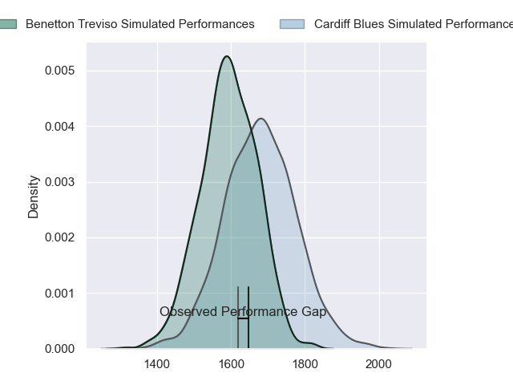
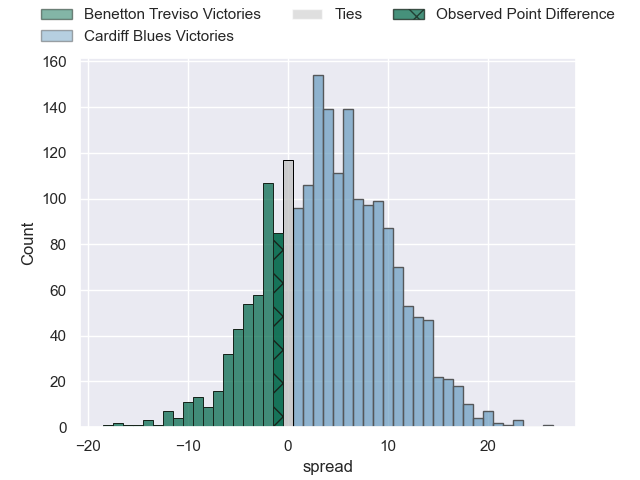
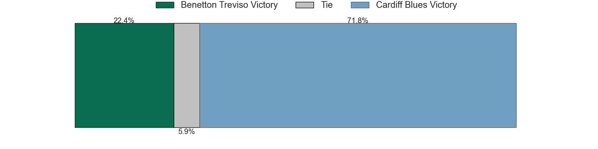
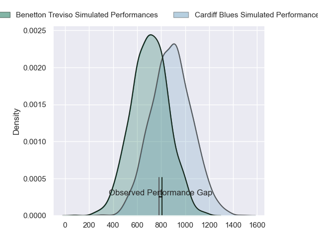
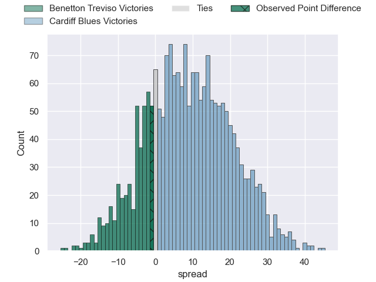
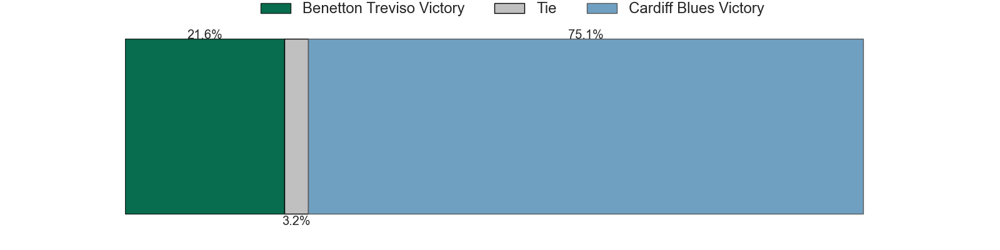
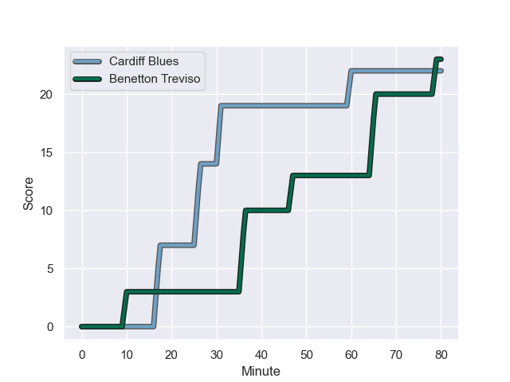
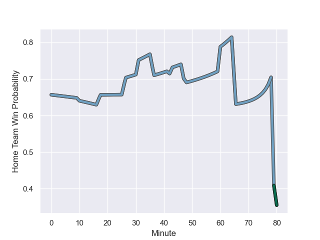

---  
layout: page  
title: Benetton Treviso at Cardiff Blues; 23.0-22.0  
date: 2023-10-21 18:00:00 -0500  
categories: "United Rugby Championship 2023" match review  
---
# Benetton Treviso at Cardiff Blues; 23.0-22.0

# Club Level Predictions

The first set of predictions treats a club as the smallest object, as the club develops its members, organizes a gameplan, and deploys its players as needed for each match. This club model has a prediction of 0.615, which translates to predicting Cardiff Blues to win by 4.2.

Each club has a rating and a rating deviation (similar to a Glicko rating), and expected performances can be generated. This allows for simulated matches and spreads like the ones below.
## Projected Performances - Club Model

## Projected Spreads - Club Model

## Projected Results - Club Model

# Player Level Predictions - Version 2

Treating teams instead as an entity made up of the currently active players, I have ratings for each player in an altogether different system. These can be combined to form team ratings once teamsheets are announced, weighting starters a bit higher than the reserves. After the match is played, players can be weighted by their minutes on the field, allowing for an accurate measure of the team's composition. With these compiled team ratings, we can make predictions, measure inaccuracy, and update the individual player ratings.
## Prediction with Player Minutes: Cardiff Blues by 7.2

Cardiff Blues by 2.7 on a neutral field
## Prediction without Player Minutes: Cardiff Blues by 6.4

Cardiff Blues by 2.0 on a neutral pitch

## Projected Performances - Player Model

## Projected Spreads - Player Model

## Projected Results - Player Model

## Scores over Time

## Win Probability over Time

There were 9 large changes in win probability in this match

|   Away Minutes | Away Player         |   Away elo |   Number |   Home elo | Home Player        |   Home Minutes |
|---------------:|:--------------------|-----------:|---------:|-----------:|:-------------------|---------------:|
|             54 | Mirco Spagnolo      |      51.88 |        1 |      34.8  | Rhys Carré         |             66 |
|             80 | Gianmarco Lucchesi  |      54.74 |        2 |      54.57 | Liam Belcher       |             66 |
|             42 | Giosue Zilocchi     |      44.9  |        3 |      42.12 | Keiron Assiratti   |             54 |
|             48 | Gideon Koegelenberg |      25.67 |        4 |      21.07 | Shane Lewis-Hughes |             80 |
|             80 | Eli Snyman          |      50.74 |        5 |      56.42 | Teddy Williams     |             66 |
|             80 | Alessandro Izekor   |      44.99 |        6 |      46.65 | Alex Mann          |             74 |
|             80 | Manuel Zuliani      |      51.69 |        7 |      48.79 | Ellis Jenkins      |             80 |
|             60 | Henry Time-Stowers  |      22.96 |        8 |      41.53 | Seb Davies         |             80 |
|             71 | Andy Uren           |      28.83 |        9 |      44.04 | Ellis Bevan        |             80 |
|             80 | Jacob Umaga         |      67.89 |       10 |      73.06 | Tinus de Beer      |             80 |
|             80 | Edoardo Padovani    |      44.9  |       11 |      47.64 | Theo Cabango       |             80 |
|             80 | Filippo Drago       |      36.24 |       12 |      98.84 | Uilisi Halaholo    |             80 |
|             54 | Joaquin Riera       |      41.01 |       13 |     109.9  | Rey Lee-Lo         |             80 |
|             80 | Ignacio Mendy       |      24.31 |       14 |       7.37 | Owen Lane          |             43 |
|             42 | Rhyno Smith         |      65.53 |       15 |      31.9  | Cam Winnett        |             80 |
|             32 | Edoardo Iachizzi    |      54.31 |       16 |      57.22 | Ciaran Parker      |             26 |
|             38 | Tomas Albornoz      |      64.29 |       17 |      39.47 | Harri Millard      |             37 |
|             38 | Simone Ferrari      |      88.76 |       18 |      22.72 | Rory Thornton      |             14 |
|             26 | Marco Zanon         |      57.42 |       19 |      39.19 | Josh Reynolds      |             14 |
|             26 | Federico Zani       |      37.54 |       20 |      46.75 | Efan Daniel        |             14 |
|             20 | Toa Halafihi        |      73.51 |       21 |      46.65 | Lucas De la Rua    |              6 |
|              9 | Dewaldt Duvenage    |      74.05 |       22 |     nan    | nan                |            nan |

