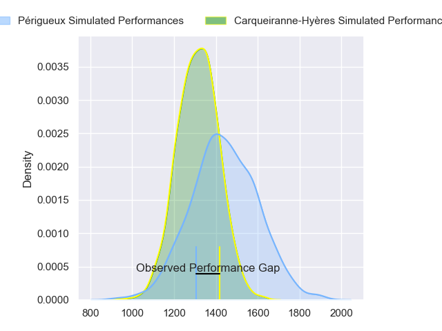
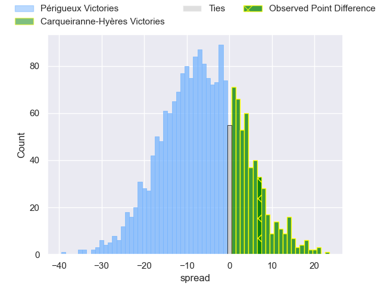
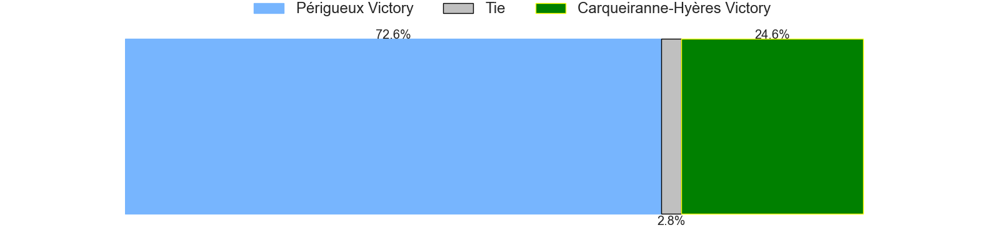
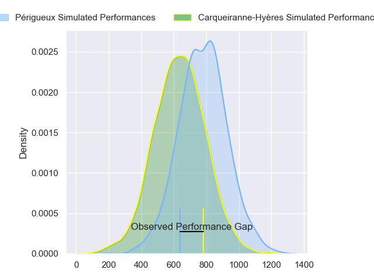
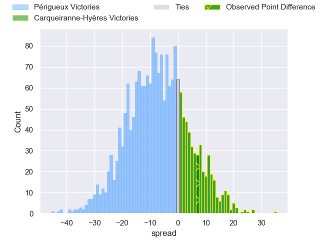
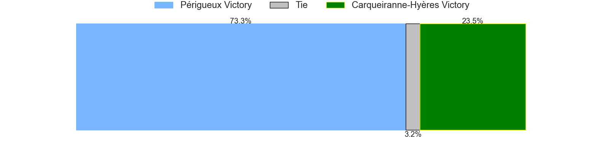
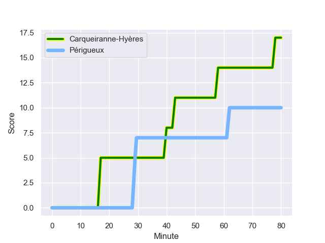
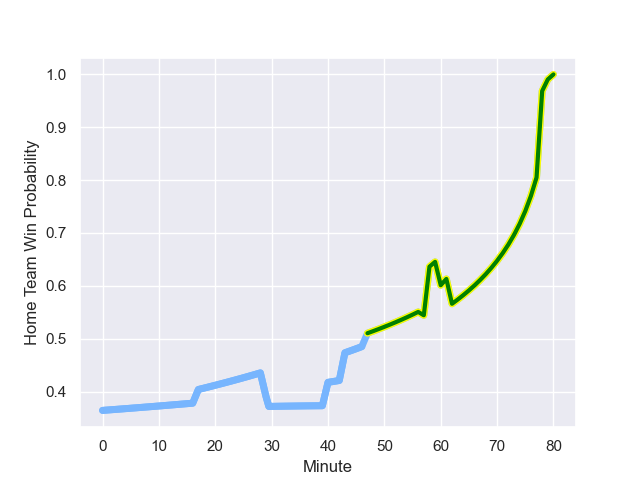

---  
layout: page  
title: Périgueux at Carqueiranne-Hyères; 10.0-17.0  
date: 2023-10-21 18:00:00 -0500  
categories: "Nationale 2023" match review  
---
# Périgueux at Carqueiranne-Hyères; 10.0-17.0

# Club Level Predictions

The first set of predictions treats a club as the smallest object, as the club develops its members, organizes a gameplan, and deploys its players as needed for each match. This club model has a prediction of 0.337, which translates to predicting Périgueux to win by 6.6.

Each club has a rating and a rating deviation (similar to a Glicko rating), and expected performances can be generated. This allows for simulated matches and spreads like the ones below.
## Projected Performances - Club Model

## Projected Spreads - Club Model

## Projected Results - Club Model

# Player Level Predictions - Version 2

Treating teams instead as an entity made up of the currently active players, I have ratings for each player in an altogether different system. These can be combined to form team ratings once teamsheets are announced, weighting starters a bit higher than the reserves. After the match is played, players can be weighted by their minutes on the field, allowing for an accurate measure of the team's composition. With these compiled team ratings, we can make predictions, measure inaccuracy, and update the individual player ratings.
## Prediction with Player Minutes: Périgueux by 6.1

Périgueux by 9.2 on a neutral field
## Prediction without Player Minutes: Périgueux by 5.7

Périgueux by 8.8 on a neutral pitch

## Projected Performances - Player Model

## Projected Spreads - Player Model

## Projected Results - Player Model

## Scores over Time

## Win Probability over Time

There were 11 large changes in win probability in this match

|   Away Minutes | Away Player        |   Away elo |   Number |   Home elo | Home Player         |   Home Minutes |
|---------------:|:-------------------|-----------:|---------:|-----------:|:--------------------|---------------:|
|             47 | Thomas Vidal       |      55.31 |        1 |      47.55 | Lasha Mchelidze     |             58 |
|             47 | Louis Martin       |      63.06 |        2 |      31.21 | Theo Lachaud        |             63 |
|             47 | Kalaveti Tawake    |      37.63 |        3 |      43.54 | Sti Sithole         |             63 |
|             80 | Pierre Rousserie   |      54.04 |        4 |      15.86 | Lucas Cazac         |             66 |
|             47 | Jaco Willemse      |      40.63 |        5 |      22.36 | Nathan Gendre       |             80 |
|             80 | Madioke Konate     |      50.07 |        6 |      47.7  | Joachim Beaumont    |             67 |
|             62 | Karl Lambert       |      54.71 |        7 |      28.08 | Nicolas Baquer      |             80 |
|             80 | Afaesetiti Amosa   |      77.11 |        8 |      45.62 | Andre Gorin         |             80 |
|             57 | Nicolas Faltrept   |      15.22 |        9 |      55.09 | Thomas Sonetti      |             58 |
|             80 | Yann Caillat       |      49.04 |       10 |      35.61 | Juan Kotze          |             80 |
|             80 | Axel Muller        |      66.48 |       11 |      34.1  | Dylan Sage          |             63 |
|             57 | Fred Hickes        |      70.24 |       12 |      31.09 | Charles Brousse     |             60 |
|             80 | Vincent Fouillade  |      59.71 |       13 |      45.32 | Romain Leveque      |             80 |
|             80 | Benjamin Yarde     |      46    |       14 |      45.35 | Paul Gadea          |             80 |
|             57 | Thibault Rabourdin |      46.43 |       15 |      29.57 | Adrien Amans        |             80 |
|             33 | Jason Tindiliere   |      50.56 |       16 |      41.95 | Eli Serra-Miglietti |             22 |
|             33 | Baptiste Arvouet   |      47.72 |       17 |      39.86 | Yan Tabarot         |             17 |
|             33 | Matias Dittus      |      24.58 |       18 |      47.76 | Costel Burtila      |             17 |
|             33 | Damien Lavergne    |      51.83 |       19 |      25.5  | Adam Peters         |             14 |
|             18 | Marius Vialle      |      37.63 |       20 |      47.44 | Marius Pellegrin    |             13 |
|             23 | Enzo Hardy         |      50.1  |       21 |      30.81 | Rémi Dubié          |             22 |
|             23 | Greg Hutley        |      53.86 |       22 |      43.01 | Enzo Miot           |             20 |
|             23 | Rory Scholes       |      61.74 |       23 |      46.21 | Quentin Bourdieu    |             17 |

