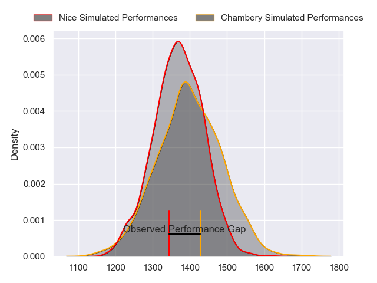
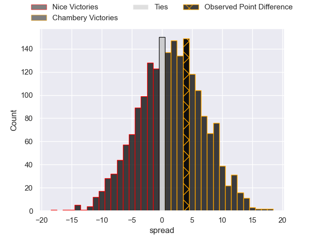
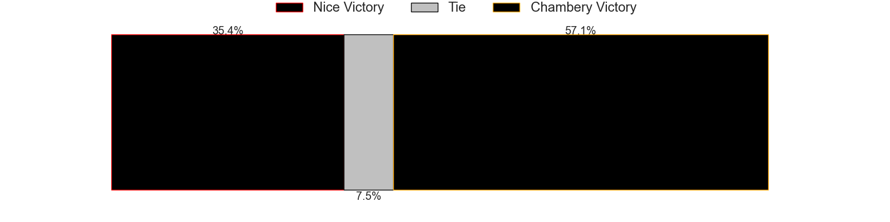
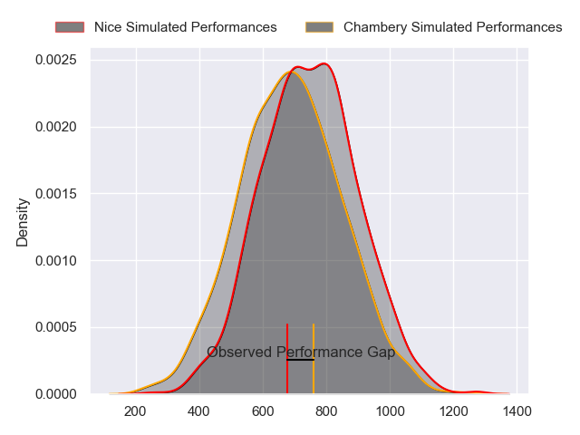
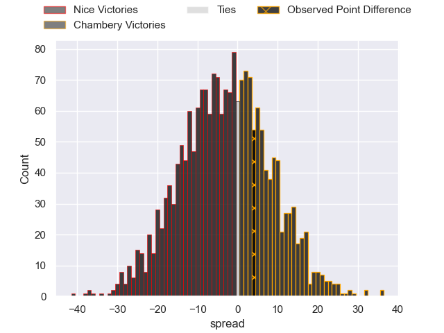
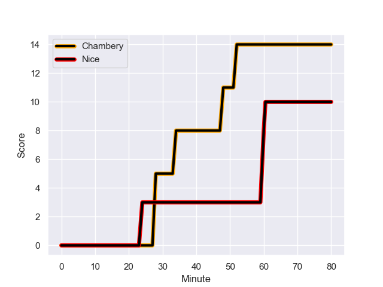
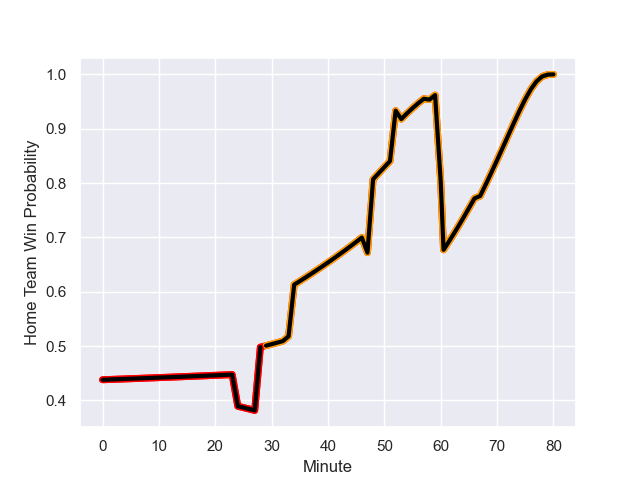

---  
layout: page  
title: Nice at Chambery; 10.0-14.0  
date: 2023-10-21 18:00:00 -0500  
categories: "Nationale 2023" match review  
---
# Nice at Chambery; 10.0-14.0

# Club Level Predictions

The first set of predictions treats a club as the smallest object, as the club develops its members, organizes a gameplan, and deploys its players as needed for each match. This club model has a prediction of 0.541, which translates to predicting Chambery to win by 1.5.

Each club has a rating and a rating deviation (similar to a Glicko rating), and expected performances can be generated. This allows for simulated matches and spreads like the ones below.
## Projected Performances - Club Model

## Projected Spreads - Club Model

## Projected Results - Club Model

# Player Level Predictions - Version 2

Treating teams instead as an entity made up of the currently active players, I have ratings for each player in an altogether different system. These can be combined to form team ratings once teamsheets are announced, weighting starters a bit higher than the reserves. After the match is played, players can be weighted by their minutes on the field, allowing for an accurate measure of the team's composition. With these compiled team ratings, we can make predictions, measure inaccuracy, and update the individual player ratings.
## Prediction with Player Minutes: Nice by 2.7

Nice by 6.0 on a neutral field
## Prediction without Player Minutes: Nice by 1.9

Nice by 5.1 on a neutral pitch

## Projected Performances - Player Model

## Projected Spreads - Player Model

## Projected Results - Player Model

## Scores over Time

## Win Probability over Time

There were 8 large changes in win probability in this match

|   Away Minutes | Away Player              |   Away elo |   Number |   Home elo | Home Player              |   Home Minutes |
|---------------:|:-------------------------|-----------:|---------:|-----------:|:-------------------------|---------------:|
|             33 | Jules Martinez           |      35    |        1 |      44.22 | Enzo Segui               |             60 |
|             58 | Sione Anga'aelangi       |      63.79 |        2 |      45.72 | Gauthier Brute de Remur  |             60 |
|             53 | Luvuyo Pupuma            |      37.07 |        3 |      46.58 | Giorgi Pertaia           |             80 |
|             76 | Thibault Rey             |       9.69 |        4 |      39.62 | Fabien Witz              |             60 |
|             58 | Adrien Vigne             |      69.08 |        5 |      40.35 | Taniela Matakaiongo      |             80 |
|             80 | Ramiha Tarrel Tia Smiler |      61.31 |        6 |      48.27 | Ahmed Tidiane Kane       |             80 |
|             80 | Martin Freytes           |      63.68 |        7 |      40.21 | Thomas Coignat           |             60 |
|             67 | Bastien Berenguel        |      21.54 |        8 |      32.8  | Colin Lebian             |             80 |
|             47 | Matéo Jeune-Joly         |      25.71 |        9 |      29.09 | Thibault Dufau           |             66 |
|             80 | Romain Riguet            |      58.61 |       10 |      36.54 | Jean-Luc Alewyn Cilliers |             80 |
|             80 | Andrzej Charlat          |      77.33 |       11 |      49.34 | Arthur Nennig            |             80 |
|             80 | Nathan Courtade          |      62.41 |       12 |      27.02 | Mickael Blanc            |             80 |
|             80 | Baptiste Lafond          |      24.55 |       13 |      43.31 | Emmanuel Vaitulukina     |             66 |
|             80 | Simon Delas              |      57.28 |       14 |      39.98 | Va'aufauese Apelu Maliko |             80 |
|             53 | Pierre Le Huby           |      42.35 |       15 |      41.89 | Thomas Hecquet           |             67 |
|             47 | Revazi Tsiklauri         |      31.69 |       16 |      51.07 | Géraud Clermont          |             20 |
|             22 | Pierre Strippoli         |      44.83 |       17 |      37.68 | Luka Begic               |             20 |
|             27 | Sunia Vola               |      65.18 |       18 |      38.36 | Steevy Cerqueira         |             20 |
|             22 | Tom Murday               |     121.03 |       19 |      46.55 | Steyl Barnard            |             20 |
|             13 | Louis Vincent            |      46.23 |       20 |      33.79 | Hugo Deschaux            |             14 |
|             33 | Jules Solinas            |      52.57 |       21 |      37.83 | Maewen Sao               |             14 |
|             27 | Mathis Viard             |      64.98 |       22 |      45.52 | Thibault Moreno          |             13 |
|              4 | Bastien Trape            |      46.65 |       23 |     nan    | nan                      |            nan |

