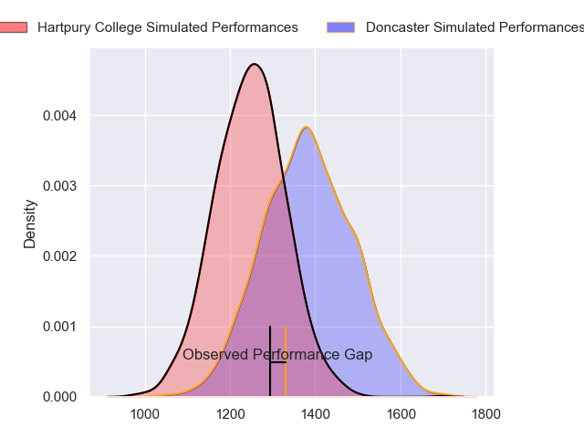
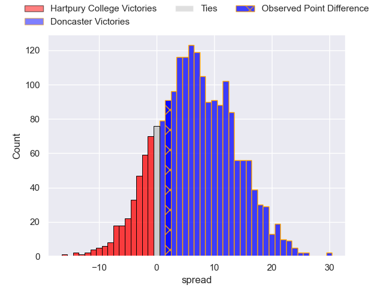
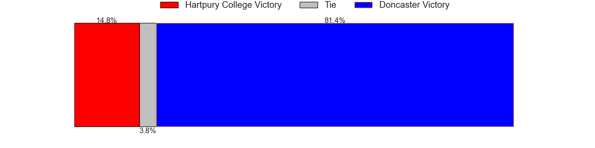
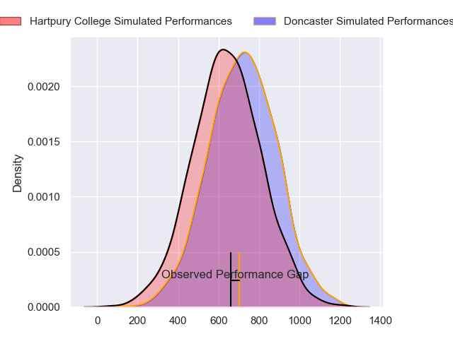
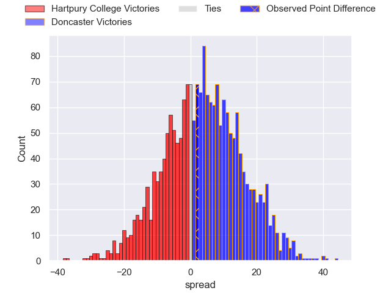
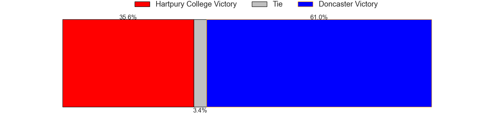
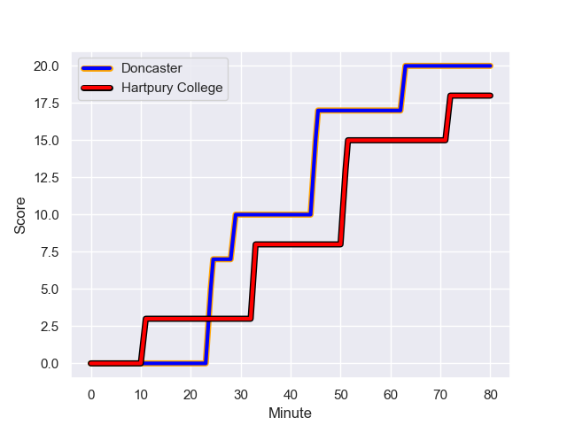
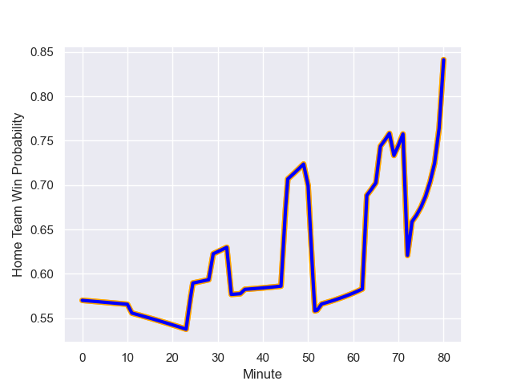

---  
layout: page  
title: Hartpury College at Doncaster; 18.0-20.0  
date: 2023-10-21 18:00:00 -0500  
categories: "RFU Championship 2023" match review  
---
# Hartpury College at Doncaster; 18.0-20.0

# Club Level Predictions

The first set of predictions treats a club as the smallest object, as the club develops its members, organizes a gameplan, and deploys its players as needed for each match. This club model has a prediction of 0.683, which translates to predicting Doncaster to win by 6.9.

Each club has a rating and a rating deviation (similar to a Glicko rating), and expected performances can be generated. This allows for simulated matches and spreads like the ones below.
## Projected Performances - Club Model

## Projected Spreads - Club Model

## Projected Results - Club Model

# Player Level Predictions - Version 2

Treating teams instead as an entity made up of the currently active players, I have ratings for each player in an altogether different system. These can be combined to form team ratings once teamsheets are announced, weighting starters a bit higher than the reserves. After the match is played, players can be weighted by their minutes on the field, allowing for an accurate measure of the team's composition. With these compiled team ratings, we can make predictions, measure inaccuracy, and update the individual player ratings.
## Prediction with Player Minutes: Doncaster by 3.1

Hartpury College by 0.2 on a neutral field
## Prediction without Player Minutes: Doncaster by 3.0

Hartpury College by 0.4 on a neutral pitch

## Projected Performances - Player Model

## Projected Spreads - Player Model

## Projected Results - Player Model

## Scores over Time

## Win Probability over Time

There were 13 large changes in win probability in this match

|   Away Minutes | Away Player          |   Away elo |   Number |   Home elo | Home Player            |   Home Minutes |
|---------------:|:---------------------|-----------:|---------:|-----------:|:-----------------------|---------------:|
|             66 | Mikey Summerfield    |      52    |        1 |      30.3  | Conor Davidson         |             80 |
|             78 | William Crane        |      37.65 |        2 |      36.85 | Tom Doughty            |             63 |
|             50 | Joe Rees             |       3.31 |        3 |      52.24 | Andrew Foster          |             50 |
|             56 | Danny Eite           |      46.65 |        4 |      71.26 | Evan Mintern           |             69 |
|             80 | Jack Davies          |      45.4  |        5 |      49.05 | Adam Hopkinson         |             53 |
|             80 | Samuel Lewis         |      15.97 |        6 |      56.6  | Ben Murphy             |             80 |
|             73 | Ellis Hart           |      46.65 |        7 |      30.52 | Harry Wilson           |             80 |
|             56 | Jarrad Hayler        |      49.65 |        8 |      33.56 | Sebastian Nagle-Taylor |             53 |
|             80 | Oscar Lennon         |      45.45 |        9 |       6.29 | Ollie Fox              |             50 |
|             80 | Harry Bazalgette     |      57.04 |       10 |      36.86 | Sam Olver              |             80 |
|             36 | Alex Morgan          |      34.88 |       11 |       6.31 | Jack Metcalf           |             73 |
|             80 | Sam Worsley          |      43.8  |       12 |      45.07 | Joe Bedlow             |             80 |
|             80 | Sam Smith            |      52.69 |       13 |      51.54 | Joe Margetts           |             80 |
|             80 | Josh Hathaway        |      46.65 |       14 |      39.81 | George Simpson         |             80 |
|             80 | Ioan Jones           |      46.65 |       15 |      74.73 | Harry Davey            |             80 |
|             24 | Michael Austin       |      46.65 |       16 |      38.78 | Corrie Barrett         |             30 |
|             24 | Joe Owen             |      46.65 |       17 |      57.8  | Alex Dolly             |             30 |
|             14 | Aristot Benz-Salomon |      49    |       18 |      35.44 | Fyn Brown              |             27 |
|              7 | Josh Gray            |      56.99 |       19 |      38.6  | Rhys Tait              |             27 |
|              2 | Andrew Davies        |      38.71 |       20 |      51.57 | Cameron Terry          |             17 |
|             44 | Alex Gibson          |      27.97 |       21 |      57.37 | Billy McBryde          |              7 |
|             30 | Joseph Jenkins       |      51.85 |       22 |      15.98 | Ehize Ehizode          |             11 |

