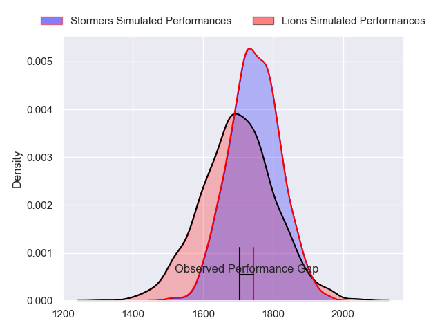
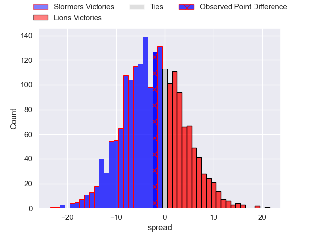
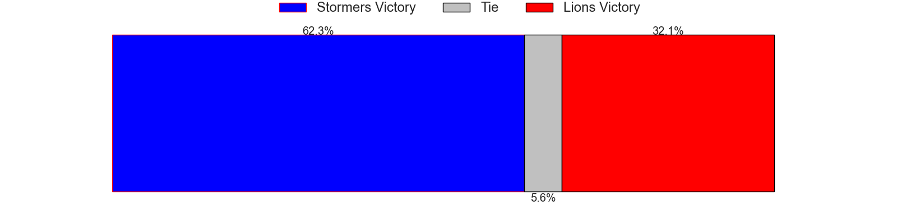
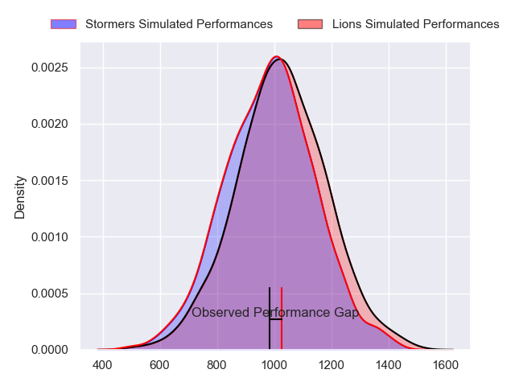
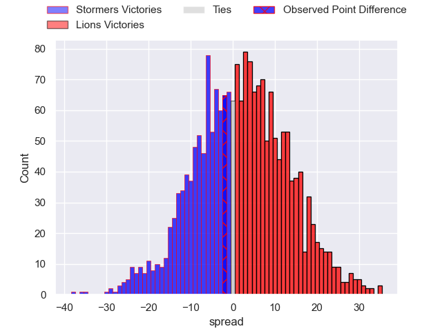
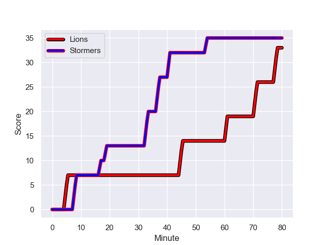
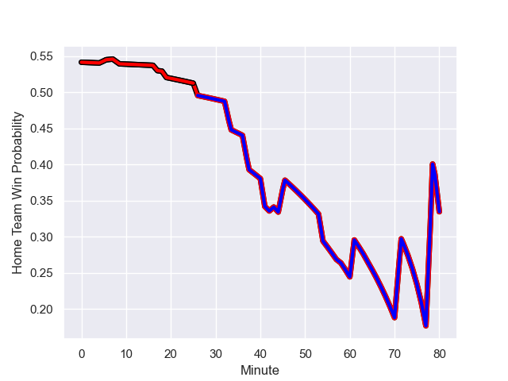

---  
layout: page  
title: Stormers at Lions; 35.0-33.0  
date: 2023-10-21 18:00:00 -0500  
categories: "United Rugby Championship 2023" match review  
---
# Stormers at Lions; 35.0-33.0

# Club Level Predictions

The first set of predictions treats a club as the smallest object, as the club develops its members, organizes a gameplan, and deploys its players as needed for each match. This club model has a prediction of 0.434, which translates to predicting Stormers to win by 2.4.

Each club has a rating and a rating deviation (similar to a Glicko rating), and expected performances can be generated. This allows for simulated matches and spreads like the ones below.
## Projected Performances - Club Model

## Projected Spreads - Club Model

## Projected Results - Club Model

# Player Level Predictions - Version 2

Treating teams instead as an entity made up of the currently active players, I have ratings for each player in an altogether different system. These can be combined to form team ratings once teamsheets are announced, weighting starters a bit higher than the reserves. After the match is played, players can be weighted by their minutes on the field, allowing for an accurate measure of the team's composition. With these compiled team ratings, we can make predictions, measure inaccuracy, and update the individual player ratings.
## Prediction with Player Minutes: Lions by 1.8

Stormers by 1.8 on a neutral field
## Prediction without Player Minutes: Lions by 2.3

Stormers by 1.4 on a neutral pitch

## Projected Performances - Player Model

## Projected Spreads - Player Model

## Projected Results - Player Model

## Scores over Time

## Win Probability over Time

There were 13 large changes in win probability in this match

|   Away Minutes | Away Player               |   Away elo |   Number |   Home elo | Home Player            |   Home Minutes |
|---------------:|:--------------------------|-----------:|---------:|-----------:|:-----------------------|---------------:|
|             24 | Kwenzokuhle Ndumiso Blose |      45.79 |        1 |      81.38 | Corne Fourie           |             55 |
|             55 | Joseph Dweba              |      49.4  |        2 |      43.66 | PJ Botha               |             55 |
|             55 | Neethling Fouche          |      55.69 |        3 |     113.6  | Ruan Dreyer            |             54 |
|             26 | Salmaan Moerat            |      49.69 |        4 |      78.96 | Ruben Schoeman         |             54 |
|             80 | Ruben van Heerden         |      49.78 |        5 |      34.08 | Darrien-Lane Landsberg |             80 |
|             58 | Marcel Theunissen         |      40.53 |        6 |      31.91 | Sibusiso Sangweni      |             43 |
|             80 | Ben-Jason Dixon           |      38.29 |        7 |      48.14 | Emmanuel Tshituka      |             80 |
|             80 | Evan Roos                 |      70.21 |        8 |     105.64 | Francke Horn           |             80 |
|             55 | Herschel Jantjies         |      87.06 |        9 |      91.81 | Sanele Nohamba         |             80 |
|             80 | Clayton Blommetjies       |      87.24 |       10 |      42.38 | Jordan Hendrikse       |             64 |
|             80 | Leolin Zas                |      73.63 |       11 |      54.74 | Rabz Maxwane           |             80 |
|             80 | Sacha Mngomezulu          |      56.33 |       12 |      80.53 | Marius Louw            |             80 |
|             80 | Ruhan Nel                 |      47.99 |       13 |      38.48 | Manuel Rass            |             43 |
|             59 | Angelo Davids             |      81.71 |       14 |      33.68 | Richard Kriel          |             80 |
|             80 | Warrick Gelant            |     110.16 |       15 |      78.09 | Quan Horn              |             80 |
|             56 | Lizo Gqoboka              |      27.5  |       16 |      57.88 | Henco van Wyk          |             37 |
|             54 | Hacjivah Dayimani         |      92.21 |       17 |      78.23 | Ruan Venter            |             37 |
|             25 | Brok Harris               |     123.46 |       18 |      27.34 | Asenathi Ntlabakanye   |             26 |
|             25 | Andre-Hugo Venter         |      54.59 |       19 |      41.93 | Willem Alberts         |             26 |
|             25 | Paul de Wet               |      66.5  |       20 |      44.34 | Morgan Naude           |             25 |
|             22 | Willie Engelbrecht        |      59.76 |       21 |      50.57 | Jaco Visagie           |             25 |
|             21 | Ben Loader                |      80.49 |       22 |      37.89 | Morne Van den Berg     |             16 |

