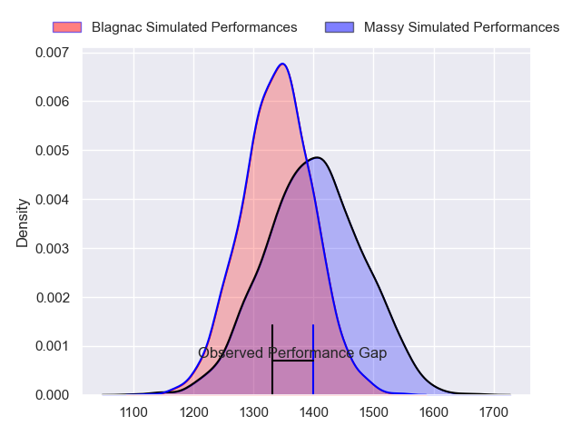
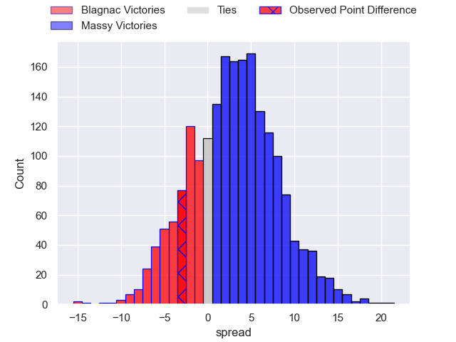
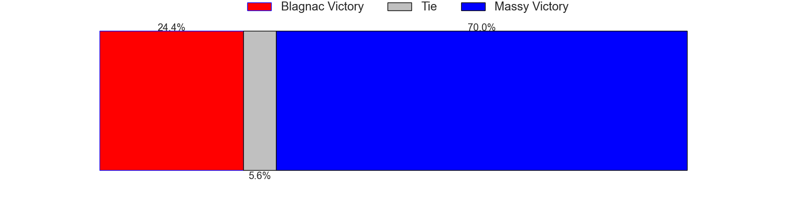
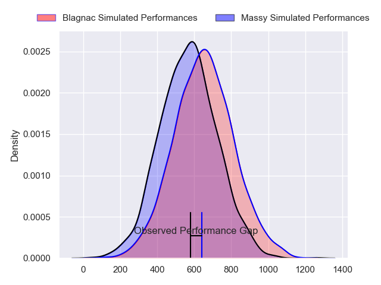
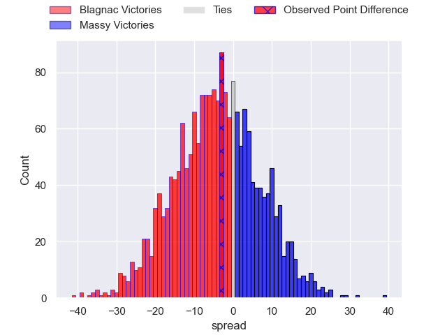
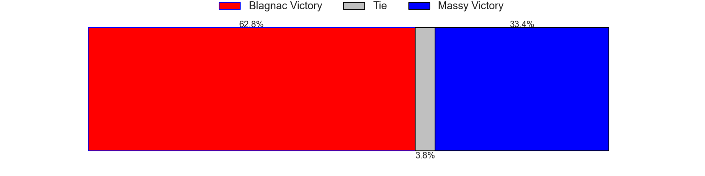
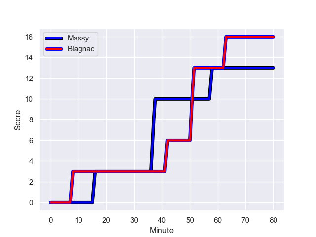
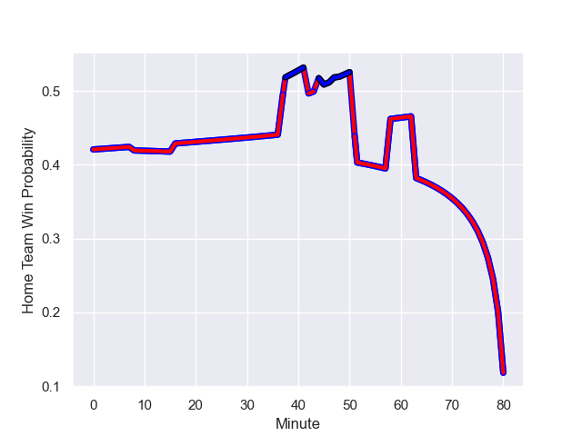

---  
layout: page  
title: Blagnac at Massy; 16.0-13.0  
date: 2023-10-21 18:00:00 -0500  
categories: "Nationale 2023" match review  
---
# Blagnac at Massy; 16.0-13.0

# Club Level Predictions

The first set of predictions treats a club as the smallest object, as the club develops its members, organizes a gameplan, and deploys its players as needed for each match. This club model has a prediction of 0.588, which translates to predicting Massy to win by 3.2.

Each club has a rating and a rating deviation (similar to a Glicko rating), and expected performances can be generated. This allows for simulated matches and spreads like the ones below.
## Projected Performances - Club Model

## Projected Spreads - Club Model

## Projected Results - Club Model

# Player Level Predictions - Version 2

Treating teams instead as an entity made up of the currently active players, I have ratings for each player in an altogether different system. These can be combined to form team ratings once teamsheets are announced, weighting starters a bit higher than the reserves. After the match is played, players can be weighted by their minutes on the field, allowing for an accurate measure of the team's composition. With these compiled team ratings, we can make predictions, measure inaccuracy, and update the individual player ratings.
## Prediction with Player Minutes: Blagnac by 3.5

Blagnac by 7.2 on a neutral field
## Prediction without Player Minutes: Blagnac by 4.6

Blagnac by 8.2 on a neutral pitch

## Projected Performances - Player Model

## Projected Spreads - Player Model

## Projected Results - Player Model

## Scores over Time

## Win Probability over Time

There were 9 large changes in win probability in this match

|   Away Minutes | Away Player       |   Away elo |   Number |   Home elo | Home Player         |   Home Minutes |
|---------------:|:------------------|-----------:|---------:|-----------:|:--------------------|---------------:|
|             47 | Alexis Decaux     |      54.27 |        1 |      -0.32 | Fernandez Correa    |             48 |
|             47 | Gabin Villerouge  |      42.85 |        2 |      46.73 | Nolan Pienaar       |             48 |
|             47 | Baptiste Collet   |      53.31 |        3 |      36.84 | Tijde Visser        |             48 |
|             44 | Nikita Bekov      |      67.24 |        4 |      45.79 | Lilian Rousset      |             48 |
|             52 | Vincent Mutel     |      48.66 |        5 |      -1.78 | Andrei Mahu         |             80 |
|             80 | Simon Veyrac      |      53.27 |        6 |      39.95 | Hugo Boutin         |             54 |
|             80 | Matthieu Thomas   |      28.05 |        7 |      42.13 | Clément Vidoni      |             80 |
|             80 | Ianis Ponsole     |      58.88 |        8 |      14.02 | Samuel Nollet       |             80 |
|             80 | Bernard Reggiardo |      39.56 |        9 |      18.17 | Lucas Rubio         |             54 |
|             60 | Valentin Delpy    |      66.48 |       10 |      25.32 | Tom Deleuze         |             80 |
|             80 | Lukas Doyhenard   |      52.35 |       11 |      49.17 | Martin Carre        |             80 |
|             80 | Aurelien Labau    |      55.91 |       12 |      41.03 | Arthur Seigneuret   |             80 |
|             80 | Clément Vareilles |      30.49 |       13 |      30.87 | Tom Cusson          |             80 |
|             80 | Francois Tardieu  |       2.38 |       14 |      56.77 | Alex Preira         |             80 |
|             80 | Antoine Renaud    |      21.86 |       15 |      32.29 | Giorgi Gogoladze    |             45 |
|             33 | Benjamin Bertrand |      44.33 |       16 |      40.51 | Robin Poipy         |             32 |
|             33 | Enzo Rivier       |      49    |       17 |      64.07 | Pierre Trassoudaine |             32 |
|             33 | Victor Delmas     |      48.83 |       18 |      41.48 | Nicolas Ferrer      |             32 |
|             28 | Pierre Jeudi      |      46.86 |       19 |      10.22 | Koen Bloemen        |             32 |
|             36 | Nekolo Tolofua    |      35.73 |       20 |      45.26 | Victorien Jacomme   |             26 |
|             20 | Ugo Seunes        |      55.73 |       21 |      24.56 | Benjamin Prier      |             26 |
|            nan | nan               |     nan    |       22 |       8.98 | Hugo Verdu          |             35 |

