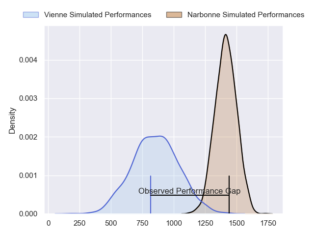
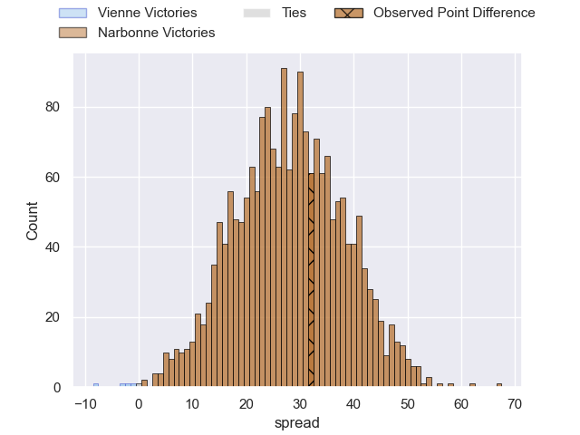
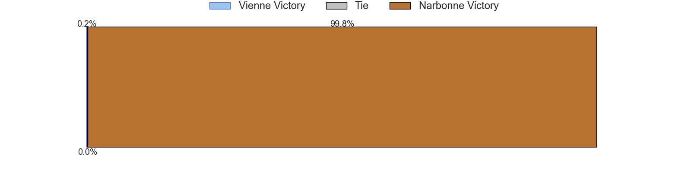
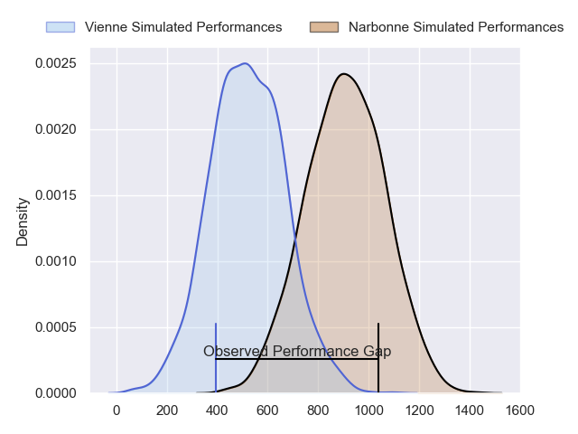
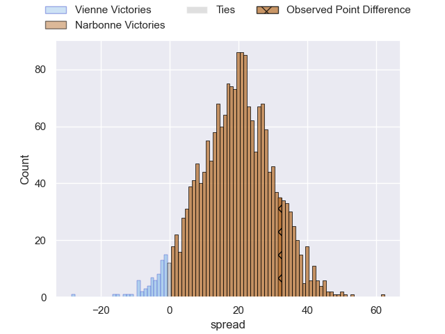
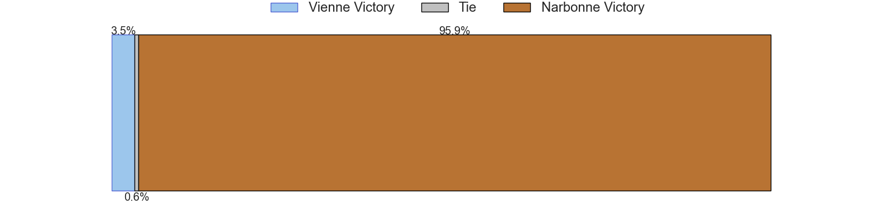
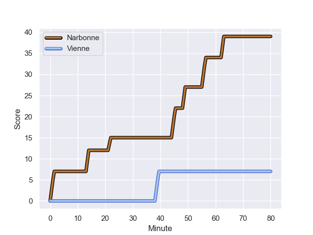
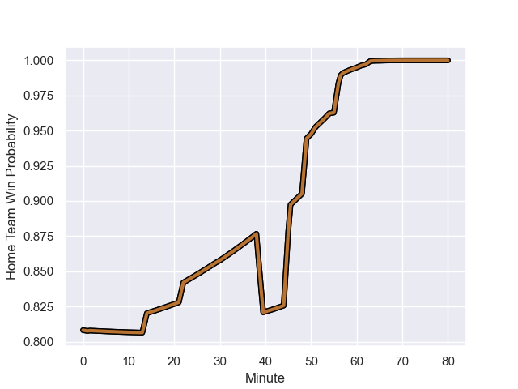

---  
layout: page  
title: Vienne at Narbonne; 7.0-39.0  
date: 2023-10-21 18:00:00 -0500  
categories: "Nationale 2023" match review  
---
# Vienne at Narbonne; 7.0-39.0

# Club Level Predictions

The first set of predictions treats a club as the smallest object, as the club develops its members, organizes a gameplan, and deploys its players as needed for each match. This club model has a prediction of 0.94, which translates to predicting Narbonne to win by 27.9.

Each club has a rating and a rating deviation (similar to a Glicko rating), and expected performances can be generated. This allows for simulated matches and spreads like the ones below.
## Projected Performances - Club Model

## Projected Spreads - Club Model

## Projected Results - Club Model

# Player Level Predictions - Version 2

Treating teams instead as an entity made up of the currently active players, I have ratings for each player in an altogether different system. These can be combined to form team ratings once teamsheets are announced, weighting starters a bit higher than the reserves. After the match is played, players can be weighted by their minutes on the field, allowing for an accurate measure of the team's composition. With these compiled team ratings, we can make predictions, measure inaccuracy, and update the individual player ratings.
## Prediction with Player Minutes: Narbonne by 15.8

Narbonne by 11.2 on a neutral field
## Prediction without Player Minutes: Narbonne by 15.9

Narbonne by 11.3 on a neutral pitch

## Projected Performances - Player Model

## Projected Spreads - Player Model

## Projected Results - Player Model

## Scores over Time

## Win Probability over Time

There were 3 large changes in win probability in this match

|   Away Minutes | Away Player              |   Away elo |   Number |   Home elo | Home Player            |   Home Minutes |
|---------------:|:-------------------------|-----------:|---------:|-----------:|:-----------------------|---------------:|
|             55 | Louan Capuano            |      34.04 |        1 |      46.65 | Benito Delacruz        |             51 |
|             61 | Axel Benjamin            |      43.32 |        2 |      56.04 | Mehdi Boundjema        |             64 |
|             55 | Pierre-Mathieu Fernandes |      32.81 |        3 |      64.19 | John Roy Jenkinson     |             51 |
|             80 | Mathias Bastide          |      34.07 |        4 |      50.52 | Marius Antonescu       |             80 |
|             56 | Geoffrey Nouhaillaguet   |       7.89 |        5 |      33.1  | Dennis Visser          |             61 |
|             80 | Pierre Chapelle          |      28.49 |        6 |      53.96 | Thibault Clauzade      |             80 |
|             51 | Charles William Nyoungue |      43.32 |        7 |      43.32 | Baptiste Abescat-Leroy |             54 |
|             80 | Théo Minodier            |      46.65 |        8 |      66.34 | Luke Nakobukobua       |             80 |
|             80 | Enzo Ravanello           |      44.75 |        9 |      47.95 | Pierrick Nova          |             64 |
|             60 | Julien Hervouet          |      36.68 |       10 |      45.5  | Tom Chauvet            |             80 |
|             51 | Hippolyte Massa          |      37.67 |       11 |      41.83 | Baptiste Tsague        |             80 |
|             80 | Axel Derderian           |      42.13 |       12 |     115.53 | Peter Betham           |             65 |
|             30 | Matthias Giovale         |      27.74 |       13 |      29.69 | Ambrose Curtis         |             57 |
|             80 | Martin Arfi              |      40.08 |       14 |      62.73 | Clément Clavières      |             80 |
|             80 | Brandon Bellavia         |      21.87 |       15 |      40.56 | Thibault Santoro       |             80 |
|             25 | Loïc Reynaud             |      46.65 |       16 |      53.36 | Théo Castinel          |             29 |
|             19 | Romain Eliot             |      34.68 |       17 |      46.71 | Gabriel Atlan          |             16 |
|             25 | Tau Junior Fifita        |      44.75 |       18 |      49.19 | Levi Tikoipau          |             29 |
|             24 | Ciaran O'Flynn           |      27.1  |       19 |      49.99 | Mauro Rebussone        |             19 |
|             29 | Steven Giroud            |      28.99 |       20 |      46.65 | Grégoire Labit         |             26 |
|             20 | Alexandre Jarguel        |      37.71 |       21 |      79.9  | Josh Valentine         |             16 |
|             29 | Hugo Pandolfo            |      30.94 |       22 |      34.07 | Théo Mias              |             15 |
|             50 | Anzize Said Omar         |      28.41 |       23 |      53.4  | Pierre Nueno           |             23 |

