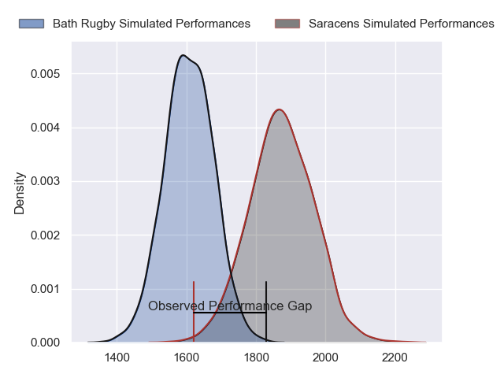
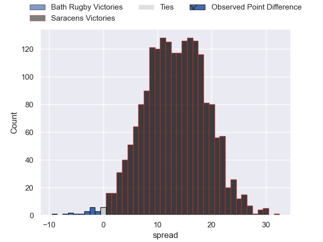
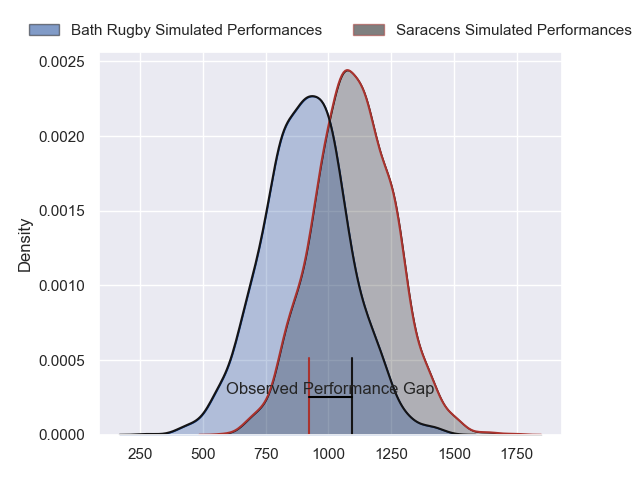
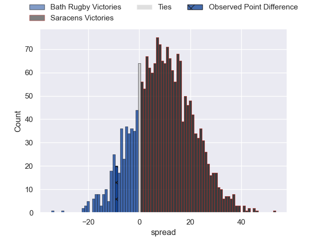
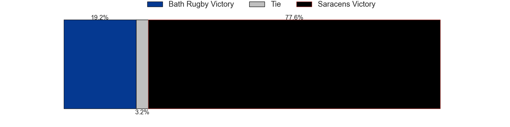
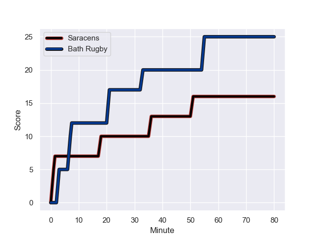
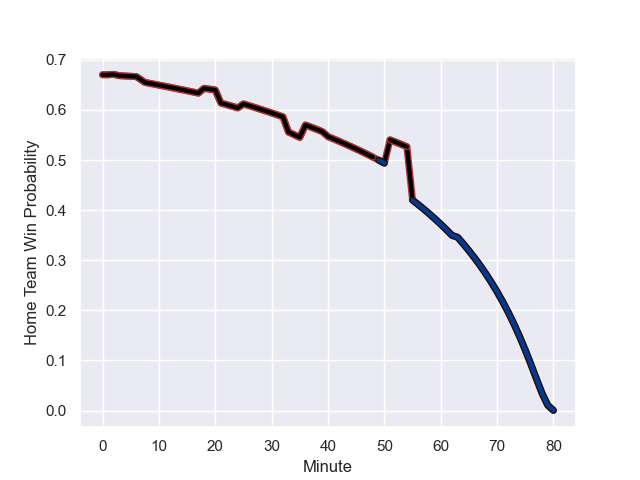

---  
layout: page  
title: Bath Rugby at Saracens; 25.0-16.0  
date: 2023-10-21 18:00:00 -0500  
categories: "Gallagher Premiership 2023" match review  
---
# Bath Rugby at Saracens; 25.0-16.0

# Club Level Predictions

The first set of predictions treats a club as the smallest object, as the club develops its members, organizes a gameplan, and deploys its players as needed for each match. This club model has a prediction of 0.818, which translates to predicting Saracens to win by 13.4.

Each club has a rating and a rating deviation (similar to a Glicko rating), and expected performances can be generated. This allows for simulated matches and spreads like the ones below.
## Projected Performances - Club Model

## Projected Spreads - Club Model

## Projected Results - Club Model

# Player Level Predictions - Version 2

Treating teams instead as an entity made up of the currently active players, I have ratings for each player in an altogether different system. These can be combined to form team ratings once teamsheets are announced, weighting starters a bit higher than the reserves. After the match is played, players can be weighted by their minutes on the field, allowing for an accurate measure of the team's composition. With these compiled team ratings, we can make predictions, measure inaccuracy, and update the individual player ratings.
## Prediction with Player Minutes: Saracens by 7.9

Saracens by 3.2 on a neutral field
## Prediction without Player Minutes: Saracens by 8.2

Saracens by 3.5 on a neutral pitch

## Projected Performances - Player Model

## Projected Spreads - Player Model

## Projected Results - Player Model

## Scores over Time

## Win Probability over Time

There were 8 large changes in win probability in this match

|   Away Minutes | Away Player         |   Away elo |   Number |   Home elo | Home Player        |   Home Minutes |
|---------------:|:--------------------|-----------:|---------:|-----------:|:-------------------|---------------:|
|             49 | Juan Schoeman       |      40.56 |        1 |     120.36 | Mako Vunipola      |             63 |
|             49 | Niall Annett        |      38.2  |        2 |      41.75 | James Hadfield     |             60 |
|             65 | Johannes Jonker     |      32.55 |        3 |      44.33 | Marco Riccioni     |             57 |
|             25 | Quinn Roux          |      89.85 |        4 |      45.3  | Callum Hunter-Hill |             40 |
|             80 | Charlie Ewels       |      25.37 |        5 |      82.45 | Nick Isiekwe       |             80 |
|             80 | Miles Reid          |      75.21 |        6 |      60.07 | Theo McFarland     |             80 |
|             80 | Chris Cloete        |     121.93 |        7 |      46.33 | Andy Christie      |             80 |
|             70 | Alfie Barbeary      |      40.56 |        8 |      38.64 | Tom Willis         |             80 |
|             79 | Ben Spencer         |      41.14 |        9 |      70.22 | Aled Davies        |             63 |
|             79 | Finn Russell        |     129.01 |       10 |      54.73 | Manu Vunipola      |             80 |
|             80 | Ruaridh McConnochie |      53.36 |       11 |      58.24 | Rotimi Segun       |             67 |
|             79 | Will Butt           |      44.31 |       12 |     107.64 | Nick Tompkins      |             80 |
|             80 | Cameron Redpath     |      54.39 |       13 |      67.76 | Alex Lozowski      |             63 |
|             80 | Joe Cokanasiga      |      77.46 |       14 |      97.66 | Sean Maitland      |             80 |
|             80 | Tom de Glanville    |      23.73 |       15 |      88    | Alex Goode         |             80 |
|             31 | Thomas du Toit      |      77.06 |       16 |      52.14 | Tom West           |             17 |
|             31 | Tom Dunn            |      82.33 |       17 |      39.17 | Samson Adejimi     |             20 |
|             15 | Archie Griffin      |      45.01 |       18 |      41.16 | Alec Clarey        |             23 |
|             55 | Josh McNally        |      69.92 |       19 |      34.7  | Toby Knight        |             40 |
|             10 | Jaco Coetzee        |      44.73 |       20 |      36.07 | Gareth Simpson     |             17 |
|              1 | Louis Schreuder     |      58.91 |       21 |      46.44 | Alex Lewington     |             13 |
|              1 | Orlando Bailey      |      39.53 |       22 |      26.42 | Olly Hartley       |             17 |
|              1 | Max Ojomoh          |      44.16 |       23 |     nan    | nan                |            nan |

